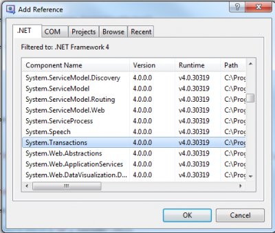

You can use you `DbConnection` to get your transaction but the `System.Transactions` namespace give you an other option for handling transaction.

This namespace work with SQL Server 2005 and later and offers support for **distributed transactions**. At first, this transactions namespace will handle the transaction has a **local lightweight transaction** but if detect that multiple connection is open that the transaction switch to **distributed transactions**. This behavior is also known as "implicit transaction" because the developer does not explicit how to handle it.


For example, here is the example we previously did with the `SqlDbConnection` with the use of the `System.Transactions` instead of the one provided by the connection.

```csharp
public int SaveCustomers(IEnumerable<Customer> customers) { 
  ConnectionStringSettings connectionStringSettings = ConfigurationManager.ConnectionStrings["ApplicationServices"];
  int rowsAffected=0; 
  using (var connection = new SqlConnection(connectionStringSettings.ConnectionString)) { 
    connection.Open(); 
    using (System.Transactions.TransactionScope ts = new System.Transactions.TransactionScope()) { 
      using (var command = new SqlCommand()) { 
        command.Connection = connection; 
        foreach (var customer in customers) { 
          if (customer.IsNew) { 
            command.CommandText = "INSERT INTO customers (CustomerID, CompanyName) VALUES (@id, @name)"; 
          } else { 
            command.CommandText = "UPDATE customers SET CompanyName = @name WHERE CustomerID = @id"; 
          } 
          command.CommandType = System.Data.CommandType.Text; 
          command.Parameters.Clear(); //Remove 
          command.Parameters.Add(new SqlParameter("id", customer.Id)); 
          command.Parameters.Add(new SqlParameter("name", customer.Name)); 
          rowsAffected += command.ExecuteNonQuery(); 
        }
      ts.Complete(); 
      } 
    } 
    connection.Close(); 
  } 
  return rowsAffected; 
} 
```

As you can see, few lines have been removed and some changed. You will notice that we do not have anymore any try-catch. That's right, the USING handle any problem and if the `Transaction.Complete()` is not called, it's automatically a RollBack. If multiple connections are inside the transaction using, all of them will be under the scope of the transaction distributed transactions coordinator.



Unfortunately, this namespace is only pertinent if you use Sql Server 2005 and more. In fact, you should always use this one if you are in a Microsoft Sql server 2005, 2008 and more. The only time that it's not possible to use it is with other type of database. The reason to use this one instead of the ADO.NET transactions is the automatic handling of lightweight transaction and distributed transactions.

## Transaction Scope Options

System.Transactions let you set you set a type for you transaction via the enumeration TransactionScopeOption.


# Required
If a transaction exist, a new declaration of the a transaction will simply join the first one. If none is defined, a new transaction will be initiated. This can be useful in the scenario that you that you have one method that call two methods. You put the a transaction and inside you add the two methods. Inside those methods you can have some database call with or without transaction scope. At the end, all will be under the same transaction. This is very powerful and let you have atomic transaction over multiple methods.

# RequiresNew
This will create a new independent transaction. This can be useful if you want to execute something what ever the state of the existing transaction. For example, you have a logging system that log data into the database. You may want to log even if they are problem.

# Suppress
This remove the transaction behavior for all call inside the transaction. This give you the leverage to do stuff outside the transaction while being inside an existing transaction.

The use of `System.Transactions` to handle DTC is very useful. 
First, it let you use Lightweight Transaction Manager(LTM) instead of DTC when possible. This give you a big performance boost.
Second, you do not need to inherit from `ServicedComponent`, so you can have cleaner object with the possibility to inherit from what you desire. The last thing is that it does not use any COM+ object. So nothing is loaded in the Component Services.
