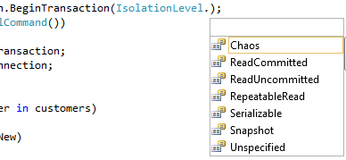
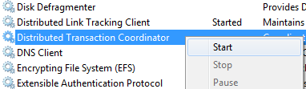

Transaction lets you rollback if a problem occur. That mean that if you insert 100 entries into the database and 1 of them is wrong, the whole list of entry will be not saved in the persistence. This is very interesting because most of the time you want to have your action to be [atomic](http://en.wikipedia.org/wiki/ACID#Atomicity "Wikipedia Atomicity").

This is an example of a good practice method that should been in a data access layer. To simplify, all will be written in the same file and the database used is the Northwind database.


```csharp
 public class Customer { public string Id { get; set; } public string Name { get; set; } public bool IsNew { get; set; } }

public partial class \_Default : System.Web.UI.Page { protected void Page\_Load(object sender, EventArgs e) { List<Customer> customers = new List<Customer>(){ new Customer(){Id="ID001", Name="Name001", IsNew=true} , new Customer(){Id="ID002", Name="Name002", IsNew=true} , new Customer(){Id="ID003", Name="Name003", IsNew=true} }; SaveCustomers(customers); }

public int SaveCustomers(IEnumerable<Customer> customers) { ConnectionStringSettings connectionStringSettings = ConfigurationManager.ConnectionStrings["ApplicationServices"];

int rowsAffected=0; using (var connection = new SqlConnection(connectionStringSettings.ConnectionString)) { connection.Open(); var transaction = connection.BeginTransaction(); using (var command = new SqlCommand()) { command.Transaction = transaction; command.Connection = connection; try { foreach (var customer in customers) { if (customer.IsNew) { command.CommandText = "INSERT INTO customers (CustomerID, CompanyName) VALUES (@id, @name)"; } else { command.CommandText = "UPDATE customers SET CompanyName = @name WHERE CustomerID = @id"; } command.CommandType = System.Data.CommandType.Text; command.Parameters.Clear(); //Remove command.Parameters.Add(new SqlParameter("id", customer.Id)); command.Parameters.Add(new SqlParameter("name", customer.Name)); rowsAffected += command.ExecuteNonQuery(); } transaction.Commit(); } catch { transaction.Rollback(); } } connection.Close();

}

return rowsAffected; } } 
```

This code contain some interesting things. First, to create a transaction you must have a connection already open. This is required. Otherwise you will have an exception that will told you that the connection is close.

Second, you must know that if you forget to commit once you are done querying that even if all queries were legit that the database won't have your data. That's right, even if the _rowsAffected += command.ExecuteNonQuery();_ add number in the rowAffected, this won't be real until you commit. The code above works because all customers have IsNew to true. If you run this code and change one to False you will tell the Save method to use the Update statement. The command will Update but the database won't find the customer and throw an exception. What it means is that the code will go in the catch and RollBack the transaction. Even if the rowsAffected is at 1, you will have 0 rows added or updated in the database.

## Type of isolation

To create a transaction you need to get it from the DbCommand. The reason is simple, a transaction is different between database provider. So, when using the SqlDbCommand, you will have more option of transaction for the Microsoft Sql Server Database. Also, transaction code will do isolation on the database. Sql Server let you do different type of transaction.

[caption id="attachment\_349" align="aligncenter" width="388" caption="Sql Server Transaction's type"]

- ReadUncommitted
This is a very weak transaction and should not be used. In fact, this type doesn't lock anything in the database. It's possible that the data changes or be deleted by the time the commit is done. This can lead to unpredictable reaction. This type of isolation will produce for a Select statement this query: 
```sql
 SELECT \* FROM CUSTOMERS WITH (NOLOCK) 
```
- ReadCommitted
This one try to have a share-lock on the data. If it succeed, it will protect any change from the external into those values.- RepeatableRead
All the data implicate in the transaction are lock.- Serializable
All the table is lock. This prevent adding other rows to the table. This is the best isolation but it comes with the cost of being not performant. Locking more value than desire can lead to reduce the speed to all other connection that need to read or edit these rows.- Snapshot
If your database is Sql Server 2005 and over you can use this type of transaction that will do a copy of the affected row. To be more accurate, rows are versionned and when others connection want to access these rows instead of locking a copy is made. This keep the system in good shape without creating any slow time for anyone.

## Transaction Type

This type of transaction is known as **Lightweight Transaction Manager (LTM)** because only one connection is required. Sometime, you may use one connection to read and while it's looping you could open an other connection to update. Anytime you have two connections open, the transaction type become **Distributed Transaction (DT)**. Microsoft Windows operating system have a Distributed Transaction Coordinator (DTC) that is a service that run in the background of your computer. The Distributed Transaction Coordinator (DTC) requires the use of System.Transactions that will be discussed in a later article or to use explicit code to execute the code under DTC. To use DTC developers have to create classes that inherited from the ServicedComponent class in the System.EnterpriseServices namespace. This won't be discussed because it's easier now to simply use the System.Transactions that handle implicitly if it really require to be DTC or LTM.

[caption id="attachment\_350" align="aligncenter" width="382" caption="Distributed Transaction Coordinator (DTC)"]
