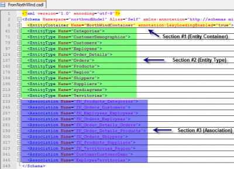
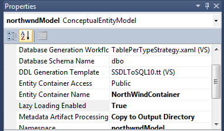

The Conceptual schema definition language (CSDL) is an XML file generated while compiling a conceptual entity model (EDMX). If you do not see the .csdl file in your output folder (bin folder), it might be because the conceptual entity model is set to embedded this file. This can be easily changed.

The CSDL file is in fact a XML with three distinct sections. If we open the NorthWind database .csdl file (the conceptual entity model has been generated from the Microsoft Northwind database) we can see these 3 sections:



The first section is the **Entity Container**. This section contain some information concerning the global container. In the example I created with the NorthWind database, I had chosen to call the NorthWind Conceptual Model "NorthWinContainer". This is the name that we would use inside the project to get the Object Context.


```xml
 <EntityContainer Name="NorthWindContainer" annotation:LazyLoadingEnabled="true"> 
```


Inside the code would have been called this way :

```csharp
var db = new NorthWindContainer(); var collectionData = db.Territories; 
```

The second attribute of the XML is the **LazyLoading** that is enable in that case. This option in code can be found in the ContextOption.

var db = new NorthWindContainer(); Console.WriteLine("Lazy loading : " + db.ContextOptions.LazyLoadingEnabled);

This value can be set also in the Conceptual Entity Model.



This first part of the CSDL file contains also all entities and associations definition. It's not in this part of the files that properties of theses entities are defined. In fact, it contains only the name and namespace. For the associations, it also only contain the two entity related.


```xml
 <EntitySet Name="Categories" EntityType="northwndModel.Categories" /> <EntitySet Name="CustomerDemographics" EntityType="northwndModel.CustomerDemographics" /> <EntitySet Name="Customers" EntityType="northwndModel.Customers" /> ... ... <AssociationSet Name="FK_Products_Categories" Association="northwndModel.FK_Products_Categories"> <End Role="Categories" EntitySet="Categories" /> <End Role="Products" EntitySet="Products" /> </AssociationSet> .... .... 
```


The second section of the CSDL file contain more meat about the entity. The unique identifier (key) of the entity is defined there and also all properties. Each property contains its meta data like the type, if the value can be nullable and other meta data depending of the type. For example, an integer does not have a MaxLength attribute but a String does.


```xml
 <EntityType Name="Categories"> <Key> <PropertyRef Name="CategoryID" /> </Key> <Property Name="CategoryID" Type="Int32" Nullable="false" annotation:StoreGeneratedPattern="Identity" /> <Property Name="CategoryName" Type="String" Nullable="false" MaxLength="15" Unicode="true" FixedLength="false" /> <Property Name="Description" Type="String" MaxLength="Max" Unicode="true" FixedLength="false" /> <Property Name="Picture" Type="Binary" MaxLength="Max" FixedLength="false" /> <NavigationProperty Name="Products" Relationship="northwndModel.FK_Products_Categories" FromRole="Categories" ToRole="Products" /> </EntityType> <EntityType Name="CustomerDemographics"> <Key> <PropertyRef Name="CustomerTypeID" /> </Key> <Property Name="CustomerTypeID" Type="String" Nullable="false" MaxLength="10" Unicode="true" FixedLength="true" /> <Property Name="CustomerDesc" Type="String" MaxLength="Max" Unicode="true" FixedLength="false" /> <NavigationProperty Name="Customers" Relationship="northwndModel.CustomerCustomerDemo" FromRole="CustomerDemographics" ToRole="Customers" /> </EntityType> 
```


The last section of the file contains detail about the association previously described in the first section. The association name concord with the AssociationSet_FK's name of the first section. This will defined both ending point and their multiplicity. Also, the property reference is defined.


```xml
 <Association Name="FK_Products_Categories"> <End Role="Categories" Type="northwndModel.Categories" Multiplicity="0..1" /> <End Role="Products" Type="northwndModel.Products" Multiplicity="*" /> <ReferentialConstraint> <Principal Role="Categories"> <PropertyRef Name="CategoryID" /> </Principal> <Dependent Role="Products"> <PropertyRef Name="CategoryID" /> </Dependent> </ReferentialConstraint> </Association> 
```


To conclude, this file should not really be modified by hand. Visual Studio 2010 visual designer is easier to use, less error prone and can save you a lot of time. Also, if your database is already defined, all the schema can be pull from it.
