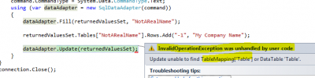
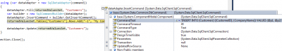

To read data from the database you need to use something else from `DbCommand` that was returning no data. Two options are available. The first one is the DataReader, the second is the DataAdapters.

## DataReader

This is the fastest way to read data from the database. To create a `DataReader` object, the use of `ExecuteReader` from the `DbCommand` class is required. It's required because you will still need to give them the type of query you want and the SQL statement (or the stored procedure name). Then, the method `ExecuteReader()` return a `DataReader`. In the example below, the reader is a `SqlDataReader`. This one derive from `DataReader` and is more specialized for Microsoft Sql Server. The latest solution is really not performant.


```csharp
ConnectionStringSettings connectionStringSettings = ConfigurationManager.ConnectionStrings["ApplicationServices"]; 
using (var connection = new SqlConnection(connectionStringSettings.ConnectionString)) { 
  connection.Open(); 
  using (var command = new SqlCommand()) { 
    command.Connection = connection; 
    command.CommandText = "SELECT CustomerID, CompanyName FROM Customers WHERE country LIKE 'canada' "; 
    command.CommandType = System.Data.CommandType.Text; 
    using (SqlDataReader reader = command.ExecuteReader()) { 
      while (reader.Read()) { 
        System.Diagnostics.Debug.WriteLine(string.Format("{0}:{1}",reader["CustomerID"], reader["CompanyName"])); 
      } 
    } 
  } 
  connection.Close(); 
} 
```

The `DataReader` acts like a cursor. It can only go forward. You can access the value of each row by using the square braquet `[]`. You can put the name of the field or a integer that represent the index of the position of the field. For example, we could have replace:


```csharp
 System.Diagnostics.Debug.WriteLine(string.Format("{0}:{1}",reader["CustomerID"], reader["CompanyName"])); 
``` 
by 

```csharp
 System.Diagnostics.Debug.WriteLine(string.Format("{0}:{1}",reader[0], reader[1])); 
``` 

The problem with the latest version is the maintainability. It's harder to know what will be displayed. Also, it can be problematic if the order of the returned data change. Let say that you get data from a stored procedure and for an unknown reason the database administrator change the order of the returned field. This would create a problem but not if the name were used.

You can also load the whole data set in one shot using the Load method. The data is loaded into a DataTable.

```csharp
ConnectionStringSettings connectionStringSettings = ConfigurationManager.ConnectionStrings["ApplicationServices"]; 
DataTable datas = new DataTable();
 using (var connection = new SqlConnection(connectionStringSettings.ConnectionString)) { 
  connection.Open(); 
  using (var command = new SqlCommand()) { 
    command.Connection = connection; 
    command.CommandText = "SELECT CustomerID, CompanyName FROM Customers WHERE country LIKE 'canada' "; 
    command.CommandType = System.Data.CommandType.Text; 
    using (SqlDataReader reader = command.ExecuteReader()) { 
      datas.Load(reader, LoadOption.Upsert); 
    } 
  } 
  connection.Close(); 
  System.Diagnostics.Debug.WriteLine("Number of rows loaded : " + datas.Rows.Count); 
} 
```

One problem with DataReader is that it uses a cursor on the server and it keeps the connection to the server open while looping. The second problem is that while looping you won't be able to execute an other query withing the loop. To solve that problem you can load all the data and loop after or use the Load method. Another option is to use a DbConnection with a special connection string. This connection string will require to have the attribute "MultipleActiveResultSets=True". This let have multiple command but at the cost of performance issue. It has to be used with cautiousness.

## Scalar

Sometime, we want to have just a single value. This can be an ID from a username, but more often it will be to get a value from an aggregate function, like a count. We could use the DataReader but this give some overhead for a single value.

```csharp
ConnectionStringSettings connectionStringSettings = ConfigurationManager.ConnectionStrings["ApplicationServices"]; 
using (var connection = new SqlConnection(connectionStringSettings.ConnectionString)) { 
  connection.Open(); 
  using (var command = new SqlCommand()) { 
    command.Connection = connection; 
    command.CommandText = "SELECT count(CustomerID) FROM Customers WHERE country LIKE 'canada' "; 
    command.CommandType = System.Data.CommandType.Text; 
    int countValue = (int)command.ExecuteScalar(); 
    System.Diagnostics.Debug.WriteLine("Count value:" + countValue); 
  } connection.Close();
} 
```

As you can see, line 10 use the `ExecuteScalar` from the DbCommand to return an Object. In our case, we return an integer.

## DbDataAdapter

The `DbDataAdapter` is the reader that give you the more leverage in data functionality. Not only it let you get the data but it let you update them.

The DbDataAdapter class derive from `DataAdapter`. As the other command, a Microsoft Sql Server one exist and it's called: `SqlDataAdapter`.

The `DbDataAdapter` contains a `SelectCommand` that use an `ExecuteReader`. Internally the data is loaded in a `DataTable`. This let the developer change the value inside the `DataTable` and if desired update them to the database or insert new rows added and also delete those who are not anymore in the `DataTable`. The `DbDataApter` is wise enough to open and close the connection. In the other end, it let the user open the connection if desired. In that case, the user will also need to close it. This can be useful when multiple calls is required because it won't open-close repetitively which is costly in performance. Here is an example of how to load data from the database into a `DbDataAdapter`.


```csharp
 ConnectionStringSettings connectionStringSettings = ConfigurationManager.ConnectionStrings["ApplicationServices"]; 
 DataSet returnedValuesSet = new DataSet(); 
 using (var connection = new SqlConnection(connectionStringSettings.ConnectionString)) { 
  connection.Open(); 
  using (var command = new SqlCommand()) { 
    command.Connection = connection; 
    command.CommandText = "SELECT CustomerID, CompanyName FROM Customers WHERE country LIKE 'canada' "; 
    command.CommandType = System.Data.CommandType.Text; 
    using (var dataAdapter = new SqlDataAdapter(command)) { 
      dataAdapter.Fill(returnedValuesSet); 
    } 
  } 
  connection.Close(); 
  System.Diagnostics.Debug.WriteLine("Number of rows loaded : " + returnedValuesSet.Tables[0].Rows.Count); 
} 
``` 
So, now the `DataSet` is filled up with the query data. It's a non-connected object but will still be able to do update later on. From this example, we can see that the SqlDataAdapter fill up with the `Fill` method. This `Fill` method can also takes a second argument that is the name of the name of the table. This mean we can modify the previous example with this one and instead of referring the data in the `DataSet` with an index, we will be able to use the string as a key.

```csharp
ConnectionStringSettings connectionStringSettings = ConfigurationManager.ConnectionStrings["ApplicationServices"]; DataSet returnedValuesSet = new DataSet(); using (var connection = new SqlConnection(connectionStringSettings.ConnectionString)) { connection.Open(); using (var command = new SqlCommand()) { command.Connection = connection; command.CommandText = "SELECT CustomerID, CompanyName FROM Customers WHERE country LIKE 'canada' "; command.CommandType = System.Data.CommandType.Text; using (var dataAdapter = new SqlDataAdapter(command)) { dataAdapter.Fill(returnedValuesSet, "Customers"); } } connection.Close(); System.Diagnostics.Debug.WriteLine("Number of rows loaded : " + returnedValuesSet.Tables["Customers"].Rows.Count); } 
```

The table name is important if you want to use other feature like insert, update and delete because the SqlAdapter will use this table to do the desired task. If you use a fake table name, you will get an exception. This exception is "Update unable to find TableMapping['Table'] or DataTable 'Table'.".



The correct code would be to provide in the `InsertCommand` property of the `SqlDataAdapter` a SQL statement with an Insert statement or a stored procedure. If you do not want to create every time the Insert, Update, Delete and Select statement, it's possible to use the `SqlCommandBuilder`.

```csharp
ConnectionStringSettings connectionStringSettings = ConfigurationManager.ConnectionStrings["ApplicationServices"]; 
DataSet returnedValuesSet = new DataSet(); 
using (var connection = new SqlConnection(connectionStringSettings.ConnectionString)) { 
  connection.Open(); 
  using (var command = new SqlCommand()) { 
    command.Connection = connection; 
    command.CommandText = "SELECT CustomerID, CompanyName FROM Customers WHERE country LIKE 'canada' "; 
    command.CommandType = System.Data.CommandType.Text; 
    using (var dataAdapter = new SqlDataAdapter(command)) { 
      dataAdapter.Fill(returnedValuesSet, "Customers"); 
      var builder = new SqlCommandBuilder(dataAdapter); 
      dataAdapter.InsertCommand = builder.GetInsertCommand(); 
      returnedValuesSet.Tables["Customers"].Rows.Add("-1", "My Company Name");
      dataAdapter.Update(returnedValuesSet,"Customers"); 
    } 
  } 
  connection.Close(); 
} 
```

This will generate the `InsertCommand` as you can see in this screenshot: 



The created SQL statement use parameter style and is Sql injection protected.

So far the `DbDataAdapter` commit one change at a time. This is because the `DbDataAdapter` has by default its `UpdateBatchSize` to one. You can select the size you want or set it to 0 to let the `DbDataAdapter` uses the largest batch size. This will increase the performance of the application.

## In practice

When using Sql statement, stored procedure or direct Sql you should always use parameters. In practice, in your data access layer when you have a method that return data from the database it should query with a `DataReader` and return a `DataSet`. The reason is the `DataSet` let you close the connection and the `DataReader` is justified by its speed.

```csharp
ConnectionStringSettings connectionStringSettings = ConfigurationManager.ConnectionStrings["ApplicationServices"]; 
DataSet returnedValuesSet = new DataSet(); 
DataTable returnedTable = new DataTable(); 
using (var connection = new SqlConnection(connectionStringSettings.ConnectionString)) { 
  connection.Open(); using (var command = new SqlCommand()) { 
    command.Connection = connection; 
    command.CommandText = "SELECT CustomerID, CompanyName FROM Customers WHERE country LIKE @country"; 
    command.CommandType = System.Data.CommandType.Text; 
    SqlParameter paramCountry = new SqlParameter("country","canada"); 
    command.Parameters.Add(paramCountry); 
    using (var reader = command.ExecuteReader()) { 
      returnedTable.Load(reader,LoadOption.Upsert); 
      returnedValuesSet.Tables.Add(returnedTable); 
    } 
  } 
  connection.Close(); 
} 
```

For inserting, updating and deleting, parameters must be used too. Here is a good example of code that could be use in a data access layer methods. Your method should return the number of row and accept as parameter your model object of the Customer.


```csharp
 ConnectionStringSettings connectionStringSettings = ConfigurationManager.ConnectionStrings["ApplicationServices"]; 
 DataSet returnedValuesSet = new DataSet(); 
 DataTable returnedTable = new DataTable(); 
 int rowsAffected; using (var connection = new SqlConnection(connectionStringSettings.ConnectionString)) { 
  connection.Open(); 
  using (var command = new SqlCommand()) { 
    command.Connection = connection; 
    command.CommandText = "INSERT INTO customers (CustomerID, CompanyName) VALUES (@id, @name)"; 
    command.CommandType = System.Data.CommandType.Text; 
    command.Parameters.Add(new SqlParameter("id","P1")); 
    command.Parameters.Add(new SqlParameter("name", "MyName")); 
    rowsAffected = command.ExecuteNonQuery(); 
  } 
  connection.Close(); 
} 
```

Do not forget to handling the DbAdapter's `UpdateBatchSize` when you have a collection that you are going to update. Let say that you pass to your data access layer a collection (`IList`). Your method should check the `Count` of items and adjust the `UpdateBatchSize` to the `Count`. This way, your performance will increase by a lot.

Last important thing is the use of `Transaction`. Usually when something goes wrong you would like to know about it and to cancel the current batch edition to restart it once the problem is fixed. Sql Transaction will be discussed in a future article but should be there for insert, update and delete queries.
