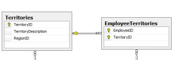

Since few months I have notice that some people near of me still do their join between table in the Where clause. It works even if it has its limitations but the biggest problem come for the maintenance. Later, a big query become hard to modify because the criterion to refine the upcoming data are mixed up with joining `where` clauses.

To solve this problem, it's simpler to use Join keyword for joining table between each of them. The Where clause is still important to refine the data. In this post, I will write the difference between all possible Join from a SQL perspective and write a little bit about their Linq syntax homologous. After all, we are a .Net blog!

In Sql, some statement are the same. The only difference is how it's written.

## Join and Inner Join

To begin with, a query with **Join** is the same thing as **Inner Join**. What is a Join or a Inner Join? It's what people are doing with the Where clause, it compares two keys and join them only if a relationship exist. Here is a simple example with the Join done inside the `where` clause:


```sql
 SELECT EmployeeTerritories.EmployeeID AS 'ET.EMPID' 
 , EmployeeTerritories.TerritoryID AS 'ET.TID' 
 , Territories.TerritoryID AS 'T.TID' 
 FROM EmployeeTerritories, Territories 
 WHERE EmployeeTerritories.TerritoryID = Territories.TerritoryID 
 AND EmployeeTerritories.EmployeeID 
```


These tables can be found in the [Microsoft NorthWind database](http://www.microsoft.com/download/en/details.aspx?id=23654 "Microsoft NorthWind database"). The line 3 does the join when the line 4 refines the query. The database's table schema below illustrate you the relationship between the table EmployeeTerritories and Territories.



This produce :


|ET.EMPID|ET.TID|T.TID|
|---|---|---|
|1|06897|06897|
|1|19713|19713|
|2|01581|01581|
|2|01730|01730|
|2|01833|01833|
|2|02116|02116|
|2|02139|02139|
|2|02184|02184|
|2|40222|40222|
|3|30346|30346|
|3|31406|31406|
|3|32859|32859|
|3|33607|33607|

The same result is output using the **Join** keyword or the **Inner Join**.

```
SELECT EmployeeTerritories.EmployeeID AS 'ET.EMPID' 
, EmployeeTerritories.TerritoryID AS 'ET.TID' 
, Territories.TerritoryID AS 'T.TID' 
FROM EmployeeTerritories 
JOIN Territories ON Territories.TerritoryID = EmployeeTerritories.TerritoryID 
WHERE EmployeeTerritories.EmployeeID <= 3 
```


Or

```
SELECT EmployeeTerritories.EmployeeID AS 'ET.EMPID' 
, EmployeeTerritories.TerritoryID AS 'ET.TID' 
, Territories.TerritoryID AS 'T.TID' 
FROM EmployeeTerritories 
INNER JOIN Territories ON Territories.TerritoryID = EmployeeTerritories.TerritoryID 
WHERE EmployeeTerritories.EmployeeID <= 3 
```


## Left Join and Left Outer Join

These two are also the same. In fact, the Outer keywords is implicit everytime in a SQL query.

The following query return exactly the same as the Join but it has a reason why.

```
SELECT EmployeeTerritories.EmployeeID AS 'ET.EMPID' 
, EmployeeTerritories.TerritoryID AS 'ET.TID' 
, Territories.TerritoryID AS 'T.TID' 
FROM EmployeeTerritories 
LEFT JOIN Territories ON Territories.TerritoryID = EmployeeTerritories.TerritoryID 
WHERE EmployeeTerritories.EmployeeID <= 3 
```


The reason is that all EmployeeTerritories have their territories defined in the Territories table. Let say that in the future a territory is deleted. The territory 19713 is deleted but not in EmployeeTerritories table. The result will be :

|ET.EMPID|ET.TID|T.TID|
|---|---|---|
|1|06897|06897|
|1|19713|NULL|
|2|01581|01581|
|2|01730|01730|
|2|01833|01833|
|2|02116|02116|
|2|02139|02139|
|2|02184|02184|
|2|40222|40222|
|3|30346|30346|
|3|31406|31406|
|3|32859|32859|
|3|33607|33607|

You can see that the `T.TID` returns `NULL`. Left Join or Left Inner Join let you return all data from the Where criterion and try to Join. If data is found, it will output them, otherwise, it will return NULL. This is different from Inner Join or Join that would have simply not return this row.

## Right Join or Right Outer Join

The Right Join statement also known as Right Outer Join is the mirror of the Left Outer Join. That mean that all results are from from the Joined table and then the join is try. If no data is found, NULL is returned.

## Cross Join

Cross Join is a Cartesian product. That mean that all data from the left side and join them to the right. The previous example with the Where statement that is query to `<=3` has 3 EmployeeTerritories. The Join Territories table contains 53 territories. If we execute a Group Statement to know how many Territories the EmployeeTerritories have per EmployeeID this will give you the number to multiply to 53 to know the amount or row returned.


```sql
 SELECT EmployeeID, count(TerritoryID) 
 FROM EmployeeTerritories 
 WHERE EmployeeTerritories.EmployeeID <= 3 GROUP BY EmployeeID 
```


|EmployeeID|count(TerritoryID)|
|---|---|
|1|2|
|2|7|
|3|4|

This give 13 totals amount of Employees/Territories that will be Cross Joined to 53 territories. For a total of 689 rows. Here is the Cross Join query:


```sql
 SELECT distinct(EmployeeTerritories.EmployeeID) AS 'ET.EMPID' 
 , EmployeeTerritories.TerritoryID AS 'ET.TID' 
 , Territories.TerritoryID AS 'T.TID' 
FROM EmployeeTerritories 
CROSS JOIN Territories 
WHERE EmployeeTerritories.EmployeeID <=3 
```


As you can see, the CROSS JOIN does not require to have the ON keyword because all rows are joined.

## Full Join and Full Outer Join

This join is combining the Left Join and Right Join. In fact, even some database does not support Full Join (like SqlLite) but Microsoft SQL Server does.

The same query modified for Full Join return 13 rows also. 

```sql
 SELECT EmployeeTerritories.EmployeeID AS 'ET.EMPID' 
 , EmployeeTerritories.TerritoryID AS 'ET.TID' 
 , Territories.TerritoryID AS 'T.TID' 
FROM EmployeeTerritories 
FULL JOIN Territories 
  ON Territories.TerritoryID = EmployeeTerritories.TerritoryID 
WHERE EmployeeTerritories.EmployeeID <= 3 
```
 
This return the same thing because as the Left and Right example, it had always a joined value on the other table. But with a Full Join, it can be possible to see returned value with NULL in the left or in the right column. Result could be like this:

|EmployeeID|count(TerritoryID)|
|---|---|
|1    | 2|
|NULL | 3|
|4    | NULL|

## Conclusion

All those Joins can be executed in Linq. Most of them have a similar syntax except the Full Join that is more tricky. In an other post, default will be provided for all those joins.
