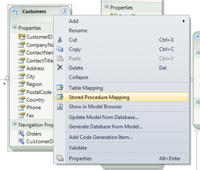
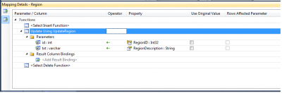
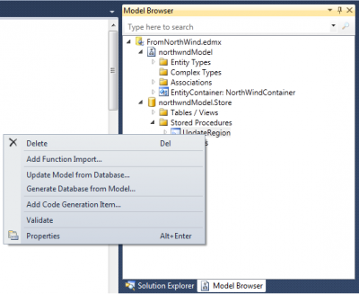
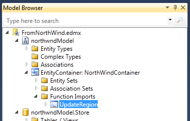

Sometime logic are stored in a stored procedure and is still required to call it instead of using the normal entity framework way to update, delete or save. Fortunately, the entity framework let you change the basic behavior of the auto generated sql for those operations by Sql Stored Procedure call.

An other scenario is that you may want to simply call a stored procedure without having to map them to a specific entity. This can called function import. This can return almost anything from the scalar, to a collection or a complex type. Even a call to a void stored procedure is possible.

## Mapping Insert, Update, Delete

Let's start with the mapping of the 3 basic Sql functions. The first thing to do is to go to the visual designer and right click on the entity you want to map the sql queries.



This will popup the "Mapping Details". From there, it will be possible to select a function for each functions. If nothing is present in the dropdown, you'll need to add the stored procedure to the entity model. To do, right click on the model, select to generate the model from the database and select under Stored Procedure the desired one. After, come back to the mapping details.

To test, lets use the Microsoft Northwind database and add inside the Sql server manager this new stored procedure:


```sql


CREATE PROCEDURE UpdateRegion ( @id INT ,@txt VARCHAR(50) ) AS BEGIN UPDATE region SET RegionDescription = @txt WHERE RegionID = @id END 
```


After, lets add it into the entity model and map the stored procedure to the update function of the region table.



Also, you do not need to modify all of the 3 functions, only those you want.

To see the difference. Lets try to change the region without the stored procedure mapped and with to see how the generated SQL change.


```csharp
 var db = new NorthWindContainer(); var region = db.Region.First(); Console.WriteLine("The first region description is : " + region.RegionDescription); region.RegionDescription = "Est"; db.SaveChanges(); region = db.Region.First(); Console.WriteLine("The first region description is : " + region.RegionDescription); Console.ReadLine(); 
```

This produce without the stored procedure mapped:


```sql
 exec sp_executesql N'update [dbo].[Region] set [RegionDescription] = @0 where ([RegionID] = @1) ',N'@0 nchar(50),@1 int',@0=N'Est',@1=1 
```


And with:


```sql
 exec [dbo].[UpdateRegion] @id=1,@txt='Est' 
```


Before going to the next part of this post, in the mapping details theirs 2 columns that we have not talk yet. The first one is "Use Original Value" and the second one is "Rows Affected Parameter". The original value is a boolean that is to false by default. If you change it to true, this will pass to the database the original loaded value of the entity. This can be used in situation where multiple concurrences could have changed the value and you want the original one. The second columns is the "Rows Affected Parameter". This one can be used if you have an integer parameter with an output specification in the stored procedure that will return the number of rows that has been changed. In the example above, that would be the value 1 that would have been passed if we had changed the stored procedure to have an additional parameter of type Int ( @paramReturnValue integer OUTPUT).

## Executing a function in Sql Server with Entity Framework

The second way to use stored procedure is to call the stored procedure from the object context. To create the mapping, this time, it requires to go in the Model Browser and to open the Stored Procedure folder. From there, the context menu of the right click let you select the desired stored procedure.



Once added, the stored procedure is set under the Function Imports of the Entity Framework Model.



When it's added, you can do the call by using directly the object context followed by the name of the function. At anytime you can change the name of it by going in the Model Browser and going in the property of the function.


```csharp
 db.UpdateRegion(1, "Estern!"); 
```

If the stored procedure return a complex entity, the wizard will let you create the complex entity and you will be able to use it from the code. If it's a scalar, the wizard will let you select the good one and you will be able to use it.
