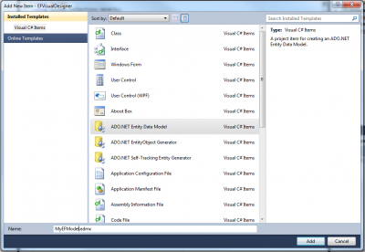
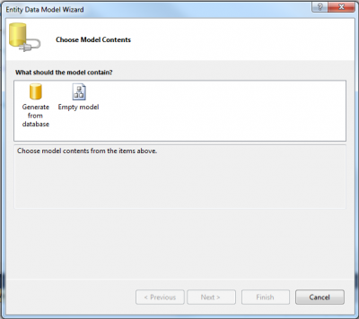
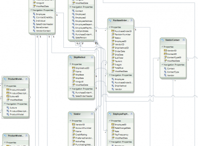
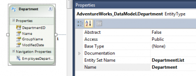
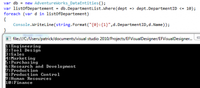

The visual designer is inside Visual Studio. It's a tool that let you change the Data Model visually. To be able to take a tour of the it, lets create a new Console Project and add a new Entity Framework Data Model.

Once the Console project is created, add a new item to the project.



From there, the second wizard step will be to select what the model will contain. We can start from a blank model or from a database. Because we want to see some functionality of the Visual Designer, let select to load the Entity Model from an existing database. For this example, I will select the [Microsoft's AdventureWorks 2008R2 SR1 database](http://msftdbprodsamples.codeplex.com).



For the purpose of this exercise, when the Wizard will ask you which table you desire to import into your Entity Model file, select them all. For the moment, lets just add tables and not Views or Stored Procedures. After that you will see a file in your project called "MyEFModel.edmx". This file if you double click on it will opens the Visual Designer.



When the Visual Designer is open, it's important to have the Properties windows (`View>Properties Window / F4`).

## Entity Properties

Lets see available properties of an Entity. To see them, click on an Entity from the Visual Designer. You should see some properties like the screenshot below.



The two most important properties are the Name and the Entity Set Name. The name represent the Entity single unit. It's usually the table name. For the Department, the name is Department. So data that come from this Entity will be `Departement`. If a list of department is required it will be an `IEnumerable<Department\>`. The Entity Set Name is the identified inside the Object Context to retrieve department. A metaphor could be with a bag of item. The bag name is the Entity Set Name and items inside that bag are the Name. So, if I want to have the 10 department with an unique identifier under 10, I will need to go in the bag called "DepartmentList" to get a collection of "Department". By the way, the DepartmentList name is a modification of mine. Initially, the Entity Set Name was the same as the name : department.



The second line that has a variable named `listOfDepartment` is in fact a `IQueryable` collection where the `T` is `Department` (the Name of the Entity).

```csharp
var db = new AdventureWorks_DataEntities(); 
var listOfDepartment = db.DepartmentList.Where(dept => dept.DepartmentID <= 10); 
foreach (var d in listOfDepartment) { 
  Console.WriteLine(string.Format("{0}:{1}",d.DepartmentID,d.Name)); 
} 
```

The line #2 could have been:

```csharp
var db = new AdventureWorks_DataEntities(); 
IQueryable listOfDepartement = db.DepartmentList.Where(dept => dept.DepartmentID <= 10); 
foreach (var d in listOfDepartement) { 
  Console.WriteLine(string.Format("{0}:{1}",d.DepartmentID,d.Name));
} 
```

## Entity Attributes Properties

It's also possible to set properties on attribute. When the model is generated from the database, all the hard work is already done. When you do it the other way, by creating the model objects first, you will need to create those attributes by hand and will be converted into table columns. Depending of the type of the attribute, property options will vary.

If the attribute is the **Entity Key**, this one will have special option like StoreGeneratedPattern.

If the attribute is a relationship attribute, called **Navigation Property** other properties like the association is required. Furthermore, the association's multiplicity is set within this attribute.

An other type of attribute is a simple value. The Value Designer call them Scalar property. This kind of entity attribute contain value that will be later be a simple column without any key.

The last kind of attribute that an entity can have is Complexe Property. Complexe Property is a way to organize multiple attribute together. In fact, behind, it's like having multiple attribute but from the object perspective, it will be inside a sub-object.

## Association Properties

Association attribute contain the multiplicity of each endpoint, it contains also if cascade delete is required and so on.

This is for a small wrap-up of the Visual Designer of Entity Framework 4.0.
