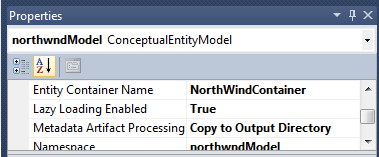
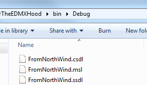

Entity Framework is built around 3 XML files. The CSDL, SSDL, and MSL.

The CSDL acronym is for "Conceptual schema definition language". This file describe the model object.

The SSDL acronym is for "Store schema definition language" and define the storage model.

The MSL acronym is for "Mapping specification language" and do the bridge between the CSDL and SSDL or in other words map the model and the storage.

Theses files are handled by Entity Framework and for most of the time won't be required to be edited by hand. Visual Studio 2010 has a create Visual Designer that let the developer go through a graphical user interface to create the model, to edit it and also to map everything.

Nevertheless, it's always good good to know what's going on under the hood. To get those 3 files, the project with the entity model must have been compiled with the option to display the meta data of the conceptual model into the Bin folder. By default, all these 3 meta data files are embedded in the assembly. To change the embedded to an external output, you need to open the Visual Designer of the Entity model. Click anywhere in a blank spot (not an entity or an association) and open the property windows. One property of the ConceptualEntityModel is called "Metadata Artifact Processing" and by default is set to "Embed in Output Assembly". You need to change this to "Copy to Output Directory".

This will output the CSDL, SSDL and MSL files in the bin folder.

For more information about the CSDL, SSDL and MSL XML files, wait few days :)
