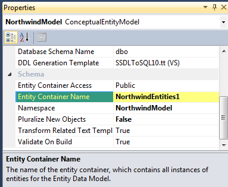

Entity SQL Query (ESQL) is not like Linq to Entity. The latest use the Linq query while the first one do not. However, they serve the same purpose and they are both in the Entity Framework.

ESQL looks more like SQL query. Even if ESQL is not SQL, it will let developer use SQL query to the database. So, they are 2 ways to use ESQL : using _EntityCommand_ or using the generic _ObjectQuery_ class.

The first thing to do is to create a EDMX file like we would do with Linq to Entity. The generated connection string that it will provides in the web.config (or app.config) will be used after that with the **EntityConnection**. For that, you will need to use the _System.Data.EntityClient_ namespace (Add System.Data.Entity).

The connection string will look like this: 
```xml
<add name="NorthwindEntities1" connectionString="metadata=res://*/NorthwindModel.csdl|res://*/NorthwindModel.ssdl|res://*/NorthwindModel.msl;provider=System.Data.SqlClient;provider connection string=&quot;Data Source=PATRICK-PC\\SQLEXPRESS;Initial Catalog=Northwind;Integrated Security=True;MultipleActiveResultSets=True&quot;" 
 providerName="System.Data.EntityClient" />
</connectionStrings> 
```


You need to have this syntax with the metadata and provider connection. Traditional ADO.NET connection string won't work.

To try your connection string for ESQL you can use this kind of code:


```csharp
string connectionString = ConfigurationManager.ConnectionStrings["NorthwindEntities1"].ConnectionString; 
using (EntityConnection conn = new EntityConnection(connectionString)) { 
  conn.Open(); 
  System.Diagnostics.Debug.WriteLine("Connected"); 
  conn.Close(); 
} 
```

In the code above, we can see the use of `EntityConnection`. This derive from `DbConnection` like `SqlConnection` do it with ADO.NET. It will also use a `EntityCommand` that also inherit from an ADO.NET object, the `DbCommand`.

ESQL is more error prone than Linq to Entity because the query is in a string. You do not have Intellisense, neither the compiler to tell you that you have error. Here is an example of showing with ESQL all regions of the Northwind database.


```csharp
 string connectionString = ConfigurationManager.ConnectionStrings["NorthwindEntities1"].ConnectionString; 
 using (EntityConnection conn = new EntityConnection(connectionString)) { 
  conn.Open(); 
  string sqlQuery = @"SELECT reg.RegionId , reg.RegionDescription FROM NorthwindEntities1.Region as reg"; 
  using (EntityCommand command = new EntityCommand(sqlQuery, conn)) { 
    var reader = command.ExecuteReader(System.Data.CommandBehavior.SequentialAccess); 
    while (reader.Read()) { 
      System.Diagnostics.Debug.WriteLine(reader["RegionId"] + " : " + reader["RegionDescription"]); 
    } 
  } 
  conn.Close(); 
} 
```

This code use an `EntityDataReader` that derive from `DbDataReader`. Like its inherited class, it can only be used to read forward. The major change is in the sqlQuery variable. As you can see, it does not do it's query against the table but against the Entity Model. You have to use the Entity Container Name.



Also, in `SELECT`, it's not the name of the column of the table that you have to use but the name of the property of the entity. So, people with a SQL background may feel comfortable with the syntax.

## Object Context

The previous section show that ESQL let you have a very tight control over the query by using a SQL type of statement. But, on the other hand, it's not very interesting because we could just use ADO.NET object to almost do the same. Wherefore, that is why ESQL has more under the hood.

ESQL can use Object Context to retrieve Entity Object without having to build them like with the ADO.NET. This start to be interesting. Let check an example.

```csharp
using System.Data.Objects; //... string 
connectionString = ConfigurationManager.ConnectionStrings["NorthwindEntities1"].ConnectionString; 
using (EntityConnection conn = new EntityConnection(connectionString)) { 
  using (ObjectContext objectContext = new ObjectContext(connectionString)) { 
    objectContext.Connection.Open();
    string sqlQuery = @"SELECT reg.RegionId , reg.RegionDescription FROM NorthwindEntities1.Region as reg"; 
    var allRegions = new ObjectQuery<DbDataRecord>(sqlQuery, objectContext).ToList(); 
    foreach (var region in allRegions) { 
      System.Diagnostics.Debug.WriteLine(region.GetInt32(0) + " : " + region.GetString(1)); 
    } 
    objectContext.Connection.Close(); 
  } 
} 
```

The line 12 and line 15 contains new code. The line 12 execute the query and return a `DbDataRecord`. A `DbDataRecord` inherits `IDataRecord` and can only access elements by index. This is not very convenient and from my personal perspective does not give an interesting way to get data from the database. However, some extension let you handle ObjectQuery easier but at the end you will still need to non typed object.
