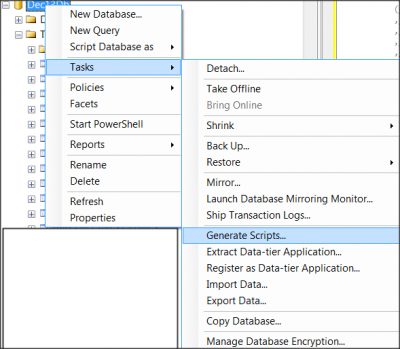
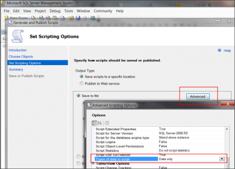

Some time it can be useful to dump all data of a table in the format of SQL insert statement.

This can be done easily with _Microsoft SQL Management Studio_. The first step is to right click on the database and select the option `Task>Generate Script`. This will popup a wizard window.

The last step is to select that we desire only the data.

This will produce all SQL's insert statement with your data.
