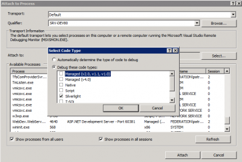
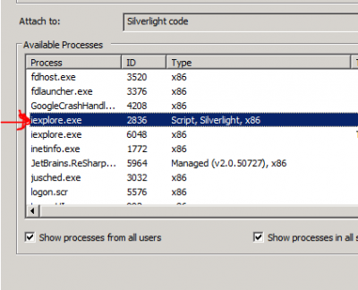

Sometime, when the application is deployed to IIS server you may still need to do some debugging. Debugging a Silverlight application is in fact very easy, and pretty much the same when you are working inside Visual Studio but change when you need to debug it on the server.

The first step is to be sure that you .xap file deployed on IIS is the same as the one that you have in your developer environment. This can be automated when a Post-Build condition like this:

``` 
 copy $(TargetDir)YOURxapFILEname.xap c:\\wwwroot\\mywebsite\\ClientBin\\YOURxapFILEname.xap 
``` 

The second step is to go in _Debug_ menu of Visual Studio and choose _Attach To Process_. This is a step that you would have to do to debug ASP pages. But, this will require a modification. When debugging .Net code, you usually set your debugging type to Managed. In the case of Silverlight, you must select _Silverlight_. This will automatically popup you a message saying that you cannot continue to debug in Managed. Just accept.

[caption id="attachment\_468" align="aligncenter" width="400" caption="The debugging type must be Silverlight"]

The third step is to attach to the process. This also require a modification. When debugging a ASP page you usually select W3WP.exe (the IIS application pool). This time, you need to attack to your browser. This can be Internet Explorer, Firefox or Chrome. The reason is that Silverlight is not server side but client side.

[caption id="attachment\_469" align="aligncenter" width="400" caption="You must attach to the browser, not IIS"]

From there you just need to refresh your page and the breakpoint you have set will be trig once reached.
