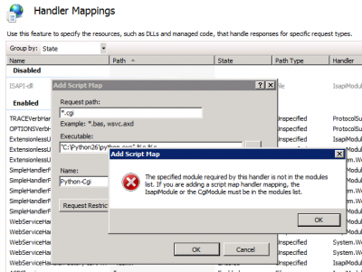
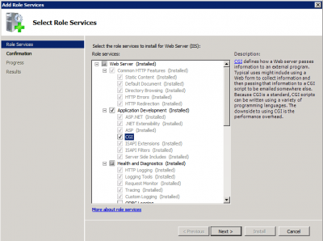

I had to install Mercurial Server on IIS 7 recently. One of the prerequirement is to have Python installing on IIS has a CGI extension.

For this, you need to add an handler on IIS to map .cgi to Python. Unfortunately, this operation is not straight forward. If you try to add the Handlers Mapping for CGI you will get this error message.

[caption id="attachment\_503" align="aligncenter" width="400" caption="Add Script Map error"]

> The specified module required by this handler is not in the modules list. If you are adding a script map handler mapping, the IsapiModule or the CgiModule must be in the modules list.

To fix that, you need to open the **Server Manager** (%SystemRoot%\\system32\\CompMgmtLauncher.exe) and go to **Roles** and **Web Server (IIS)**. From here you may have to wait few minutes and you will be able to add the Cgi extension.

[caption id="attachment\_504" align="aligncenter" width="400" caption="Add Cgi extension to IIS server"]

Then, the last step is to Install. This also takes few minutes. Once done, restart IIS and you will be able to add the Http Handler for Python (or what ever CGI you need).
