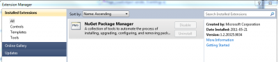
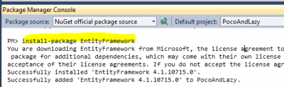
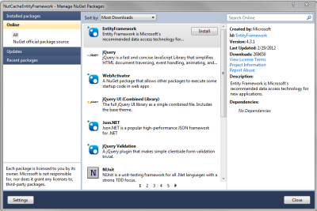
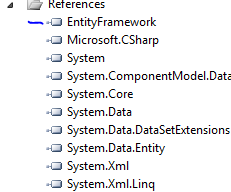

You need to open the solution where you want to have the latest version of EF. If you are running under .Net 3.5, big chance that you are running on the version 1. If you are running on .Net 4.0 you should be on the EF version 4. The 4.1 require to do some manual change.

First, be sure you have the NuGet extension.

Second, open the console of NuGet and type : install-package EntityFramework. To open the console you need to go to View > Other Windows > Package Manager Console.

EntityFramework 4.1 will be installed on the solution that is active.

You can also use the NuGet Package Manager which give you a visual interface to download Entity Framework. This is located in Project > Manage NuGet Package.

Once done, your project will now have a reference to the DLL of Entity Framework. 
