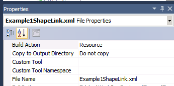

Sometime it can be useful to get a file that is a resource into the application. For example, using an XML file as resource for testing purpose instead of having them outside the application.

## File Property

The first step is to get the file into the project and mark the Build In Action to resource in the property of the file.



## Application.GetResourceStream Methods

After, the only code required will be to read this resource from your C# code. To extract the content of this resource you need to use the _GetResourceStream_ method of the _System.Windows.Application_. Don't worry if you are a Silverlight user, you still have access to this namespace. This method take a URI as parameter. This is where it can be tricky. First, you need to use a syntax that will define the namespace and then a relative path to the file.

Let say that my project name is Project1 and the file is in Folder1/Folder2. The file name is Test.xml. You have a URI that would look like this.


```csharp
 ... = new Uri("Project1;component/Folder1/Folder2/Test.xml", UriKind.Relative) 
```

Has you can see, the path needs to have the "component" before all directories.

## Example of using XML with file resource

So, if you want to load a text file you will need to write:


```csharp
 //... StreamResourceInfo sr1 = Application.GetResourceStream(new Uri("Project1;component/Folder1/Folder2/Test.xml", UriKind.Relative)); var file = new StreamReader(sr1.Stream); return file.ReadToEnd(); 
```
