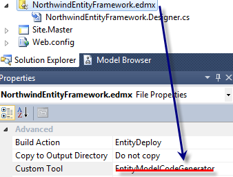
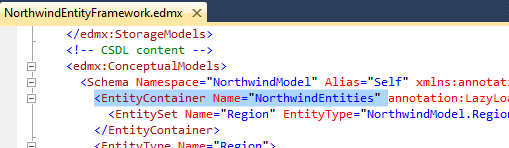

I have put in the title Entity Framework 4 because since version 4 it has a great new addition. This new feature is that POCO object does not require to use any interface inheritance. Also, no meta attribute is required to be added to your classes. So, how does the entities map to your Poco classes? Well, the mapping is done with the name of the entity and the class. These two must be the same. If you have a classe named "Region" than you need an entity name "Region". So, this mean that you still need to have a conceptual model with a .edmx file. Also, you do not want the entity model to create the classes since you already have them. To do, you need to clear in the entity file (.edmx) the Custom Tool property. As said previously, the mapping is done with the name. In the case you have in your project 2 classes with the same name but with a different namespace, this will confuse the mapper and an exception will be thrown. It's a good practice to put all your poco classes in the same project with the Entity Framework file.

# Example

Create a new project and add a new Entity Framework Model file. You could choose to create your entities manually, but to be faster, let create them from the database. Lets just select the Region table. Do not forget to go in the entity framework's model properties to remove the Custom Tool.



By turning this off, no classes generation will be done.

The last step is to create the Object Context. This is required because we have removed previously the generation of it. To do, you need to create a new class that inherit the base class `ObjectContext`. Don't forget to add `using System.Data.Objects;` at the top of the file to be able to see `ObjectContext`.

So, here is the code.

Region class:

```csharp
public class Region { 
   public Int32 RegionID { get; set; } 
   public string RegionDescription { get; set; } 
} 
```

The Object Context class:


```csharp
public class NorthwindObjectContext:ObjectContext { 
  private ObjectSet<Region>_Region;

  public NorthwindObjectContext() : base("name=NorthwindEntities", "NorthwindEntities") { 
    this.ContextOptions.LazyLoadingEnabled = true; 
  }

  public ObjectSet<Region> Regions { 
    get { 
      if ((_Region == null)) {
        _Region = base.CreateObjectSet<Region>("Region"); 
      } 
      return_Region; 
    } 
  } 
} 
```

Finally, to test, I added a page with a paragraph and showed the first region description:


```csharp
NorthwindObjectContext db = new NorthwindObjectContext(); 
TextBlock.InnerText = db.Regions.Where(region => region.RegionID == 1).FirstOrDefault().RegionDescription; 
```

They are two errors that can appear to you if you try this code :

> Mapping and metadata information could not be found for EntityType

This message indicates that you have not removed the Custom Tool of the entity framework model properties.

> The specified default EntityContainer name 'NorthwindEntities1' could not be found in the mapping and metadata information. Parameter name: defaultContainerName

This mean the the container name is not the name of container generated by the entity model. If your model is from the database, it should be the same as the connection string name. If you want to know exactly where is the container name, you need to go in the csdl file. This is inside the entity model. To see, open the .edmx file with a XML editor and go to the CSDL section. You will see a EntityContainer element.



They are two others details that you must know when using POCO object with Entity Framework and it's concerning complex object. As you know, complex objects are in fact object inside object instead of CLR type. Those complex object must be build as class and not struct. Also, you cannot use inheritance with complex type. For example, if your Company class contain a list of Employee you cannot have the Employee derive from Person.

From here you should be all good to use Entity Framework and Poco object.
