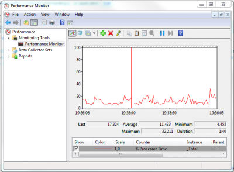
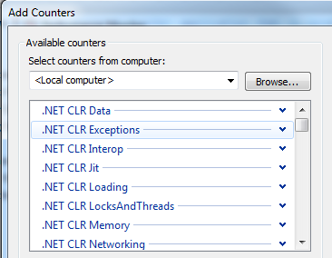

Microsoft Windows has a Performance Counter application that is located in the Administrator Folder.

[caption id="attachment\_446" align="aligncenter" width="400" caption="Performance Counter"]

Go to Control Panel\\All Control Panel Items\\Administrative Tools\\ and select _Performance Monitor_. This will open a window with by default the processor performance. What is interesting is that you can see a lot of already coded performance counter by right clicking the list of counter and select _Add Counters..._ or to press the button with the "+" icon.

[caption id="attachment\_447" align="aligncenter" width="366" caption="Some already available .Net counters"]

What is interesting is that you can create your own inside your application and be able to visualize the result within this Performance Counter.

What you need is the _System.Diagnostics_ namespace. From there you can verify if the counter you want to create exist with the static method 'PerformanceCounterCategory.Exists'.

To create your counter, you need 'PerformanceCounterCategory.Create'. 
```csharp
 PerformanceCounterCategory.Create("CategoryName", "CategoryHelpText", PerformanceCounterCategoryType.SingleInstance, "CounterNameInsideTheCategory", "CounterHelpText."); 
```

This code must only executed when a verification is made with the Exists method of PerformanceCounterCategory because an exception will be throw.

When you are ready to use the counter you need to use the method Increment or IncrementBy. The first one will increment by one and the other one with the value passed in a parameter. If it requires to decrease, you will need to pass a negative value.


```csharp
 var pc = new PerformanceCounter("CategoryName", "CounterNameInsideTheCategory", false); pc.IncrementBy(10); 
```
