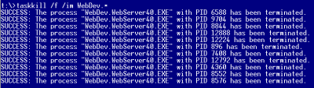

When developing with Visual Studio, when you attach to the process or use the inner server (Cassini) a new process is launched. This one doesn't always stop when you stop debugging. You can have a list of process that is running and sometime this can cause problem when debugging because you are not accessing the right one.

To close those server, you can check in the task bar, at the right side, in the tray, and you will notice a little icon with a paper and a mechanism wheel. This is what you need to kill. You can right click and closing. The problem is that if you forget to do it every time, after some time you will have a lot of them.

To be quick, you can use a command line that will close them all for you.

```sh
taskkill /f /im WebDev.* 
``` 



This command line give to the Windows the right to kill a process by forcing it (`/f`) to close all process name (`/im`) that start with WebDev.
