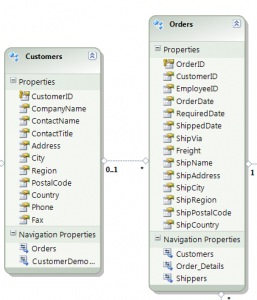
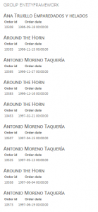
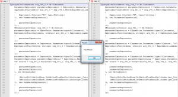

Linq let you query a collection and one of its possible action is the GroupJoin.

A GroupJoin is in SQL what we call a "Left Outer JOIN" while a Join in SQL refer to "Inner Join". In short, a GroupJoin will do a link between 2 entities even if the right side of the link has nothing to link to. In contrast, the Join will link 2 entities only if both entities contain a link between them.

To demonstrate the GroupJoin and the Join, a small example with Northwind Database will be used. This database schema and data is free at [Microsoft](http://www.microsoft.com/download/en/details.aspx?id=23654 "Microsoft's Northwind database"). Once downloaded, this will create a SQL file that require to be executed. Once executed, you will see multiples tables. For our example, only the table Customers and Orders will be used.



The Customers can contain multiple Orders. The Order contain a link to the Customer.

We could have been used any type of project, but to be short I have used a ASP.NET Webform and have created a ASPX page with the containing HTML:


```csharp
</pre> <h1>Group EntityFramework</h1> <pre> 
```

On the code-behind the code is executed:


```csharp


NorthwindEntities db = new NorthwindEntities();

var source = db.Customers.Where(c => c.CustomerID.StartsWith("A"))

.GroupJoin(db.Orders, c => c.CustomerID, o => o.CustomerID, (c, o)

\=> new { Customer = c, Order = o });

string html = string.Empty;

foreach(var cust in source)

{

html+="</pre> <h2>"+cust.Customer.CompanyName+"</h2> "; html+=""; foreach (var order in cust.Order) { html+=""; } html += " <table> <tbody> <tr> <th>Order id</th> <th>Order date</th> </tr> <tr> <td>" + order.OrderID + "</td> <td>"+order.OrderDate+"</td> </tr> </tbody> </table> <pre>";

}

this.groupEF.Controls.Add(new LiteralControl(html));

sqlGroupef.Text = (source as ObjectQuery).ToTraceString();


```

Alright, so the LINQ query select all client that start with the letter A to filter a little bit the amount of returning data and then join to this result all orders. The second parameter of the GroupJoin is the "On" statement that we use to see in SQL. It tells how to join the two entities. Once it's done, the code within the foreach statement loop all customers and the inner foreach loop and order.

The output look like this:



This is generated with almost the same code as before but instead of using GroupJoin only the Join is used. Also, since no grouping is done, the second foreach is not needed.

```csharp
NorthwindEntities db = new NorthwindEntities(); var source = db.Customers.Where(c => c.CustomerID.StartsWith("A")) .Join(db.Orders, c => c.CustomerID, o => o.CustomerID, (c, o) => new { Customer = c, Order = o }); string html = string.Empty; foreach(var cust in source) { html+="</pre> <h2>"+cust.Customer.CompanyName+"</h2> "; html+=""; html+=""; html+=" <table> <tbody> <tr> <th>Order id</th> <th>Order date</th> </tr> <tr> <td>" + cust.Order.OrderID + "</td> <td>"+ cust.Order.OrderDate+"</td> </tr> </tbody> </table> <pre> "; } this.groupEF.Controls.Add(new LiteralControl(html));

sqlGroupef.Text = (source as ObjectQuery).ToTraceString(); 
```

The output produce a cross join without any grouping. This is why we can see the Customer repeated in the output. If we want to group the result of the join without using GroupJoin it's possible. In fact, it's possible to create the same output with Join if using On statement and Equal the 2 entities together. Here is the change required :

```csharp
NorthwindEntities db = new NorthwindEntities(); var source = from c in db.Customers where c.CustomerID.StartsWith("A") join o in db.Orders on c.CustomerID equals o.CustomerID into g select new { Customer = c, Order = g }; string html = string.Empty; foreach(var cust in source) {

html+="</pre> <h2>"+cust.Customer.CompanyName+"</h2> "; html+=""; foreach (var order in cust.Order) { html+=""; } html += " <table> <tbody> <tr> <th>Order id</th> <th>Order date</th> </tr> <tr> <td>" + order.OrderID + "</td> <td>"+ order.OrderDate+"</td> </tr> </tbody> </table> <pre> ";

} this.groupEF.Controls.Add(new LiteralControl(html));

sqlGroupef.Text = (source as ObjectQuery).ToTraceString(); 
```

To be sure that what we state is real, let compare the generated MSIL for the two Linq. The first one is the GroupJoin and the second one is the Join with a On and Into.


```csharp
 var source = db.Customers.Where(c => c.CustomerID.StartsWith("A")) .GroupJoin(db.Orders, c => c.CustomerID, o => o.CustomerID, (c, o) => new { Customer = c, Order = o }); 
``` 
```csharp
 var source2 = from c in db.Customers where c.CustomerID.StartsWith("A") join o in db.Orders on c.CustomerID equals o.CustomerID into g select new { Customer = c, Order = g }; 
```

Both generate the exact same MSIL:


```csharp
 IQueryable arg_244_0 = db.Customers; ParameterExpression parameterExpression = Expression.Parameter(typeof(Customers), "c"); IQueryable arg_381_0 = arg_244_0.Where(Expression.Lambda>(Expression.Call(Expression.Property(parameterExpression, (MethodInfo)MethodBase.GetMethodFromHandle(ldtoken(get_CustomerID()))), (MethodInfo)MethodBase.GetMethodFromHandle(ldtoken(StartsWith())), new Expression[] { Expression.Constant("A", typeof(string)) }), new ParameterExpression[] { parameterExpression })); IEnumerable arg_381_1 = db.Orders; parameterExpression = Expression.Parameter(typeof(Customers), "c"); Expression> arg_381_2 = Expression.Lambda>(Expression.Property(parameterExpression, (MethodInfo)MethodBase.GetMethodFromHandle(ldtoken(get_CustomerID()))), new ParameterExpression[] { parameterExpression }); parameterExpression = Expression.Parameter(typeof(Orders), "o"); Expression> arg_381_3 = Expression.Lambda>(Expression.Property(parameterExpression, (MethodInfo)MethodBase.GetMethodFromHandle(ldtoken(get_CustomerID()))), new ParameterExpression[] { parameterExpression }); parameterExpression = Expression.Parameter(typeof(Customers), "c"); ParameterExpression parameterExpression2 = Expression.Parameter(typeof(IEnumerable), "o"); var source = arg_381_0.GroupJoin(arg_381_1, arg_381_2, arg_381_3, Expression.Lambda(Expression.New((ConstructorInfo)MethodBase.GetMethodFromHandle(ldtoken(.ctor()), typeof(<>f__AnonymousType0>).TypeHandle), new Expression[] { parameterExpression, parameterExpression2 }, new MethodInfo[] { (MethodInfo)MethodBase.GetMethodFromHandle(ldtoken(get_Customer()), typeof(<>f__AnonymousType0>).TypeHandle), (MethodInfo)MethodBase.GetMethodFromHandle(ldtoken(get_Order()), typeof(<>f__AnonymousType0>).TypeHandle) }), new ParameterExpression[] { parameterExpression, parameterExpression2 })); 
```

The file compare result show exact same code:



To conclude, the GroupJoin is a short lamba version of the Join statement with the On and Into. It's possible to do a simple Join with only Join statement. Linq let you do other type of Join like Cross Join.
