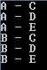

It's possible to perform a Cross Join with Linq. A Cross Join is a Cartesian product. It means that if between 2 sets of value all value will join one time the other set.

For example:

If we have one set with the letter A and B, and a set with C, D, E than the result should be : A-C, A-D, A-E, B-C, B-D, B-E. Let do it in code.


```csharp
 var x = new string[] { "A", "B" }; var y = new string[] { "C", "D", "E" }; var cross = from x1 in x from y1 in y select new {x1,y1}; foreach (var output in cross) { Console.WriteLine(string.Format("{0} - {1}",output.x1, output.y1)); } Console.Read(); 
```

This console application output: 

To conclude, cross join are pretty straight forward with Linq. This example was done with Linq to Object but can be also be done with Linq to Sql query.
