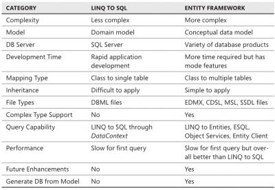

I have seen in many website the differences between Linq to Sql and Entity Framework but the most effective summary I saw is from the book "MCTS Self Paced Traning Kit Exam 70-516". Here is the table without their explication.

[caption id="attachment\_173" align="aligncenter" width="400" caption="Difference between Linq to Sql and EntityFramework comparison table"]
