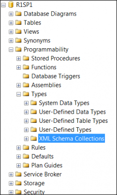

Sometime, Xml can be stored in column of a table. I personally try to avoid, especially when it has XSD (Xml Schema Definition) that will be validate in the database side instead of the code side. Even more when I'll need to get specific data into it later on in a query. Still, sometime, you have no choice because the system has been built this way.

I had a problem in an ASP.NET project which doesn't allow a XML to save. After a while, I realized that the database contained a XML Schema Collections. This is located when you open the Microsoft Sql Server Management Studio under the database, into the Programmability folder, under Types and XML Schema Collection.



The problem is when trying to altering this schema you will get an error message.

> Altering existing schema components is not allowed. There was an attempt to modify an existing XML Schema component, component namespace

To fix this, you will need to change the column type to remove the XSD validation. After, you will need to drop the validation and create a new one to finally apply again the new validation.


```sql


ALTER TABLE my_table ALTER COLUMN xml_column XML

DROP XML SCHEMA COLLECTION xml_collection

CREATE XML SCHEMA COLLECTION xml_collection AS 'YOU XSD HERE'

ALTER TABLE my_table ALTER COLUMN xml_column XML(xml_collection)


```

