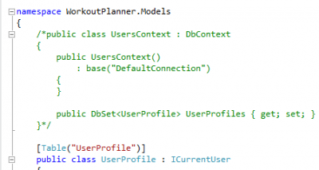
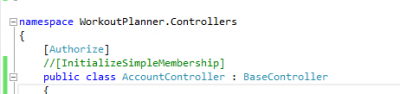
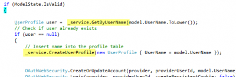
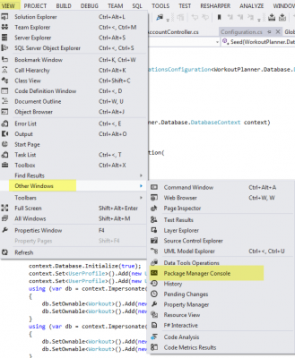

MVC4 doesn't use the same tables and infrastructure of MemberShip that Asp.Net or Asp.NET MVC3 used. You can see that just by creating a new MVC4 projet. You will notice that inside the **Model** folder that you have a class "AccountModel.cs". Also, inside the AccountController.cs you will see the use of WebSecurity that come from **WebMatrix** namespace.

The default configuration ain't a problem until you want to remove the DbContext from the Model folder (which shouldn't be there but inside the DAL layer). Also, it's ain't a problem until you you like to auto generate the table inside the database with some data into it. Creating a user is pretty easy with WebSecurity but it's not when you try to seed the database with it. In fact, you will get error message saying that WebSecurity need to be initialized before use and if you initialize it, the database might not be created by Entity Framework and then it crashes.

The solution is to use the Package Manager Console and to generate the database with some commands line. This processes is called "Migration".

## Removing default code

The first step is to clean up some code that doesn't have its place. The first code to delete is inside `AccountModels.cs` inside the `Models` folder. You will see at the top of the file a class called _UsersContext_. This need to be removed.



The second code that need to be deleted is the filter `InitializeSimpleMembershipAttribute`. This filter create the tables for MemberShip if not created. Since we do not want to create on the fly but when the application start (or with commands line) we can delete this filter. It's a good idea because it uses the UsersContext that we just deleted. This file is located inside the _Filters_ folder.

The third code to remove is the filter use that is above the `AccountController` class inside AccountController.cs file.



Of course, now you have to setup your DbContext to be able to do what UsersContext was doing. If you compile now, it won't compile because we have deleted the UsersContext. But, 2 lines of code is required inside AccountController.cs to be able to compile. The first one is to create in your DbContext a methbod to get the user by name and one to create a new user. Here is an example that use a "Service layer" to access the repository that will use a DbContext later.



## Configure Entity Framework Migration

The next step is to make sure the the web.config contain the right provider for the role and membership. Inside web.config, in the system.web section be sure that you have the code below. If not, add it.

```xml
 <roleManager enabled="true" defaultProvider="SimpleRoleProvider">
  <providers>
    <clear/>
      <add name="SimpleRoleProvider" type="WebMatrix.WebData.SimpleRoleProvider, WebMatrix.WebData"/>
      </providers> </roleManager> <membership defaultProvider="SimpleMembershipProvider">
    <providers>
    <clear/>
    <add name="SimpleMembershipProvider" type="WebMatrix.WebData.SimpleMembershipProvider, WebMatrix.WebData"/>
  </providers>
 </membership>
```

This will specify that we are using the **SimpleRoleProvider** and the **SimpleMembershipProvider**. To be honest, I think with MVC4 it's the default configuration so you do not required to do this but [this website](http://blog.longle.net/2012/09/25/seeding-users-and-roles-with-mvc4-simplemembershipprovider-simpleroleprovider-ef5-codefirst-and-custom-user-properties/) suggest to have it.

Once done, you need to build the Migration Configuration. This is automatically done if you are using the **Package Manager Console**. This tool can be open by going inside VIEW>Other Windows>Package Manager Console.



The next step is to use this command below that will force the creation of the configuration file. This will be required only once. Do not forget to use `EnableAutomaticMigration`. This will let you update the database later accordingly to changes you made to your model and entity configuration. ```
Enable-Migrations –EnableAutomaticMigrations -Force

````

Since we have removed the _UsersContext_ we won't have any conflict doing the command above. Otherwise, we would have need to specify which DbContext we want the migration to occur. Also, if you already had a database initializer (IDatabaseInitializer) like a `DropCreateDatabaseIfModelChanges`, this won't work with the `DbMigrationsConfiguration`. 
In fact, you need to remove any initializer because we are switching to the Migration configuration. Nevertheless, this will give us additionnal control, more manual control but at least the possibility to generate the database automatically and also seed the database with Membership and custom tables.

The command creates a folder called _Migrations_ with a _Configuration.cs_. Inside the Seed method, you will be able to create all data you want inside the database. Here is a small snippet of code that create a role, a user and some entities.


```csharp
 internal sealed class Configuration : DbMigrationsConfiguration<WorkoutPlanner.Database.DatabaseContext> { 
   public Configuration() { AutomaticMigrationsEnabled = true; }

protected override void Seed(WorkoutPlanner.Database.DatabaseContext context) { 
  base.Seed(context);

  WebSecurity.InitializeDatabaseConnection( "DefaultConnection", "UserProfile", "UserId", "UserName", autoCreateTables: true);

  if (!Roles.RoleExists("Administrator")) 
  Roles.CreateRole("Administrator");

  if (!WebSecurity.UserExists("123123")) 
  WebSecurity.CreateUserAndAccount("123123", "123123");

  if (!((IList<string>)Roles.GetRolesForUser("123123")).Contains("Administrator")) 
    Roles.AddUsersToRoles(new[] { "123123" }, new[] { "Administrator" });

  context.Database.Initialize(true); 
  context.Set<UserProfile>().Add(new UserProfile { UserId = 1, UserName = "123123" }); 
  context.Set<Workout>().Add(new Workout { Id = 1, Name = "My First workout user1", StartTime = DateTime.Now.Add(TimeSpan.FromDays(-10)), Goal = "Increase body mass" }); 
  context.Set<Workout>().Add(new Workout { Id = 2, Name = "My Second workout user1", StartTime = DateTime.Now, Goal = "Increase chest muscle, lower fat around abs" }); 
  } 
}
```

The last step is to create table schema and insert those values from the seed configuration. This is done by this command : 

```
update-database -verbose -force
```

The verbose will show you the SQL statement executed and the force will regenerate the table even if data already exist in those tables.

## Conclusion

Any time you change your model or the configuration of your entities, you need to run _update-database_ command. This will drop tables, create them again, create FK and insert seed data.

