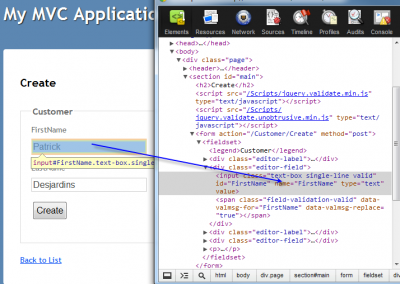

ASP.Net MVC Model Binding is one of the powerful "in-the-box" feature s that make the life of developer easy.

The primary goal is to let you get information from the http request without having to map manually all string to your objects. This can be the case of any http request type like POST after a form is submitted or a GET where information are requested. In fact, it will get query string with many values or values in JSON format and take the information to instantiate the object specified with the good values. Of course, this is possible only if some convention are followed.

# Without Model Binding

Without model binding the code of loading an object from an html form would look like the following code:

```csharp
 public ActionResult Create() {
   var product = new User() {
    BirthDay = DateTime.Parse(Request["birthdate"]),
    UserId= Int32.Parse(Request["userid"]), Name = Request["name"]
   };
}
```

As you can see, we directly go to the Http Request to get every parameters that correspond to the name of the input of the html form.

# Binding simple value with Model Binding

With Asp.Net MVC you can let the model binding automatically parse every parameters to the parameter type specified in the signature of the method. For example, if you have a method with 2 parameters, one is an integer and one a string, if the method (which is called "action" in the MVC world) detect a request parameter name that fit with the action parameter name, it will get by reflection the time required and will automatically parse it. If the parameter is not provided, the null value is used or the default value if one is provided. The code above will now look like this:

```csharp
public ActionResult Create(DateTime birthdate, int userid, string name) {
  var product = new User() {
    BirthDay = birthdate,
    UserId= userid,
    Name = name
  };
}
```

This is not bad! In fact, the MVC model binding can do even better which is to create the user object itself. This is called Binding Complex Object.

# Asp.Net MVC Binding Complex Object

Complex object will need to have scalar property that has the same name has the form inputs name and if the complex object contains more than only scalar object (like having sub object) will need to receive a JSON object. .Net will be able to transform this JSON object into C\# object if every json variable has its property call the same way. With the example that we use since the beginning, this mean that we could have :

```csharp
public ActionResult Create(User user) {
  //User user here
}
```

This is very strong isn't? The only think we require was to have the signature of the method with User and than, the view to have input names that is similar to the model' properties name. What is even more powerful is that if you use the framework to generate the form, let say to bind the model User to the Razor view, the name used will be automatically the property name. The reason is that the Razor view can use **Html extension** which will reflect the name when bound to property.

```csharp
 @Html.TextBoxFor(model=>model.userId);
```
Will generate something like:

```html
<input name="userId" value=""/>
```
When the user enter a value, let say for example 123, and submit the form, this will put in the http request, inside the http post data in the http header the value. The format look like this: `userId=123`. If you have many parameters, every will be seperated with the symbol an ampersand (`&`). Asp.net MVC will receive the information and will check the type of the parameter that is a User and check for all public property to find match. In our example, it will find the property userId. Since it's an integer time, it will try to parse and convert the string.

Note that you need to have an empty constructor to be able to let the model binding being able to instantiate the object.

If you ask yourself "what's about a wrong type value? how does it handle error?" Don't worry, you can check if the model binding had error. You can see this in a previous [post](./how-to-validate-model-object-with-asp-net-mvc-correctly).

# MVC Model Binding Example

Let image a really simple model object : Customer.
```csharp
public class BaseEntity { public int Id { get; set; } }
public class Customer:BaseEntity {
  public string FirstName { get; set; }
  public string LastName { get; set; }
}
````

To be able to create a new customer, the view create need to bind input fields to the name of the property.

```csharp
 @using (Html.BeginForm()) { @Html.ValidationSummary(true) <fieldset> <legend>Customer</legend>

<div class="editor-label"> @Html.LabelFor(model => model.FirstName) </div> <div class="editor-field"> @Html.EditorFor(model => model.FirstName) @Html.ValidationMessageFor(model => model.FirstName) </div>

<div class="editor-label"> @Html.LabelFor(model => model.LastName) </div> <div class="editor-field"> @Html.EditorFor(model => model.LastName) @Html.ValidationMessageFor(model => model.LastName) </div>

<p> <input type="submit" value="Create" /> </p> </fieldset> }
```

These Html helpers will create the Html with the good name to be able to read them back from the controller once posted (the create is a POST Http method).



When the user hit "Save" the server will receive `FirstName=Patrick&LastName=Desjardins`.

We can save the new customer :

```csharp
[HttpPost] public ActionResult Create(Customer customer) {
if (ModelState.IsValid) {
  db.Customers.Add(customer);
  db.SaveChanges();
  return RedirectToAction("Index");
}

ViewBag.Id = new SelectList(db.Licenses, "Id", "Name", customer.Id);
return View(customer); }
```

but we could have simply use:

```csharp
[HttpPost] public ActionResult Create(string firstName, string lastName) {
  var customer = new Customer { FirstName = firstName, LastName = lastName };
  if (ModelState.IsValid) {
  db.Customers.Add(customer);
  db.SaveChanges();
  return RedirectToAction("Index");
}

ViewBag.Id = new SelectList(db.Licenses, "Id", "Name", customer.Id);
return View(customer); }
```

or

```csharp
 [HttpPost]
 public ActionResult Create(FormCollection inputs) {
   var customer = new Customer {
     FirstName = inputs["FirstName"],
     LastName = inputs["LastName"]};
     if (ModelState.IsValid) {
       db.Customers.Add(customer);
       db.SaveChanges();
       return RedirectToAction("Index");
     }

  ViewBag.Id = new SelectList(db.Licenses, "Id", "Name", customer.Id);
  return View(customer);
}
```

All three ways are correct, but the first one use the power of MVC to automatically bind input values to the object.

## Complex object

Complex object are instanced classes that contain another object. Let say that we change the Customer class to have a 1 to 1 relation with the Avatar class.

```csharp
public class Customer:BaseEntity {
  public string FirstName { get; set; }
  public string LastName { get; set; }
  public Avatar Avatar { get; set; } 
}

public class Avatar : BaseEntity {
  public string Name { get; set; }
}
```

How can we modify the View to have a possibility to receive the Avatar name and to save it when the form is submit to the controller?

The only thing that need to be done is to modify the view.

```csharp
@using (Html.BeginForm()) { @Html.ValidationSummary(true) <fieldset> <legend>Customer</legend>

<div class="editor-label"> @Html.LabelFor(model => model.FirstName) </div> <div class="editor-field"> @Html.EditorFor(model => model.FirstName) @Html.ValidationMessageFor(model => model.FirstName) </div>

<div class="editor-label"> @Html.LabelFor(model => model.LastName) </div> <div class="editor-field"> @Html.EditorFor(model => model.LastName) @Html.ValidationMessageFor(model => model.LastName) </div>

<div class="editor-label"> @Html.LabelFor(model => model.Avatar.Name) </div> <div class="editor-field"> @Html.EditorFor(model => model.Avatar.Name) @Html.ValidationMessageFor(model => model.Avatar.Name) </div> <p> <input type="submit" value="Create" /> </p> </fieldset> }
```

This will automatically load the Customer object in the controller. Let's see the generated Html.

```html
<form action="/Customer/Create" method="post">
  <fieldset>
    <legend>Customer</legend>

    <div class="editor-label"><label for="FirstName">FirstName</label></div>
    <div class="editor-field">
      <input
        class="text-box single-line"
        id="FirstName"
        name="FirstName"
        type="text"
        value=""
      />
      <span
        class="field-validation-valid"
        data-valmsg-for="FirstName"
        data-valmsg-replace="true"
      ></span>
    </div>

    <div class="editor-label"><label for="LastName">LastName</label></div>
    <div class="editor-field">
      <input
        class="text-box single-line"
        id="LastName"
        name="LastName"
        type="text"
        value=""
      />
      <span
        class="field-validation-valid"
        data-valmsg-for="LastName"
        data-valmsg-replace="true"
      ></span>
    </div>

    <div class="editor-label"><label for="Avatar_Name">Name</label></div>
    <div class="editor-field">
      <input
        class="text-box single-line"
        id="Avatar_Name"
        name="Avatar.Name"
        type="text"
        value=""
      />
      <span
        class="field-validation-valid"
        data-valmsg-for="Avatar.Name"
        data-valmsg-replace="true"
      ></span>
    </div>
    <p><input type="submit" value="Create" /></p>
  </fieldset>
</form>
```

As you can see, the name of the input is the property of Customer followed with a dot and the name of the property of the Avatar object. This is how the Model Binding can figure out that the value inside the text box belong to the Avatar object of Customer.
