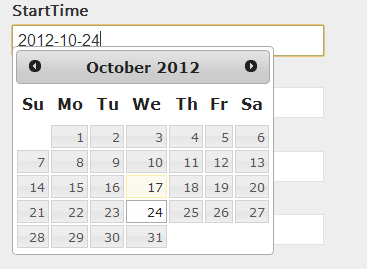

If you want to use a date picker I suggest you to use [JQuery UI Date Picker](http://jqueryui.com/datepicker/). It simple, doesn't require to have a lot of configuration and it's localized for you in several languages.

The whole process of adding JQuery Date Picker result to download JQuery UI and to create an editor template that will add a class that will let you bind the date picker into it.



First step, in the layout you need to add JQuery UI. If you are using Asp.Net MVC 4.0+ you can use the Bundles. This should be located inside the App_Start folder of the project. The configuration is inside BundleConfig.cs.


```csharp
 bundles.Add(new ScriptBundle("~/bundles/jqueryui").Include( "~/Scripts/jquery-ui-{version}.js")); 
```

If you are getting JQuery UI with NuGet package, this will be automatically setup for you. Do not forget to add inside your masterpage (by default :_layout.cshtml) the use of this bundle. 

```csharp
 @Scripts.Render("~/bundles/jqueryui") 
```

The second step is to create a template that will be used for the binding of a DateTime type. You can put the template for DateTime into the Views/Shared folder. You just need to create (if not already there) a folder called "EditorTemplates" and create a .cshtml with the name of "DateTime".


```csharp
 @model DateTime?

@if(Model.HasValue) { 
  @Html.TextBox(string.Empty,Model.Value.Date.ToString("yyyy-MM-dd"), 
  new {@class = "ui-date-picker"}) 
} else { 
  @Html.TextBoxFor(m => m, new {@class = "ui-date-picker"}) 
} 

``` 

Here is an example. You could use instead of a hard coded format the format you want. In fact, if you do not define here with a `ToString()` the format you want, you will get the time. This way to proceed let you use JQuery date picker but **let you have a default value** for your date without the section. If you do not format, you will not only have a default value with date time but when the user will select a date with the date picker, this one will be formatted. Indeed, this will be very strange to have half of the time the date formatted. The first parameter of the TextBox helper is an empty string. This is because the view has a context that is aware of what the field prefix is and we do not need to specify it. Since we do not know which property that will use the template, it's better to let it empty. We couldn't use the TextBoxFor method because this one doesn't let us bind on a method like the ToString.

If you go into the MVC framework we can see that it will check the TemplateInfo to get the current bound property and will assign the name property to the control:

```csharp
 private static MvcHtmlString InputHelper(HtmlHelper htmlHelper, InputType inputType, ModelMetadata metadata, string name, object value, bool useViewData, bool isChecked, bool setId, bool isExplicitValue, string format, IDictionary<string, object> htmlAttributes) { 
  string fullHtmlFieldName = htmlHelper.ViewContext.ViewData.TemplateInfo.GetFullHtmlFieldName(name);

//... 
```


Last step is to bind JQuery DatePicker to the class ui-date-picker that we have set in the template. 

```typescript
$(document).ready(function () { 
  $(".ui-date-picker").datepicker({ dateFormat: 'yy-mm-dd' }); 
} 
``` 

This is set in the document ready. This will hook the date picker to all element that has the ui-date-picker class.
