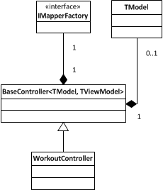

In this third part, we will discuss about controller. We aren't done yet with the model (still require to add more validation) but let's talk about the controller. In Asp.Net MVC, the controller act has the gate for the Http Request and answer back to any request with a Http Response. That's it. It's role should be limited to this task to respect the [Single Responsability Principle](http://en.wikipedia.org/wiki/Single_responsibility_principle).

But, we need to do a lot of thing when a client send information to the server. We need to convert the data in input to object, we need to convert this information to the model domain, we need to get into the database to load information and maybe to save information, we need to manipulate the data and we need to send back an answer. How can the controller be clean and in the same time be able to do all those things? Well, we will need to use the principle of seperation of concern and to split every task into multiple classes.

We will start with the model binding, which is the first step of any request.

## Auto-mapping

In Asp.Net Mvc, the transformation of HTTP Get parameter or HTTP Post parameters into C# code is called **Model Binding**. The Model binding by default try to convert any data to primitive type or try to instantiate your model object if the request contain a Json object that fit the schema of your classes. That mean that you can simply use Asp.Net MVC to send back all properties values of your model back to the server and Asp.Net MVC is bright enough to build a new object for you. 
```csharp
 [HttpPost] public ActionResult Create(WorkoutModel model) { //1)Validate model //2)Do manipulation //3)Save into the database

return View("Create);//4)Return a response to the client } 
``` The problem with this approach is, it works fine if you use Model object to send information to the view but we are using ViewModel (this was an architecture decision we took in the first part of this series). ViewModel give us the leverage to add additional information like a list of exercises that could be used in the workout, etc. So, before the task 1 of validating the model, we need to convert back the view model into model object. This is where **automapper** come to the rescue.

An automapper is a library that map property from an object to an other one. In our example, we will use [AutoMapper](http://automapper.org/). It's a free, open source, and widely used automapper. It can be configurable or by default map property name automatically. I won't show you how to use automapper in this article but you can find good example in this blog or anywhere on the web.

So, once we have receive the view model back to from the view to the controller, we need to automap the view model to the model. That mean that every time we use a controller action that we need to do this task. This can be repetitive and error prone. That's why a better approach is to implement a "Model" object. A little bit like Microsoft did with Asp.Net MVC with the View. We will create a Model property that will hold the converted view model. To do so, we will need to modify the BaseController.

### Automapper and BaseController

We will modify the BaseController and override the method **OnActionExecuting**. This will give us the opportunity to modify the code before entering the code of the action defined inside the controller.



This is an overview of what we are going to do. First, we will have a concrete controller for every entity. In our case, the WorkoutController. Each controller inherit of the BaseController which is generic with 2 types. The first one is the model type, and the second is the view model type. The BaseController contain a reference to a IMapperFactory, which is a layer of abstraction to the AutoMapper implementation. We will come back later with the IMapperFactory. Finally, the BaseController contain a property of TModel type. That mean that for the WorkoutController that we will be able to use "this.Model" to get the model from the view model. For another entity, the Model will be of the entity type because it will use the TModel type defined by the BaseController. Here is the code that reflect the illustration above.


```csharp
 public class WorkoutController : BaseController<Workout, WorkoutViewModel> {

public WorkoutController(IMapperFactory mapperFactory):base(mapperFactory) { }

public ActionResult Index() { }

[HttpGet] public ActionResult Details(int id) { }

[HttpGet] public ActionResult Create() {

}

[HttpPost] public ActionResult Create(WorkoutViewModel viewModel) { }

[HttpGet] public ActionResult Edit(int id) { }

[HttpPost] public ActionResult Edit(WorkoutViewModel viewModel) { } }

public abstract class BaseController<TModel, TViewModel>:Controller { private readonly IMapperFactory_mapperFactory; protected TModel Model { get; private set; }

protected BaseController(IMapperFactory mapperFactory) {_mapperFactory = mapperFactory; }

protected override void OnActionExecuting(ActionExecutingContext filterContext) { base.OnActionExecuting(filterContext); if(filterContext.ActionParameters.Any()) { var possibleViewModel = filterContext.ActionParameters.FirstOrDefault(x => x.Value.GetType() == typeof(TViewModel)); if (possibleViewModel.Value!=null) { var viewModel = (TViewModel) possibleViewModel.Value; var model = (TModel) Activator.CreateInstance(typeof (TModel)); Model =_mapperFactory.Map(viewModel, model); } } } } 
```

Anytime, inside the Update or Create, instead of using the viewModel parameter which is of WorkoutViewModel type, you can use the base.Model. This way to code give us few advantages. First, the controller is clean. No mapping is done on any concrete controller. Second, we still have access to the view model if required. Third, we do not repeat work on all controllers.

## Service layer

Now that we have the data from the view, we need to do some manipulation. We will skip the validation process because it will be in another part of this series. Let's jump to the service layers. The service layer is a layer between the service layer is above the controller and could be used not only by the web controller but by the web api controller or any other application. It's the layer between the user interaction and the repository. It's the one that can contact the repository, the cache, or manipulate many entity to return a unique one. The service layer will be used by the controller to access the repository and to build the view model. For example, it will load a specific workout if the user call the Edit action of the Workout controller. Not only it will load the workout, but it will give us the view model filled correctly with the extra properties that could contain additional choices to be selected (like a list of exercise) and additional localized text for example.

So, we need to modify the WorkoutController to have a service reference. 
```csharp
 public class WorkoutController : BaseController<Workout, WorkoutViewModel> { public WorkoutController(IMapperFactory mapperFactory):base(mapperFactory) { } //... 
``` will become: 
```csharp
 public class WorkoutController : BaseController<Workout, WorkoutViewModel> { private readonly IWorkoutService_service; public WorkoutController(IWorkoutService service, IMapperFactory mapperFactory):base(mapperFactory) {_service = service; } //... 
```

As you can see, the IWorkoutService has been added. This will give us the possibility to inject the service into the controller. Every controller will have its own service.

Because most of the service will look the same we can create a base service class, that I'll call IService. The IService will contain the primitive call that are concerning getting the model, saving the model and deleting the model. 
```csharp
 public interface IService<TModel, TViewModel> { IEnumerable<TViewModel> GetAll(); TViewModel Get(TModel model); int Create(TModel model); int Update(TModel model); int Delete(TModel model); }

public interface IWorkoutService : IService<Workout, WorkoutViewModel> { } 
```

We could add in IWorkoutService more specific method. For example, one could require to have a specicial Get that will return a extended view model with more data. Or, someone might want to have to model from the Get instead of the view model. This type of architecture let a flexibility.

If we check the concrete implementation of IWorkoutService we will see all repository access and the automapper to convert the model to view model. 
```csharp
 public class WorkoutService : BaseService, IWorkoutService { public WorkoutService(IRepositoryFactory repositoryFactory, IMapperFactory mapperFactory) : base(repositoryFactory, mapperFactory) { }

#region Implementation of IService<Workout>

public IEnumerable<WorkoutViewModel> GetAll() { var listModel = Repository.Workout.GetAll().ToList(); return Mapper.Map<List<Workout>,List<WorkoutViewModel>>(listModel); }

public WorkoutViewModel Get(Workout model) { var modelToBound = Repository.Workout.Get(model.Id); return Mapper.Map<Workout, WorkoutViewModel>(modelToBound); }

public int Create(Workout model) { return Repository.Workout.Insert(model); }

public int Update(Workout model) { return Repository.Workout.Update(model); }

public int Delete(Workout model) { return Repository.Workout.Delete(model); }

#endregion } 
```

As you can see, we are using the IMapperFactory to map data and not directly the automaper. This abstraction give us the possibility to mock the mapping easily later. Also, you can see that we are doing the same with the repository. We are using IRepositoryFactory which is not tightly bound to any repository, neither bound to the workout. That mean that workout could load exercises without problem. The detail about the repository will be defined in another article.

## Conclusion

We have seen that we can have clean controller and the use of service help us to separate the request from the repository. We also have seen that it's better to use interface instead of concrete classes because it gives us the possibility to mock later on, give us a layer of abstraction between concrete implementation of the controller and from the repository, mapper and so on. In the next article of this series we will discuss about the repository and Entity Framework in an enterprise Asp.Net MVC web application. We will come back with controller in the article concerning validation of the model. Indeed, the controller will have its role with validation and we will see how to implement a solution that will still respect the single responsibility principle.

### Series Articles

[Article #1: Asp.Net MVC Enterprise Quality Web Application](./enterprise-asp-net-part-1-mvc-the-planification) [Article #2: Asp.Net MVC Enterprise Quality Web Application Model](./enterprise-asp-net-mvc-part-2-building-the-model) [Article #3: Asp.Net MVC Enterprise Quality Web Application Controller](./enterprise-asp-net-mvc-part-3-controller) [Article #4: Asp.Net MVC Enterprise Quality Web Repository Layer](./enterprise-asp-net-mvc-part-4-repository) [Article #5: Asp.Net MVC Enterprise Quality Web with Entity Framework](./enterprise-asp-net-mvc-part-5-database-context-and-impersonate-data) [Article #6: Asp.Net MVC Enterprise Quality Layers](./enterprise-asp-net-mvc-part-6-the-three-layers-of-validation) [Article #7: Asp.Net MVC Enterprise Quality Web Security](./enterprise-asp-net-mvc-part-7-securing-action-with-role-authorization)
