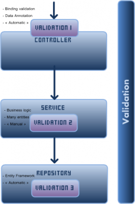

Validations is definitely a serious subject. If no validation is made, then the system is compromise. Whatever the architecture, whatever the hardware setup and whatever the idea of the product, you need to implement validations to protect your system. This is why it must be taken seriously.

By default, Asp.Net MVC handles validation and also [Entity Framework uses the same interface to handle validation](./model-validation-and-entity-framework-4-3) entities. So, why not use what is already in place and not try to reinvent the wheel. In fact, we follow the [KISS](http://en.wikipedia.org/wiki/KISS_principle) principle.

Here is an overview of the article in a single image. 

We have 3 layers of validation. The first layer and third layer are built-in with .Net with the [IValidatableObject interface](./how-to-validate-model-object-with-asp-net-mvc-correctly). I have [already](./how-to-validate-model-object-with-asp-net-mvc-correctly) discussed about this interface for validating entity but I'll show you how to use it in a more "enterprise way".

## Using IValidatableObject

This interface lets you have a single method called _Validate_ which lets you return error message linked to a property method. If you want a general error, you can also specify an empty string for the property name. Simple? Yes. Powerful? Even more! The framework know this interface and it automatically uses the validation when the model is bound from a Http request to your view model by the Model Binder. The .Net framework automatically call this method when Entity Framework try to save entities to the database. This mean that you have nothing to do, but to add your business logic validation.

From here, it's interesting to force every model to have this interface and this is why a good place to inherit from _IValidatableObject_ is in the BaseModel.

```csharp
public abstract class BaseModel : IValidatableObject { public const int NOT_INITIALIZED = -1; public int Id { get; set; }

#region Implementation of IValidatableObject

public abstract IEnumerable<ValidationResult> Validate(ValidationContext validationContext);

#endregion

} 
```

Every model have to define the _Validate_ method. If no validation is required, the method is simply empty. Let's go back with the Workout entity and add some validations. 
```csharp
public class Workout : BaseModel, IUserOwnable { public DateTime StartTime { get; set; } public DateTime? EndTime { get; set; } public string Name { get; set; } public string Goal { get; set; } public ICollection<WorkoutSession> Sessions { get; set; }

public override IEnumerable<ValidationResult> Validate(ValidationContext validationContext) { if (string.IsNullOrEmpty(Name)) { yield return new ValidationResult("Name is mandatory", new[] {"Name"}); } if (EndTime.HasValue) { if (StartTime > EndTime.Value) { yield return new ValidationResult("EndTime must be after the StartTime", new[] {"StartTime", "EndTime"}); } } }

#region Implementation of IUserOwnable

public int UserId { get; set; }

#endregion } 
``` 

Every time we have an error we return a **ValidationResult**. We specify a message and an array of properties that are concerned by the error. In this example, the name is validated and the EndTime property too but only when this one is specified.

## The first layer of validation : Model Binding inside the controller

We have implemented the **IValidatableObject** and when a Http request is done to the server, the controller bind the data to the model. Since we are using the ViewModel approach, this validation is not triggered! But, since we have a BaseController and already have defined the new approach of having the model to be automapped automatically it hooks the validation and apply it when the ViewModel is mapped to the Model. (You have to go read previous post of "Business" category to understand why it's automatically mapped.)

The first modification occurs in the override method _OnActionExecuting_ that should be already overrided with the modification of the mapper. We simply need to check if the model bound is really a IValidatableObject and to trig the validation mechanism.

```csharp
protected override void OnActionExecuting(ActionExecutingContext filterContext) { base.OnActionExecuting(filterContext); if(filterContext.ActionParameters.Any()) { var possibleViewModel = filterContext.ActionParameters.FirstOrDefault(x => x.Value.GetType() == typeof(TViewModel)); if (possibleViewModel.Value!=null) { var viewModel = (TViewModel) possibleViewModel.Value; var model = (TModel) Activator.CreateInstance(typeof (TModel)); Model =_mapperFactory.Map(viewModel, model); ApplyOwnership(); ApplyErrorsToModelState(); } } }

private void ApplyErrorsToModelState() { if (Model is IValidatableObject) { var errors = (Model as IValidatableObject).Validate(new ValidationContext(this)); foreach (var validationResult in errors) { foreach (var memberName in validationResult.MemberNames) { ModelState.AddModelError(memberName, validationResult.ErrorMessage); } } } } 
```

What we are doing is a general method that works for any entities. We verify if the Model bound from the ViewModel is really inherited from a **IValidatableObject**. From here, we do what the framework would do if we weren't using view model : calling the Validate method of the interface. We then loop all error and assign everything to the ModelState. This will give us the possibility to act like if no view model has been used.

The code above about the method "ApplyErrorsToModelState" could be replaced with the code below to be able to validate the **data annotation** AND also the **IValidatableObject** interface.


```csharp
 private void ApplyErrorsToModelState() { ModelMetadata metadata = ModelMetadataProviders.Current.GetMetadataForType(() => Model, Model.GetType());

foreach (ModelValidationResult validationResult in ModelValidator.GetModelValidator(metadata, this.ControllerContext).Validate(null)) { var propertyName = validationResult.MemberName; ModelState.AddModelError(propertyName, validationResult.Message); } } 
``` 
The code above validate the data annotation and the IValidatableObject. This can be used in a scenario where you need to have deeper validation process. For example here is the same code as above with enhanced validation on the mapping. This required to have split both validation. 
```csharp
 private void ApplyErrorsToModelState(TModel model, TViewModel viewModel) { //Data Annotation validation ICollection<ValidationResult> result; ValidateDataAnnotation(model, out result); foreach (ValidationResult validationResult in result) { foreach (string memberName in validationResult.MemberNames) { ModelState.AddModelError(memberName, validationResult.ErrorMessage); } }

//IValidatableObject validation if (Model is IValidatableObject) { IEnumerable<ValidationResult> errors = (Model as IValidatableObject).Validate(new ValidationContext(this)); foreach (ValidationResult validationResult in errors) { if (validationResult is EnhancedMappedValidationResult<TModel>) { var enhanced = (EnhancedMappedValidationResult<TModel>)validationResult; var viewModelPropertyName =_mapperFactory.GetMapper(model, viewModel).GetErrorPropertyMappedFor(enhanced.Property); ModelState.AddModelError(viewModelPropertyName, validationResult.ErrorMessage); } else { if (validationResult.MemberNames.Any()) { foreach (string memberName in validationResult.MemberNames) { ModelState.AddModelError(memberName, validationResult.ErrorMessage); } } else { ModelState.AddModelError(string.Empty, validationResult.ErrorMessage); } } } } /* //This validate underlying entity which can be not fully loaded in the case of reference ModelMetadata metadata = ModelMetadataProviders.Current.GetMetadataForType(() => Model, Model.GetType());

foreach (ModelValidationResult validationResult in ModelValidator.GetModelValidator(metadata, this.ControllerContext).Validate(null)) { var propertyName = validationResult.MemberName; ModelState.AddModelViewModelToErrorsMap(propertyName, validationResult.Message); }*/ }

private bool ValidateDataAnnotation(object entity, out ICollection<ValidationResult> results) { var context = new ValidationContext(entity); results = new List<ValidationResult>(); return Validator.TryValidateObject(entity, context, results, true); } 
```


```csharp
 [HttpPost] public ActionResult Create(WorkoutViewModel viewModel) { if (ModelState.IsValid) //This is the default Asp.Net MVC way to validate entity { //Save the entity 
``` 
This is great because it's the default way to validate object that has been bound in MVC. The _IsValid_ doesn't only validate our business logic but also validate all data annotation that could have been set. It's even greater because people that are used to use the ModelState for validation won't have to learn a new way to act with controllers because it's the same.

## The second layer of validation : Service layer

So far, the validation works fine but it doesn't handle the case that you need to validate across many entities. You can have case that you need to validate an entity dependently of the value of others entities. It can also be a validation from some value that are inside the database. Since Model doesn't have access to the repository, at this moment, we couldn't validate. To solve this problem, the second layer of validation is required and the perfect place it's in the Service layer. The reason is that this layer does have access to all entities and also have access to all repositories. Contrary to the first layer of validation, this one will require some manual explicit call for validation. The concrete implementation of this second layer of validation will be done with the Workout entity. What we want to implement is a validation that the active user cannot create more than 3 workouts per month without a premium account. That mean that we need to go check in the database the amount of workout for a specific user for a specific month. This couldn't be validate in the Workout class because it doesn't have access to the database.


```csharp
 public int Create(Workout model) { int amountWorkout = Repository.Workout.GetAmountWorkoutForCurrentMonth(); if (amountWorkout>3)//More than 3 workouts done without premium account { throw new ValidationErrors(new GeneralError("You have reach the limit of 3 workouts per month, you need premium or wait the next month")); } return Repository.Workout.Insert(model); } 
```

This get the amount of workout for the month and if it's over a certain threshold will raise the error.

The error is handled by the controller that verify that the action executed has been completed without error. Here is the Create action of the Workout controller with the first layer validation and with the catch for the second layer. 
```csharp
 [HttpPost] public ActionResult Create(WorkoutViewModel viewModel) { if (ModelState.IsValid) { try {_service.Create(Model); } catch (ValidationErrors propertyErrors) { ModelState.AddValidationErrors(propertyErrors); } } return View("Create"); } 
``` 
The exception type is ValidationErrors which is our custom error handler. The reason is that we do not want to use specific exception from other layers. This is why cross layers classes will be used to transport exception through all layers. This will be discussed after the third layer of validation.

## The third layer of validation : Persistence layer

The persistence layer is where the call to the database is done. This is an automatic validation with Entity Framework that call the **IValidatableObject** interface of the entity before save it to the database.

But, since we do not want to raise a **DbEntityValidationResult** up to the controller (because it's a class that belong to Entity Framework (System.Data.Entity.Validation), we will use our own exception classes.

We will create an interface that will hold the property name in error and also the error message. 
```csharp
 public interface IBaseError { string PropertyName { get; } string PropertyExceptionMessage { get; } } 
```

Two classes will inherit from this interface. One for a property error and one for a general error. 
```csharp
 public class PropertyError:IBaseError { public string PropertyName { get; set; } public string PropertyExceptionMessage { get; set; } public PropertyError(string propertyName, string errorMessage) { this.PropertyName = propertyName; this.PropertyExceptionMessage = errorMessage; } }

public class GeneralError:IBaseError { #region Implementation of IBaseError

public string PropertyName { get {return string.Empty; }} public string PropertyExceptionMessage { get; set; }

public GeneralError(string errorMessage) { this.PropertyExceptionMessage = errorMessage; }

#endregion } 
``` 
Then, we add the interface _IValidationErrors_ which holds all _IBaseError_ to be send back through all layers. 
```csharp
 public interface IValidationErrors { List<IBaseError> Errors { get; set; } } 
``` 
The first implementation can be used anywhere, like in the service layers. 
```csharp
 public class ValidationErrors : Exception, IValidationErrors { public List<IBaseError> Errors { get; set; } public ValidationErrors() { Errors = new List<IBaseError>(); }

public ValidationErrors(IBaseError error): this() { Errors.Add(error); }

} 
``` 
The second is more specific to database. 
```csharp
 public class DatabaseValidationErrors : ValidationErrors { public DatabaseValidationErrors(IEnumerable<DbEntityValidationResult> errors):base() { foreach (var err in errors.SelectMany(dbEntityValidationResult => dbEntityValidationResult.ValidationErrors)) { Errors.Add(new PropertyError(err.PropertyName,err.ErrorMessage)); } } } 
```

The last one is used by the repository. In fact, when we **SaveChanges()** to the database, we need to validate before Entity Framework executes the SaveChanges. Of course, we could let Entity Framework but we would have to catch the exception. Since they are a way without having to catch an exception, I prefer to use it.

If you remember correctly, our DatabaseContext inherit from **IDatabaseContext** which have SaveChanges() method. We simply need to override this one instead of relying on the one from DbContext and call the DbContext one if everything is fine. 
```csharp
 public override int SaveChanges() { var errors = this.GetValidationErrors(); if (!errors.Any()) { return base.SaveChanges(); } else { throw new DatabaseValidationErrors(errors); } } 
```

The exception thrown will loop all errors and be trig to a higher level. In fact, this exception is raised to the service layer which doesn't handle the exception. So, the exception will be raised to the controller layer. This is the same patch of exception than having an exception thrown from the service in the layer 2 because of business logic validation! We are reusing the same mechanism and this is possible because of the exceptions classes we have created which are abstracted with interface.

## Model State and custom exceptions classes

If you remember, the controller does have a catch for ValidationErrors. 
```csharp
 //... catch (ValidationErrors propertyErrors) { ModelState.AddValidationErrors(propertyErrors); } 
``` 
By default, the model state doesn't have this method that accept our interface IValidationErrors. This is an extension method. 
```csharp
 public static class ControllersExtensions { public static void AddValidationErrors(this ModelStateDictionary modelState, IValidationErrors propertyErrors) { foreach (var databaseValidationError in propertyErrors.Errors) { modelState.AddModelError(databaseValidationError.PropertyName, databaseValidationError.PropertyExceptionMessage); } } } 
``` 
Using **IValidationErrors** lets handle errors from the service layer or the database error. In fact, at this point, it doesn't really matter because we want to loop through all exceptions and to use the model state to attach doesn't exception to the correct property (or if general exception to the string.empty which will be a global error message).

## Conclusion

Validation of the model could be more complex. It could have been used external classes for each validation. We could have create our own system for validation message and not using the **IValidatableObject** interface. We could have completely not using the ModelState and create our own html helper with custom mechanism for validating across all layers. We could have add a layer of abstraction between Entity Framework and the service and to handle validation there. But at the end, having solution that are short and efficient seem to be better in my point of view. The current solution give a lot of flexibility concerning the validation and keep the code easy to maintain. In fact, add a validation are a two steps. First, where the validation should be coded? Second, adding the validation. I have seen patterns for validation that goes so beyond MVC and respect even more the single responsibility principle that adding a single validation take over 30 minutes. For me, this is not acceptable. Abstractions levels never should make the development of the code harder. In theory, adding levels of abstraction ain't cost a thing, but in real enterprise code, where people have to maintain the code base, this can lead to problem.

The solution proposed here use layers previously defined without adding overhead to handle validation.

### Series Articles

[Article #1: Asp.Net MVC Enterprise Quality Web Application](./enterprise-asp-net-part-1-mvc-the-planification) [Article #2: Asp.Net MVC Enterprise Quality Web Application Model](./enterprise-asp-net-mvc-part-2-building-the-model) [Article #3: Asp.Net MVC Enterprise Quality Web Application Controller](./enterprise-asp-net-mvc-part-3-controller) [Article #4: Asp.Net MVC Enterprise Quality Web Repository Layer](./enterprise-asp-net-mvc-part-4-repository) [Article #5: Asp.Net MVC Enterprise Quality Web with Entity Framework](./enterprise-asp-net-mvc-part-5-database-context-and-impersonate-data) [Article #6: Asp.Net MVC Enterprise Quality Layers](./enterprise-asp-net-mvc-part-6-the-three-layers-of-validation) [Article #7: Asp.Net MVC Enterprise Quality Web Security](./enterprise-asp-net-mvc-part-7-securing-action-with-role-authorization)

[Source code on GitHub](https://github.com/MrDesjardins/GymWorkout)
