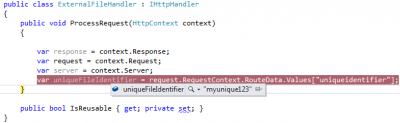

In diverse scenario you could require to give to your user files. You can let them access them directly by having a directory of files and give the complete path to the file but this can lead to different issue. First of all, this will bind the server folders/files structures to the url that you give the the user which might not be interesting. Second, it doesn't give you any control over the files shared. Third, you may want to add algorithm for caching or give expiry to some files. All those customs code can't be done by giving a direct access to files, the solution : using Http Handler.

[HttpHandler was there in Asp.Net traditional](http://patrickdesjardins.com/blog/how-to-access-session-information-from-httphandler-ashx-file "How to access Session information from HttpHandler (Ashx file)") and in Asp.Net MVC is even easier because not configuration is required for IIS.

First, you need to add a new route to let know the MVC routing system that the url sent is not going to go to a traditional controller but to go to your http handler.


```csharp
 public class ExternalFileRouteHandler : IRouteHandler { public IHttpHandler GetHttpHandler(RequestContext requestContext) { } } 
``` 
Inside the Global.asax.cs you need to add your route. You need to put the new route BEFORE the default route because otherwise it won't trig the route. The reason is that because the default route has default parameter that 2 parameters will automatically goes inside the Default route. But, if you set the FilesRoute before, the condition will match and this one will be executed.

```csharp
public static void RegisterRoutes(RouteCollection routes) { routes.IgnoreRoute("{resource}.axd/{\*pathInfo}"); routes.Add("FilesRoute", new Route("files/{uniqueidentifier}", new ExternalFileRouteHandler())); routes.MapRoute( "Default", // Route name "{controller}/{action}/{id}", // URL with parameters new { controller = "Home", action = "Index", id = UrlParameter.Optional } // Parameter defaults );

} 
```

At this moment, the code doesn't compile because our IRouteHandler doesn't return anything from the GetHttpHandler. This is why we need to create a class that will inherit of IHttpHandler.


```csharp
 public class ExternalFileHandler : IHttpHandler {

public void ProcessRequest(HttpContext context) { }

public bool IsReusable { get; private set; } }

public class ExternalFileRouteHandler : IRouteHandler { public IHttpHandler GetHttpHandler(RequestContext requestContext) { return new ExternalFileHandler(); } } 
``` 
At this point, we have nothing to do anymore from the perspective of the url. Every call will look like this:

`http://yourwebsite.com/files/yourIdenfierHere.abc`

Now, you need to get the file but first let's get some information about the request like the request itself, the response where we will send back the image and some information about the server and what file is requested.


```csharp
public class ExternalFileHandler : IHttpHandler { public void ProcessRequest(HttpContext context) {

var response = context.Response; var request = context.Request; var server = context.Server; var uniqueFileIdentifier = RequestContext.RouteData.Values["uniqueidentifier"].ToString(); }

public bool IsReusable { get; private set; } } 
```

If we debug we can see that if the request is sent with the good url that the http handler catch the request with the good value.



The next step is to check if the file really exist. In fact, we need to check if the unique identifier match a file. If it's not the case, in a scenario of a people trying to get some body else file, it should return a message.


```csharp
 public void ProcessRequest(HttpContext context) {

var response = context.Response; var request = context.Request; var server = context.Server; var uniqueFileIdentifier = request.RequestContext.RouteData.Values["uniqueidentifier"].ToString();

FileInformation file = GetFromPersistenceStorage(uniqueFileIdentifier); if (file == null) { response.Write("File not found"); } } 
``` As you can see, the file came from GetFromPersistenceStorage method. This method in reality would go into the database and search the file from the unique file identifier. This field in the database should be indexed and unique.

The next step is to check if the file is really on the server. It might be stored correctly into the database but not available on the server.


```csharp
 public void ProcessRequest(HttpContext context) {

var response = context.Response; var request = context.Request; var server = context.Server; var uniqueFileIdentifier = request.RequestContext.RouteData.Values["uniqueidentifier"].ToString();

FileInformation file = GetFromPersistenceStorage(uniqueFileIdentifier);

//Validate the file exist in the persistence storage if (file == null) { response.Write("File not found"); return; }

//Validate the the file exist on the server physically string completeFilePath = Path.Combine(file.PathOnServer, file.FileName); if(!File.Exists(completeFilePath)) { response.Write("File not on the server"); return; }

//Prepare to send the file response.Clear(); response.ContentType = file.FileType; response.TransmitFile(completeFilePath); response.End();

} 
```


Finally, if the file is present, we will receive its content.


You can now secure the file. This can be done in many ways. First, I suppose that the database table that contain every files will have some kind of relation between the user and files. Let say that every files has the possibility to allow many users, that mean the you should have 3 tables : User, UsersFiles and Files. UsersFiles table contain the id of the User that can access the file and the id of the file.

So the FileInformation class that we have defined earlier would have a List that can access the file. A small modification will be required to get the current user from the session and to check if the file allow the user. 

```csharp
public void ProcessRequest(HttpContext context) {

var response = context.Response; var request = context.Request; var server = context.Server; var uniqueFileIdentifier = request.RequestContext.RouteData.Values["uniqueidentifier"].ToString();

FileInformation file = GetFromPersistenceStorage(uniqueFileIdentifier);

//Validate the file exist in the persistence storage if (file == null) { response.Write("File not found"); return; }

//Validate if the current logged user can access the file if (!file.UserIdAuthorized.Contains(SessionUserId)) { response.Write("You are not authorized to see this file."); return; }

//Validate the the file exist on the server physically string completeFilePath = Path.Combine(file.PathOnServer, file.FileName); if(!File.Exists(completeFilePath)) { response.Write("File not on the server"); return; }

//Prepare to send the file response.Clear(); response.ContentType = file.FileType; response.TransmitFile(completeFilePath); response.End(); }

public class FileInformation { public string PathOnServer { get; set; } public string FileName { get; set; } public string FileType { get; set; } public List<int> UserIdAuthorized { get; set; } } 
```

And that's it. You can from here add any other type of validation or expiry or caching. The method **GetFromPersistenceStorage()** could store into the cache the content of the file and if the file is requested again would get it from the cache instead of the server. You could also add expiry for file that may be deleted later by setting a timespan on the FileInformation and having a generated DateTime inside the table that contain the file information. A simple validation inside **ProcessRequest** will do the job.

You are now limitless about what to do with files on your server.
