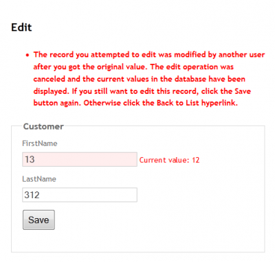
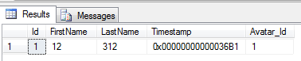

The web is stateless and usually have the particularity to have many users. In some application, a single information can or could be modified by more than one person. This has the side effect that conflict could occur.

Let say that user A want to edit the product 123 and few seconds later, the user B edit the same product. By the time user A save the product, the user B might have changed some information. If the user A save and later the user B save this could create some conflict.

In normal web situation, the user B would have override the user A changes. In fact, this is totally acceptable in a lot of situation. This is called `Client Wins` By this, I mean that if the user B decided that the product 123 name should be called "product 12345" and that this user is the last to edit the product that he should be the one with the latest information about what should be the name of this product. If many user want to change something and change it for a different value, let say user A wanted to called if "prod 12345" and user B "product 12345" than it's more a logic problem by the enterprise than a software problem.

Nevertheless, in some situation, the first user must have the privilege to be no override. Since we cannot lock the entry and for good we can't, an other approach is to simply let know the second user that someone has changed the information since the load of the entity. This situation is called `Server Wins` and solve the problem of `concurrency conflict`.

# How to handle concurrency conflict with Entity Framework and Asp.Net MVC with Server Wins approach

We do not want to lock an entry from the database because some entry could be lock when the system crash and it also cause performance problem. The best way is to use optimistic approach. With Microsoft Sql Server, we can use a column of type TimeStamp or RowVersion. In both case, it will contains an incremental sequential number that will increase every time the entry is modified. This approach let you know that if you load an entity with the number 23 and when you save you are at 24 that someone has done something to the entity because it should be remain to 23.

To be able to apply this strategy to your entities, you need to configure your BaseEntity.cs class (a class that every model will inherit). You need to add a TimeStamp property with the TimeStamp and ConcurrencyCheck attribute.

```csharp
public class BaseEntity { 
  public int Id { get; set; }

  [ConcurrencyCheck] 
  [Timestamp] 
  public Byte[] Timestamp { get; set; } 
} 
```

To be able to use this value we need to add it into the view in a hidden field. This hidden field will give back the Timestamp to the server and will be used to compare with the database version when saving.


```csharp
@Html.HiddenFor(model => model.Timestamp) 
```

So, the whole view look like this: 

```csharp
 @using (Html.BeginForm()) { @Html.HiddenFor(model => model.Timestamp) @Html.ValidationSummary(true) <fieldset> <legend>Customer</legend>

<div class="editor-label"> @Html.LabelFor(model => model.FirstName) </div> <div class="editor-field"> @Html.EditorFor(model => model.FirstName) @Html.ValidationMessageFor(model => model.FirstName) </div>

<div class="editor-label"> @Html.LabelFor(model => model.LastName) </div> <div class="editor-field"> @Html.EditorFor(model => model.LastName) @Html.ValidationMessageFor(model => model.LastName) </div>

@Html.HiddenFor(model => model.Id)

<p> <input type="submit" value="Save" /> </p> </fieldset> } 
```

The model look like:


```csharp
public class Customer:BaseEntity { 
  public string FirstName { get; set; } 
  public string LastName { get; set; } 
} 

public class BaseEntity { 
  public int Id { get; set; } 
  
  [ConcurrencyCheck]
  [Timestamp] 
  public Byte[] Timestamp { get; set; } 
} 
```

And the controller which contain the compare code: 

```csharp
[HttpPost] 
public ActionResult Edit(Customer customer) { 
  if (ModelState.IsValid) { 
    db.Entry(customer).State = EntityState.Modified; 
    try { db.SaveChanges(); } catch (DbUpdateConcurrencyException ex) { 
      var entry = ex.Entries.Single(); 
      var databaseValues = (Customer)entry.GetDatabaseValues().ToObject(); 
      var clientValues = (Customer)entry.Entity; 
      if (databaseValues.FirstName != clientValues.FirstName) 
        ModelState.AddModelError("Name", "Current value: " + databaseValues.FirstName); 
      if (databaseValues.LastName != clientValues.LastName) 
        ModelState.AddModelError("Budget", "Current value: " + databaseValues.LastName);

      ModelState.AddModelError(string.Empty, "The record you attempted to edit " + "was modified by another user after you got the original value. The " + "edit operation was canceled and the current values in the database " + "have been displayed. If you still want to edit this record, click " + "the Save button again. Otherwise click the Back to List hyperlink.");

      customer.Timestamp = databaseValues.Timestamp; 
    } 
    return RedirectToAction("Index"); 
  }

  ViewBag.Id = new SelectList(db.Licenses, "Id", "Name", customer.Id); 
  return View(customer); 
} 
```

As you can see if you open 2 tabs of a single entity if you save in the first tab and try to save in the second you will see the error message (the exception message is from [Asp.net website](http://www.asp.net/mvc/tutorials/getting-started-with-ef-using-mvc/handling-concurrency-with-the-entity-framework-in-an-asp-net-mvc-application)).



If we go check in the database, we will see that the table contains a hexadecimal value inside the TimeStamp.



# Conclusion

You can have a quick and easy way to control concurrency conflict with a timespan field located inside every entities. You only need to add this field in a base model class, modify your controller to handle the exception and add an hidden field into the view.

# Edit February 2th, 2013

In the Workout website I have used concurrency and I have found few details that were not written in the above blog article. First of all, you must have the `ConcurrencyCheck` attribute and not only the `Timestamp` attribute over the property that will take care of the concurrency. If you do the modification, do not forget to regenerate the database to have the database having this field (which should be not nullable). Entity Framework will take care to compute to correct value to set into this field automatically. Second, you need to not load the entity from the database just before using SetValues (to update scalar property of your object). This would result to alter the Timestamp and to override the one that came from the form (ViewModel to Model) to the value of the one from the database. This cause the mechanism to not detect the concurrency. Here is what I had previously which work to update the scalar value but doesn't work with the concurrency. Following will be the new code which work in both case.


```csharp
public int Update(Muscle entity) { 
  Muscle fromDatabase = Get(entity.Id); 
  DatabaseContext.Entry(fromDatabase).CurrentValues.SetValues(entity); 
  DatabaseContext.Entry(fromDatabase).State = EntityState.Modified; 
} 
``` 

By this: 

```csharp
 public int Update(Muscle entity) { 
  this.Set<Muscle>().Attach(entity); 
  this.ChangeTracker.Entries<Muscle>().Single(d => d.Entity == entity).State = EntityState.Modified; 
} 
```

Hope this detail will help someone else who is struggling with Asp.Net MVC concurrency with Entity Framework.
