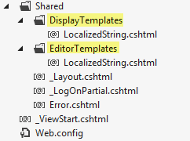
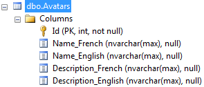

In some situation, you may have a string that will require to be localized and be displayed differently depending of the current culture.

This can be the case of a specific name or description. You may want to display the name of the product in French if the user is logged in French but to be able to display in English for other users.

You have a lot of different way to handle this situation. The one proposed here is simple, it respects the SOC (separation of concern), and doesn't change the database drastically. By not changing the database drastically I mean that I do not have to have a table with association to multiple languages.

First, let create some model classes. To have relative useful example that is near of a real life example I will re-use the Customer and Avatar classes defined in previous blog post.


```csharp
 public class Customer:BaseEntity { public string FirstName { get; set; } public string LastName { get; set; } public Avatar Avatar { get; set; } } 
```

The Customer class contain 2 strings that won't be localized and a property of type Avatar. This class contain 2 fields : name and description that require to be translated in multiple languages.


```csharp
 public class Avatar : BaseEntity { public string Name { get; set; } public string Description { get; set; } } 
```

Right here, we see something wrong. The Name and Description properties are type of string which can only have one value. So, we need to have Name in 2 languages (or more). 
```csharp
 public class Avatar : BaseEntity { public string NameFrench { get; set; } public string DescriptionFrench { get; set; }

public string NameEnglish { get; set; } public string DescriptionEnglish { get; set; }

//And so on... } 
``` The problem with this solution is that it goes really out of proportion if you have let say 10 languages to support. It's also a problem when it's the time to bind to the view. Which one is the good to display depend of the user language and you couldn't simply bind to one property.

This lead us to think that maybe the problem is that we are using a wrong approach. In fact, what we want to use is not a string but a **LocalizedString**. What we would like is to have the Avatar having only 2 properties, one for the Name and one for the Description.


```csharp
 public class Avatar : BaseEntity { public LocalizedString Name { get; set; } public LocalizedString Description { get; set; } } 
```

The **LocalizedString** is a class that we will create and will handle all different languages that we have. Let say we want French and English. The class could look like the above with 2 properties. If we would need 10 languages, we would have 10 properties. I choose to have 1 property per language because I want to have in the database 1 column per language and not having a table with multiple languages. The reason is that I do not want the overhead of multiple join tables.


```csharp
 [ComplexType] public class LocalizedString { public string French { get; set; } public string English { get; set; } public override string ToString() { return English; } [NotMapped] public string Current { get { switch (Thread.CurrentThread.CurrentUICulture.TwoLetterISOLanguageName.ToUpperInvariant()) { case "FR": return French; case "EN": return English; } return ToString(); }

set { switch (Thread.CurrentThread.CurrentUICulture.TwoLetterISOLanguageName.ToUpperInvariant()) { case "FR": French = value; break; case "EN": English = value; break; } } } } 
```

Many stuff in the **LocalizedString**. First, the attribute ComplexType is added to the class. The reason is that I do not want to have a new class for each Model that will use the new type of string. In fact, what I want is to have Avatar having all properties automatically generated for me. From the database point of view, it's the same thing. I do not want to have a table Customer with a 1-1 association to the table Avatar and from there having 10 relations for 10 different languages. I would like to have Customer having a relation to Avatar that contains all name and description. This is the reason of the **Complex Type**.

The second attribute is the NotMapped over the Current property. The Current property is there to display the string in the active language. I could have directly put the code of Current into the ToString() but I didn't because I want to be able to bind to a property from the view.

From here, we are almost done. The last step is to create templates. We need one **EditorTemplates** and one **DisplayTemplates**. Both of them are here let know Asp.Net MVC how to display the new type **LocalizedString**.



Both DisplayTemplates and EditorTemplates require to be into the Shared folder. You need to create 1 file per folder with the name of your new type. In our case, it's **LocalizedString**.

Both of them are very simple. This is of the DisplayTemplates. 
```csharp
 @model EFCodeFirst.General.LocalizedString <p>@Model.Current</p> 
``` And this is for the EditorTemplates. 
```csharp
 @model EFCodeFirst.General.LocalizedString @Html.TextBoxFor(s => s.Current) 
```

If we go into the view, the code use **EditorFor** for the Name and Description of the Avatar. This will trig in MVC to use the good template for the type **LocalizedString**. 
```csharp
<fieldset> <legend>Customer</legend>

<div class="editor-label"> @Html.LabelFor(model => model.FirstName) </div> <div class="editor-field"> @Html.EditorFor(model => model.FirstName) @Html.ValidationMessageFor(model => model.FirstName) </div>

<div class="editor-label"> @Html.LabelFor(model => model.LastName) </div> <div class="editor-field"> @Html.EditorFor(model => model.LastName) @Html.ValidationMessageFor(model => model.LastName) </div>

<div class="editor-label"> @Html.LabelFor(model => model.Avatar.Name) </div> <div class="editor-field"> @Html.EditorFor(model => model.Avatar.Name) @Html.ValidationMessageFor(model => model.Avatar.Name) </div> <div class="editor-label"> @Html.LabelFor(model => model.Avatar.Description) </div> <div class="editor-field"> @Html.EditorFor(model => model.Avatar.Description) @Html.ValidationMessageFor(model => model.Avatar.Description) </div> <p> <input type="submit" value="Create" /> </p> </fieldset> 
```

The generated html contain a valid name that link to the Current property of Avatar. 
```html  
<input id="Avatar\_Name\_Current" name="Avatar.Name.Current" type="text" value="" /> 
``` 

The controller will use the model binding to be able to set the Current value to the good language. This is automatically done because of the setter of Current that check the current language and set the value into the good property.


Once saved, the data is inserted into the avatar table.



And the data :


That's it. The model is clean with 1 property, the view is clean because it uses template so it's a one liner like normal string. The controller is clean because it doesn't have any logical for the language. The database is clean because the information is stored what ever which class will use **LocalizedString**. Those additional rows are automatically create by Entity Framework and doesn't require any.

To conclude, alternative solution like using a ViewModel could have been a solution but would add a lot of additional overhead like having to auto-map most of field, having to redo mapping for localized string every new model and the last one would been to have additional testing because you would have a ViewModel with condition which could have lead to possible error. I suggest you to use this approach which is simple, object oriented and work fine with Entity Framework.

## Edit: Reflection

Instead of using a Switch case, you can use reflection to get the good property depending of the thread language. Here is the version with reflection.


```csharp
 [ComplexType] public class LocalizedString { public string French { get; set; } public string English { get; set; }

[NotMapped] public string Current { get { return (string) LanguageProperty().GetValue(this,null); } set { LanguageProperty().SetValue(this, value,null); } }

public override string ToString() { return Current; }

private PropertyInfo LanguageProperty() { string currentLanguage = Thread.CurrentThread.CurrentUICulture.DisplayName; return GetType().GetProperty(currentLanguage); } } 
```
