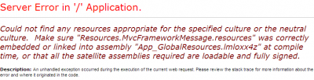

You cannot simply use an attribute like Required to specify the message your want for an invalid value. What you have to do is to change the default model binding resource class. When the model binder try to convert the input to the type of the model, if this one cannot be converted, a message is sent back to the client in the format : The value '{0}' is not valid for {1}. To change the message, you need to go inside the Global.asax.cs, in the Application_Start method.



You need to set the name of a resource file that you will create.


```csharp
 DefaultModelBinder.ResourceClassKey = "GlobalErrorMessage" 
```

The file (in our case called GlobalErrorMessage) needs to be inside the App_GlobalResources of the assembly that use the view. Then, you need to add an entry called PropertyValueInvalid. For a French translation, you could use: La valeur '{0}' n'est pas valide pour le champ {1}.

If you mistmatch the name of the resource class key and the file you may receive an error saying that it was correctly embedded.

> Could not find any resources appropriate for the specified culture or the neutral culture. Make sure "Resources.MvcFrameworkMessage.resources" was correctly embedded or linked into assembly "App_GlobalResources.lmloxx4z" at compile time, or that all the satellite assemblies required are loadable and fully signed.

To solve this error, just rename the file or change the string. With this solution, you can now have a valid translated error message for invalid data type.
