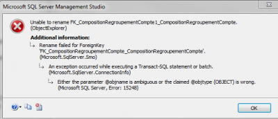

This task should be easy isn't?

Well, if you go to the Microsoft Server Management Studio (2008 R2) designer to do it and that the constraint is located into a schema other than DBO, this might be more complex that you think.



> Rename failed for ForeignKey 'FK__ABC'. Either the parameter @objname is ambiguous or the claimed @objtype (OBJECT) is wrong. (Microsoft SQL Server, Error: 15248)

What's happening it that the tool is trying to use SP_RENAME with DBO as the schema. This can be verified with the Sql Profiler. It's also a [known bug that Microsoft](http://connect.microsoft.com/SQLServer/feedback/details/462046/cannot-rename-a-default-constraint-for-a-table-in-a-schema-which-is-not-dbo) should have fixed in their latest release of SQL Server.

To be able to change the foreign key constrain name, you need to do it manually with the SP_RENAME function.

The syntax is 'YourSchema.YourFKNameToChange' followed by only the FK you want. Here is an example:


```sql
 sp_rename 'YourSchema.YourFKNameToChange', 'YourNewFKName', 'OBJECT' 
```


That's it!
