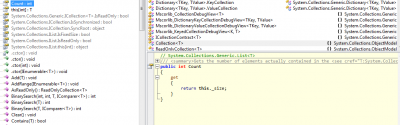

If you are using a `collection` : `ICollection`, `IList`, `List`, which doesn't use enumerator to navigate, the fastest way to check if the collection contain anything is to use `.Length` or `.Count`.

But, if you are using `IEnumerator<>` which contain `GetEnumerator()` and `MoveNext()` the fastest way is to use `.Any()`. The reason is that `Any()` will do 1 loop and find that it has information so stop looping. 
If the collection is 10 of size or 9000 of size, both will do 1 loop so the speed is O(1).

LINQ-to-Objects implementation of `Count()` will call the `.Count` property for optimisation but if you have used LINQ with WHERE statement or any other Linq filter function, you will have an iterator-block based sequence and this Count() optimisation won't be applied. In fact, it will loop all the collection to get the count. That mean that the performance is O(n).

To keep it simple, for performance wise and maintenability wise, `.Any` is the best to use to know if something is inside a list.
