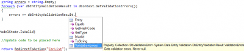

In a previous post concerning the [IValidatableObject with Asp.Net MV3](./how-to-validate-model-object-with-asp-net-mvc-correctly "How to validate model object with Asp.Net MVC correctly?") we have discussed the powerful of the **IValidatableObject** interface with MVC framework which is a fast solution to handle error in the model, error in the model binding and error in the controller.

What is great by using Microsoft ecosystem is that most of the framework work well together. If you are using the ORM Entity Framework and you are validating your business logic with the **IValidatableObject** interface you can benefit that before executing SaveChanges() on you database context that Entity Framework will call all model validation. This mean that you cannot forget to call it or it means that you do not need to explicitly check for the validation. If something is wrong with the model validation, when the SaveChanges() is called, Entity Framework will throw an exception.

Here is an example that we try to save an entity which fail because a business logic added into the Validate method of the inherited class IValidateObject fail. Without having to check if the ModelState.IsValid, Entity Framework call the Validate method of all changed entity and raise an exception of **DbEntityValidationException**. This is an awesome protection that ensure that nothing goes beyond the controller if something is wrong with the model; the database is clean.

I am pretty sure that at this point, someone will say that the exception defeat the purpose in many scenario where you would like to handle particularly all errors from all models objects and display something to the user (or to log them). Well, you can skip the exception and go directly to the model error.


```csharp
var fromDatabase = dContext.Cars.Single(p => p.Id == car.Id); 
dContext.Entry(fromDatabase).CurrentValues.SetValues(car); 
if (!dContext.GetValidationErrors().Any()) { 
  dContext.SaveChanges(); 
} 
else { 
  //Display the error in the list dContext.GetValidationErrors() 
} 
```

As you can see, this way, you check if they are any problem and then you save if none. On the other side, if errors occur you can display them. This is very powerful because you have the entity which is problematic, all its properties that is in error and all its errors messages. This is possible because the **GetValidationErrors** function return a DbEntityValidationResult which contain the Entry itself, the state if it's valid or not and a collection of error in the DbValidationError format which mean that you know what property is in error with the message.



That's it. At this point, you know that Entity Framework work in a team with MVC's ModelState. You do not need to add custom code in a generic model class that will contain validation method. It's already built in. Also, if you are using Entity Framework as ORM, you can benefit of extra security that your database won't be altered by wrong data because Entity Framework takes care to call the Validate method of all your object before using them.
