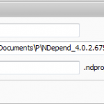
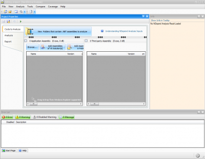
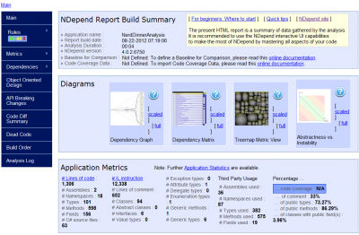
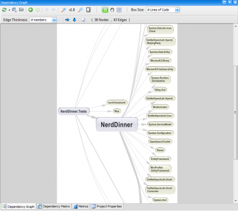
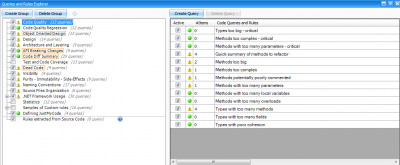

[NDepend](http://www.ndepend.com/) is an analysis tool for Microsoft .Net code. The primary goal of this tool is to let you know about the quality of your code with some metrics.

You can use NDepend as a software or as a Visual Studio Add-in. I tried both and prefered the standalone application. I found it easier to use and also didn't find any real advantage to have it integrated into Visual Studio. Nevertheless, it can become handy to have it inside Visual Studio if your daily task is to optimize .Net code.

I did a run with the open source project called [Nerd Dinner](http://nerddinner.codeplex.com) which is a MVC3 application. The version of Nerd Dinner is 77871 and the version of NDepend is 4.0.2 Professional edition.

The way it works is that you ahve to create a new project inside NDepend. This will allow you to not have to configure every time where are the assemblies to analyse and also give you the opportunity to compare in time the progression of your changes.

Once the project is done, you will be landed to the main user interface of the application with the project's properties windows open. This will let you choose assembly or directly the solution file to analyse.

For my test, I choose the solution file which contain 2 projects, the main website and the testing project. Once selected you just need to press the Play button and the selected files will be analysed. Nerd Dinner is a very small project and it took 4 seconds to analyse. When the analyse is done, your browser will popup a webpage with a report.

The next step is to continue inside NDepend Analysis tool and to use the **NDpend Interactive UI Graph**. 

Next, we have the **Queries and Rules Explorer**. This tool have predefined queries that are in the form of Linq statement. They are queries executed against your code. Not only predefined queries are available, but you can modified them and add new one as you like. 

For me, this is THE killer functionality of NDepend. Let's start with an example. If we choose the category "Code Quality" and select the metric "Methods too bigs" we see in a panel the query itself and the result under it. 

As you can see, I know that LogOnPostAssert(string) contain 31 lines of code which generate 205 IL instructions. The query was searching for method with over 30 line of code or 200 IL instructions. Not only that, but NDepend help in embedded with the query panel which let you expand the information with a link to their website. No need to search to know why the query has been made this way, everything is clearly stated. From this screen, it's possible to double click the method and to see the code that is problematic and to do necessary changes.

NDepend is a great tool to have if you care about code quality and iterative improvement of your application. You can use the tool within few minutes of installation but will require you more hours to truly go deeper in its functionalities.

You can [download NDepend](http://www.ndepend.com/NDependDownload.aspx) and give a try for 14 days free. After this period, the cost is 368$US for 1 seat and go down if you want a bundle of licences. I think every team should have at least one version per team and to periodically do a run to see if the quality go up or down.
