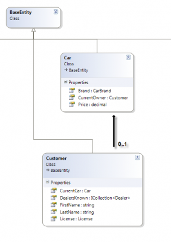

Most of the work is done in your **DbContext** when we talk about configuration of your entities. This is also true for navigation properties that can be set via the fluent interface of Entity Framework.

The first step is to override the method **OnModelCreating**.


```csharp
 protected override void OnModelCreating(DbModelBuilder modelBuilder) { //... } 
```

From there you can work in two different ways, the first one is to create class for each entity's configuration. The second one is to work directly into the **OnModelCreation** method. I prefer the first one because it's cleaner with bigger project. 
```csharp
 protected override void OnModelCreating(DbModelBuilder modelBuilder) { modelBuilder.Configurations.Add(new MyEntityConfiguration()); } //... public class MyEntityConfiguration: EntityTypeConfiguration<MyEntity> { public MyEntityConfiguration() { //Configurations here } } 
```

As you can see, the type inherited by the configuration class is EntityTypeConfiguration but could be ComplexTypeConfiguration for complex type instead of entity type.

To make it shorter, for the purpose of this blog post, I won't use the classes approach but in real life, I would suggest your to use it.

## HasRequired and HasOptional

This two keywords work in conjunction of the use of virtual object inside your classes. They will specify the type of relationship between entities.

HasRequired is implicit if you declare a virtual property for your class. For example, the code below display 2 classes and both of them refer to each of them. This is a 1 to 1 implicit relationship.


```csharp
 public class User { public int Id { get; set; } public string Username { get; set; } public virtual Profile Profile { get; set; } }

public class Profile { public int Id { get; set; } public string PostalCode { get; set; } public virtual User User { get; set; } } 
```

No configuration is required, nevertheless, you could have wrote in the **DbContext** some code that explicit the navigation type.


```csharp
 protected override void OnModelCreating(DbModelBuilder modelBuilder) { modelBuilder.Entity<User>().HasRequired(t => t.Profile); } 
```

This scenario is good for the case that a "User" require to have a "Profile" but "Profile" class can be created without being linked to a "User". If you want to specify if it's the class "Profile" or user "User" that will contain the relationship than you need to use the clause **WithRequiredPrincipal** or **WithOptionalPrincipal**.


```csharp
 protected override void OnModelCreating(DbModelBuilder modelBuilder) { modelBuilder.Entity<User>() .HasRequired(t => t.Profile) .WithRequiredPrincipal(t => t.User); } 
```

The first code that were using HasRequired only was in fact using implicitly "WithOptional(t=>t.User)". The User would have the relation inside the table and not profile. The second code also specify with **WithRequiredPrincipal** that the User will hold the foreign key.

## Has or With

You have HasRequired, HasOptional, HasMany and HasForeignKey. In the same time you have WithRequired, WithOptional, WithMany. What is the main difference between those method with _Has_ and _With_. The first one, the _Has_, represent the navigation property. The second one, the _With_ represent the reverse property configuration. Let say you have class A and class B. If you configure the entity A every call with the keywork _Has_ will be on the class A property (you can see this within the lambda expression that will be of type A with the return of type B. However, if you use property with _With_ in prefix, you will configure B to A relationship. For example : 
```csharp
 modelBuilder.Entity<A>().HasRequired(a => a.B).WithOptional(b => b.A); 
```

To clarify even more the Has and With, here is a more complex scenario that involve many classes. 


```csharp
 public class CarConfiguration : EntityTypeConfiguration<Car> { public CarConfiguration() { HasOptional(x => x.CurrentOwner).WithOptionalPrincipal(t => t.CurrentCar); //User contain the Customer FK } }

public class CustomerConfiguration : EntityTypeConfiguration<Customer> { public CustomerConfiguration() { HasKey(x => x.Id); HasOptional(x => x.CurrentCar).WithOptionalDependent(t => t.CurrentOwner);//Defined inside the CarConfiguration (up-side-down), may not be required } } 
``` In the first scenario, we would have only the HasOptional statement on the CarConfiguration class without having anything in the CustomerConfiguration. It's the reverse for the second way. The last one is exactly the whole code you see above, with both navigation defined.

In the case you think you can only setup the HasOptional on both without setuping up the WithOptionalPrincipal or WithOptionalDependent you are wrong. This will lead to an error :

> Unable to determine the principal end of an association between the types 'EFCodeFirst.Models.Car' and 'EFCodeFirst.Models.Customer'. The principal end of this association must be explicitly configured using either the relationship fluent API or data annotations.

How come? Because it's impossible for Entity Framework to know who's between the Customer or the Car contain the reference of the object. This is because if one of the object require to have the reference and the other one not, Entity Framework will create the table with the reference on the table with the required FK required. This is why having the code below won't work and raise the error described. 
```csharp
 public class CarConfiguration : EntityTypeConfiguration<Car> { public CarConfiguration() { HasKey(x => x.Id); HasOptional(x => x.CurrentOwner); //Error!!! } } public class CustomerConfiguration : EntityTypeConfiguration<Customer> { public CustomerConfiguration() { HasKey(x => x.Id); HasOptional(x => x.CurrentCar);// Error!!! } } 
```

The only time you can write HasOptional or HasRequired without defining the other side of the navigation is when you have the class having the reference to the other object and that the other one doesn't. If we want to do it with our class Car and Customer we just need to remove from Customer the Car property like the following code.


```csharp
 public class Car:BaseEntity { public Customer CurrentOwner { get; set; } //Relationship : One to (zero or one) } public class Customer:BaseEntity { //public Car CurrentCar { get; set; } //Relationship: One to (zero or one) public License License { get; set; } //Relationship: One to (zero or one) }

public class CarConfiguration : EntityTypeConfiguration<Car> { public CarConfiguration() { HasKey(x => x.Id); HasOptional(x => x.CurrentOwner); } } public class CustomerConfiguration : EntityTypeConfiguration<Customer> { public CustomerConfiguration() { //Nothing } } 
```

This will work.
