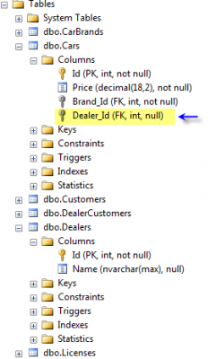
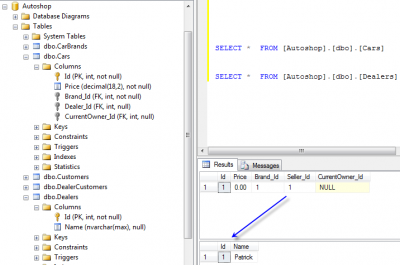
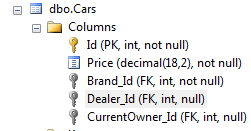
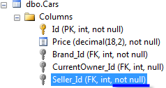

Like [configuring Entity Framework Code First for 1 to 1 or 1 to 0](./understand-basic-navigation-with-entity-framework-code-first-4-3-with-1-to-0-1-relationship) relation, you need to go in your DbContext and to configure your entities.

For 1 to many, the syntax is quite the same but is changed to fill up the need of one to many. First, of all, unlike 0 to 1 or 1 to 1 the choice of the relation is simpler. The foreign key is always at the "1" side. That mean that if you have a Dealer that sale many car, every car will have a reference in the database the its seller.

Lets use the same objects that we did previously with 1 to 1 relation.


```csharp
public class Dealer:BaseEntity { 
  public string Name { get; set; }
  public ICollection<Car> CarToSale { get; set; } //Relationship: Many to one (one side) 
  public ICollection<Customer> Customers { get; set; }//Relationship: Many to many (two side) 
} 
```

and the car is like :


```csharp
public class Car:BaseEntity { 
  public decimal Price { get; set; } 
  public CarBrand Brand { get; set; } //Relationship : One to one 
  public Customer CurrentOwner { get; set; } //Relationship : One to (zero or one) 
} 
```

As you can see, I only put the CarToSale property which is the one that will link to the Car. This is a little bit the reverse of what I just said about having the Car table having the reference to the Dealer right? Well, in fact, the way we will configure the DbContext will still put the Foreign Key of the table the way we previously stated.

First, lets configure the dealer by stating that we have many cars associated to its.


```csharp
public class DealerConfiguration : EntityTypeConfiguration<Dealer> { 
  public DealerConfiguration() { 
    HasMany(x => x.CarToSale); //One to many 
  } 
} 
```



But, let say that we want to add in our model the property Dealer inside the car. For the car, the relation is **1 to 0..1**.

So, it's now possible to join to the car the dealer by setting the car to the dealer or to set the dealer to the car.


```csharp
 //Add to the database from the car 
 using (var db = new DatabaseContext()) { 
  var dealer = new Dealer() {Name = "Patrick"}; 
  var car = new Car {Brand = new CarBrand(), Seller = dealer}; 
  db.Dealers.Add(dealer); db.Cars.Add(car); 
  db.SaveChanges(); 
} 
```



or


```csharp
 //Add to the database from the Dealer 
 using (var db = new DatabaseContext()) { 
  var car = new Car { Brand = new CarBrand() }; 
  var dealer = new Dealer() {Name = "Melodie", CarToSale = new Collection<Car>{car}}; 
  db.Dealers.Add(dealer); db.Cars.Add(car); db.SaveChanges(); 
} 
```

In both case, the table still has the foreign key inside the car and the dealer is not aware (from the table Dealer alone) about the car he has sell. From the Entity Framework Entities, both know. Both can read the value and both can save value as we just saw.

# Required relation of one to many

For the moment, if we take a look at the database, the generated table contain a NULL at the dealer_id foreign key.



Let say that we want to have this field has a required field. We want **"Not NULL"** to be generated into the table column property.


```csharp
 public CarConfiguration() { 
  HasRequired(x => x.Seller); //One to many is now a required field. It's really 1 to * and not 0 to * 
 
 } 
``` 

Will produce:



Not bad! Now we have what we want, a required field for the Dealer (called seller from the car perspective). Could we have configure this from the Dealer's entity instead of using the Car configuration? Of course!


```csharp
public class DealerConfiguration : EntityTypeConfiguration<Dealer> { 
  public DealerConfiguration() { 
    HasMany(x => x.CarToSale).WithRequired(e=>e.Seller); //One to many (1 to *) 
  } 
} 
```

So, now you are able to create **0..*** and **1..*** relationship with Entity Framework.
