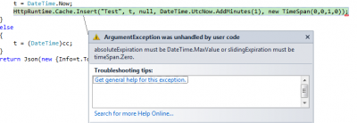
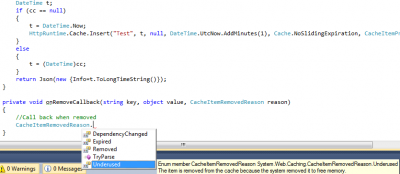

Sometime you may need to store information for few times in the memory without having to compute the data every time a user request it. This can save time and also processor time. To do, we can use the System.Web.Cache object.


```csharp
 var cc = HttpRuntime.Cache.Get("Test"); 
 DateTime t; 
 if (cc == null) { 
   t = DateTime.Now; 
   HttpRuntime.Cache.Insert("Test", t); 
  } else { 
    t = (DateTime)cc; 
  } 
``` 

The code above set into the cache the value of the current time and for all subsequent calls will get the value from the cache instead of getting the date itself. This demonstrate that in fact, it won't do exhaustive calculation (date in this example).

HttpRuntime.Cache.Get let you get an object from a key. The key is set when you are using HttpRuntime.Cache.Insert.

The Insert method has many parameters. The first parameter is the key, the second the value. Other parameters are concerning the time the value will stay in cache. The third parameter is by default NULL but could be anything that if changed will flush the cache. The forth parameter is the time when the data must be removed form the cache in an absolute time. For example, you can wrote that you want the data to be removed 20 minutes later by setting the DateTime.Now + 20 minutes ( `DateTime.UtcNow.AddMinutes(20)` ).

The last possible parameter is the sliding which decide if it gives additional time to the expiration of the cache if the data is accessed. This parameter is a TimeSpan. If you say 1 minute in this parameter you will have the data stored for 1 minute after the last get is done. This give you 1 minute time frame every time a user Get the value from the time you Inserted it. If at anytime no body access the cache, even the first 1 minute, the cache is resetted for this key. You can say that you do not want to use absolute time by setting this one to Cache.NoAbsoluteExpiration and only set a TimeSpan.


```csharp
 HttpRuntime.Cache.Insert("Test", t,null, Cache.NoAbsoluteExpiration, new TimeSpan(0,0,1,0)); 
```

or to set it for 20 minutes


```csharp
 HttpRuntime.Cache.Insert("Test", t, null, DateTime.UtcNow.AddMinutes(20), Cache.NoSlidingExpiration); 
```

If you try to use the absolute and sliding in the same time you will get the an Argument Exception.



This mean you can only use one of the type in the same time. It's also possible to have a call back when the data is removed from the cache. This can be interesting if you need to act differently when something is access removed from the cache. To do, you need to set the CacheItemRemovedCallback. This method will be called whenever the cache is removed. If you set 1 minute, 1 minute after the call back will be raised. This is raised what ever happen on the server side, even if no client call the server.


```csharp
 HttpRuntime.Cache.Insert("Test", t, null, DateTime.UtcNow.AddMinutes(1), Cache.NoSlidingExpiration, CacheItemPriority.Normal, onRemoveCallback); 
```

This method will give you also the detail about why it has been removed. Your item might have been set to stay 30 minutes but because low memory is running that the cache system will removed it. You will get the reason with the enumerator `CacheItemRemovedReason`.



It's pretty much it about the Cache for basic use. Do not forget that the data is cached into the memory of the process and is not shared across multiple server if you have multiple Web Server. You should use server with affinity to be able to reuse the cache for a same client otherwise the cache will be good only for the Web Server who has inserted the values.
