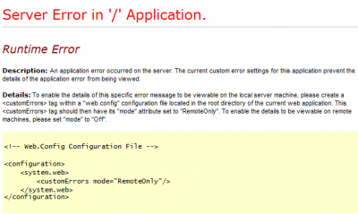

In Asp.Net Mvc, you can add an attribute to your controller or to some actions of your controller to tell Asp that you will take care of errors if they occur. You simply need to add the attribute HandleError.


```csharp
 [HandleError] public class MyController : Controller { } 
```

You can take care of specific error by specifying one or many type of exception that you want to handle. To do, simply add the property ExceptionType at your HandleError level.


```csharp
 [HandleError(ExceptionType = typeof(SqlException))] public class MyController : Controller { } 
```

If you need to handle multiple exception, you will need to use multiple attributes.


```csharp
 [HandleError(ExceptionType = typeof(SqlException))] [HandleError(ExceptionType = typeof(NullReferenceException))] public class MyController : Controller { } 
```

You can also in HandleError attribute specify what view to display. 
```csharp
 [HandleError(ExceptionType = typeof(SqlException), View="SqlView")] public class MyController : Controller { } 
```

If you do not specify any view, the exception will be viewed in the default error page. At first, it will check for Error.aspx in the Views folder associated with the Controller and then go see in the Shared folder.

Now you have the control to display specific exception to a specific view, others errors to the generic error page or to do not use anything and use the default ASP error page (yellow page of death) by setting the customErrors to off in the web.config file.
