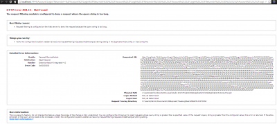

If you create a new MVC projet and hit F5 to start the application. As you may know by now, Visual Studio 2013 doesn't have Cassini, the internal web server inside Visual Studio. So, IIS Express is quickly automatically configured and the default website start.

Unfortunatly, if I do nothing, I am having a issue with query string being too long. This is because it redirect to the login page which redirect to the login page and so on.

So far, I haven't found solution, neither [StackOverFlow](http://stackoverflow.com/questions/19601412/new-asp-net-mvc5-project-produces-an-infinite-loop-to-login-page). But, if you are using IIS, everything works. Personally, I am always using IIS, but I am still curious why the IIS express, even with a brand new project doesn't work.

**EDIT**

I finally found that in IIS Express configuration file (located inside your document setting), I had windows authentication enabled. You need to remove this and to use anonymous authentication.
