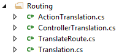
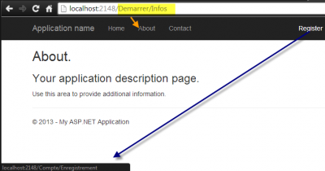

Often we see people using for multi language website the possibility to change the language by adding a property into the session of the user which tell the server to change the culture and culture ui to something else than english. This is fine because resources files handle multi languages if the culture is set correctly. An other way to do it, is to allow the user to have the culture into the url like the following example : http://yourwebsite.com/fr-ca/controllerName/actionName. I personally dislike this approach. It has the advantage to give the possibility to send an url to someone and to have it in the correct language, this can't be done with the previous solution of allowing the user to change the language and set it to the session. But, it has the disadvantage to tell that the language is French and still having the text in the url in English. The solution is suggest is that if you have public page that these one should control the language with an url that is already in the desired language. You should also let the user select the language and set the client language into a session which will tell the server how to display the url. This solution gives you good SEO url with named url in the good language and allow the user to control the language if this one want to change it.

At the end, what we want is to have url like this : http://yourwebsite.com/Compte/Identification for French website and for English : http://yourwebsite.com/Account/Login

Everything start by changing the routing. This can be done by opening the file **RouteConfig.cs** that is inside your web project under the folder App_Start.

Several things need to be done. First, we need to specify which culture will be used by you application. Then, you will have to use a custom structure to specify every controllers and actions with the translated values. This is required to associate every language word to an existing controller and existing action. Finally, the last step is to create a binder that will allow you to use the new mechanism to translate route. This is an example of how the routeConfig.cs looks for a brand new Asp.Net MVC5 application with the Home and Account controller translated.


```csharp
 public class RouteConfig { public static void RegisterRoutes(RouteCollection routes) { routes.IgnoreRoute("{resource}.axd/{*pathInfo}");

var cultureEN = CultureInfo.GetCultureInfo("en-US"); var cultureFR = CultureInfo.GetCultureInfo("fr-FR");

var translationTables = new List<ControllerTranslation>{ new ControllerTranslation("Home" , new List<Translation>{ new Translation(cultureEN, "Home") ,new Translation(cultureFR, "Demarrer") } ,new List<ActionTranslation>{ new ActionTranslation("About" , new List<Translation>{ new Translation(cultureEN, "About") ,new Translation(cultureFR, "Infos") }) , new ActionTranslation("Home" , new List<Translation>{ new Translation(cultureEN, "Home") ,new Translation(cultureFR, "Demarrer") }) , new ActionTranslation("Contact" , new List<Translation>{ new Translation(cultureEN, "Contact") ,new Translation(cultureFR, "InformationSurLaPersonne") }) }) ,new ControllerTranslation("Account" , new List<Translation>{ new Translation(cultureEN, "Account") ,new Translation(cultureFR, "Compte") } , new List<ActionTranslation> { new ActionTranslation("Login" , new List<Translation>{ new Translation(cultureEN, "Login") ,new Translation(cultureFR, "Authentification") }) , new ActionTranslation("Register" , new List<Translation>{ new Translation(cultureEN, "Register") ,new Translation(cultureFR, "Enregistrement") })

} ) };

routes.Add("LocalizedRoute", new TranslatedRoute( "{controller}/{action}/{id}", new RouteValueDictionary(new { controller = "Home", action = "Index", id = "" }), translationTables, new MvcRouteHandler()));

routes.MapRoute( name: "Default", url: "{controller}/{action}/{id}", defaults: new { controller = "Home", action = "Index", id = UrlParameter.Optional } ); } } 
```

As you can see, it can be very exhaustive to define every actions of every controller. However, this configuration can be saved in a database and loaded once for the application if you desire.

We are using a lot of classes that you will need. First of all, let's define all classes that are used to structure the controllers and actions translation. I have separated all classes in 4 files.




```csharp
 public class ControllerTranslation { public string ControllerName { get; set; } public List<Translation> Translation { get; set; } public List<ActionTranslation> ActionTranslations { get; set; }

public ControllerTranslation(string controllerName, List<Translation> translation, List<ActionTranslation> actionsList) { this.ControllerName = controllerName; this.Translation = translation; this.ActionTranslations = actionsList; } } 
``` This is the main class that has the controller name, which is required to be able to bind the translated name for the real code name. It contains a translation list which contains for every cultures the new name which is used in the url. Then, it contains a list of actions. This way, we have a well structured a logically separated structure.


```csharp
 public class ActionTranslation { public string ActionName { get; set; } public List<Translation> Translation { get; set; }

public ActionTranslation(string actionName, List<Translation> translation) { this.ActionName = actionName; this.Translation = translation; } } 
```

ActionTranslation is almost the same as ControllerTranslation. The only difference it that it doesn't contain a list of class.


```csharp
 public class Translation { public CultureInfo CultureInfo { get; set; } public string TranslatedValue { get; set; } public Translation(CultureInfo culture, string translatedValue) { CultureInfo = culture; TranslatedValue = translatedValue; } } 
``` Finally, the Translation class contain a culture information that is associated to a string that is translated in the language of the culture.

Take note that you could also have a AreaTranslation that would have a Controller class list. This example is extensible for more level of url structure without problem. For the simplicity, this article concentrate its effort for Controller and Action only.

The last class is here to define a new Route. In the RouteConfig.cs class, the route is defined, before the default route.


```csharp
 routes.Add("LocalizedRoute", new TranslatedRoute( "{controller}/{action}/{id}", new RouteValueDictionary(new { controller = "Home", action = "Index", id = "" }), translationTables, new MvcRouteHandler())); 
```

The third parameter takes the controller list that has all actions translated. A route is a class that inherit from System.Web.Routing.Route class. This class allow you to override two important methods. RouteData GetRouteData(HttpContextBase httpContext) and VirtualPathData GetVirtualPath(RequestContext requestContext, RouteValueDictionary values). The first one is used when a request is done to the server. This mean that is takes the localized words of the controller and action of the URL and translated them with your list of controller defined previously in the RouteConfig.cs. The second one is used by Html helper to create new link. This mean it takes the real controller and action name and translated them to create localized link for your application. This is awesome because not only your url are in the good language but also all your link everywhere in your application is automatically translated.


```csharp
 public class TranslatedRoute : Route {

public List<ControllerTranslation> Controllers { get; private set; }

public TranslatedRoute(string url, RouteValueDictionary defaults, List<ControllerTranslation> controllers, IRouteHandler routeHandler) : base(url, defaults, routeHandler) { this.Controllers = controllers; }

public TranslatedRoute(string url, RouteValueDictionary defaults, List<ControllerTranslation> controllers, RouteValueDictionary constraints, IRouteHandler routeHandler) : base(url, defaults, constraints, routeHandler) { this.Controllers = controllers; }

/// <summary> /// Translate URL to route /// </summary> /// <param name="httpContext"></param> /// <returns></returns> public override RouteData GetRouteData(HttpContextBase httpContext) { RouteData routeData = base.GetRouteData(httpContext); if (routeData == null) return null;

string controllerFromUrl = routeData.Values["controller"].ToString(); string actionFromUrl = routeData.Values["action"].ToString(); var controllerTranslation = this.Controllers.FirstOrDefault(d => d.Translation.Any(rf=>rf.TranslatedValue == controllerFromUrl)); var controllerCulture = this.Controllers.SelectMany(d => d.Translation).FirstOrDefault(f => f.TranslatedValue == controllerFromUrl).CultureInfo; if (controllerTranslation != null) { routeData.Values["controller"] = controllerTranslation.ControllerName; var actionTranslation = controllerTranslation.ActionTranslations.FirstOrDefault(d => d.Translation.Any(rf => rf.TranslatedValue == actionFromUrl)); if (actionTranslation != null) { routeData.Values["action"] = actionTranslation.ActionName; } System.Threading.Thread.CurrentThread.CurrentCulture = controllerCulture; System.Threading.Thread.CurrentThread.CurrentUICulture = controllerCulture; }

return routeData; }

/// <summary> /// Used in Html helper to create link /// </summary> /// <param name="requestContext"></param> /// <param name="values"></param> /// <returns></returns> public override VirtualPathData GetVirtualPath(RequestContext requestContext, RouteValueDictionary values) {

var requestedController = values["controller"]; var requestedAction = values["action"]; var controllerTranslation = this.Controllers.FirstOrDefault(d => d.Translation.Any(rf => rf.TranslatedValue == requestedController)); var actionTranslation = controllerTranslation.ActionTranslations.FirstOrDefault(d => d.Translation.Any(rf => rf.TranslatedValue == requestedAction)); var controllerTranslatedName = controllerTranslation.Translation.FirstOrDefault(d => d.CultureInfo == System.Threading.Thread.CurrentThread.CurrentCulture).TranslatedValue; if (controllerTranslatedName != null) values["controller"] = controllerTranslatedName; var actionTranslate = controllerTranslation.ActionTranslations.FirstOrDefault(d => d.Translation.Any(rf => rf.TranslatedValue == requestedAction)); if (actionTranslate != null) { var actionTranslateName = actionTranslate.Translation.FirstOrDefault(d => d.CultureInfo == System.Threading.Thread.CurrentThread.CurrentCulture).TranslatedValue; if (actionTranslateName != null) values["action"] = actionTranslateName; } return base.GetVirtualPath(requestContext, values); } } 
```

For both method, if we do not find the controller name or action name, it falls back to the default name. This way, nothing crash. I have also added two lines that change the thread language. This is not require if you do not want to change the language of the whole application but it seems logical to do it. If you send an url in French, you certainly want to have the whole page to use French resources.



You can have the complete source code on [GitHub](https://github.com/MrDesjardins/WebForLocalizedUrl).
