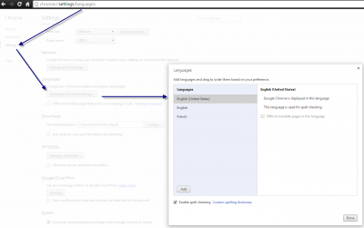
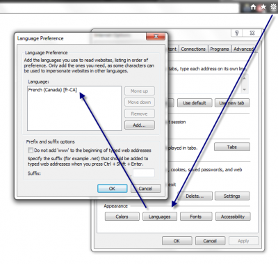

This post contains information to localize your Asp.Net MVC web application. I have already covered how to [change the language from the url without having to use the culture code in the url](./asp-net-mvc-localized-url-without-having-to-specify-the-language-in-it). This post goal is to detect the default language of the user browser for a default language and to let the user select his preferred language. Never only depend of the browser language for choosing localization. I have a French keyboard since I am living in Quebec, Canada and I hate to see French localized website. I want to see everything in English. I am not the only one that desire to see specific website in specific language and this is why you should also let the user choose in which language to display your string, date and number.

Localization works by setting the current thread Culture and Culture UI with a CultureInfo class. CultureInfo can contains the region or not. So, you can have the language and the country or just the language.


```csharp
 var culture1 = new System.Globalization.CultureInfo("fr"); var culture2 = new System.Globalization.CultureInfo("fr-CA"); 
```

In the example above, culture1 specify the language, French, but doesn't specify the region which can be a problem for number and date. This is why it's always better to be region specific instead of using neutral culture. With experience, you will see that your customer won't want the European format for currency if they live in North America (euro is not Canadian dollar!).

In a MVC application, the language is often set in the user session or cookie. It's then loaded back when one of your controller is called. Normally, all your controllers should inherit from a base controller. This is the perfect place to set the thread culture back from the session or cookie.

You can set the thread inside the **OnActionExecuting**.


```csharp
 protected override void OnActionExecuting(ActionExecutingContext filterContext) { Thread.CurrentThread.CurrentUICulture = new CultureInfo(CurrentUser.Language); Thread.CurrentThread.CurrentCulture = new CultureInfo(CurrentUser.Language); //... } 
```

If you want to use by default if the session is not set the language set in the browser, it's possible. This language is set in the preference of the browser. Here is two screenshots that explain how to adjust the language for Chrome and for Internet Explorer.





This set the Accept-Language in the http header. The server receive this information, and you can read it from the Http Request header. 
```csharp
 cultureName = Request.UserLanguages != null && Request.UserLanguages.Length > 0 ? Request.UserLanguages.First(); 
```

If the language is not available inside your resource file, it falls back the the localized file that doesn't have any culture. Normally, you have resource files like Message.resx, Message.en.resx, Message.fr.resx. As you can see, we do not specify the region, but we could. In fact, Asp.Net try to take the more specific to the less specific. This is very useful because you can translate very specific string for a specific region in Message.fr-Ca.resx without having to define every others strings. When creating your resource files, set the access modifier to Public. This will allow to use your resource outside the project, which is good if you have a project for resource. This set the build option from ResXFileCodeGenerator to PublicResXFileCodeGenerator for the custom tool to use. From here, you can use the resource inside your application by specifying the namespace and the name of the resource (without any culture) and with the key name of the resource.


```csharp
 <h1> @ResourcesNamespace.Titles.CreateCustomer </h1> 
```

If you do not want to type the namespace every time you can set a using at the top of the file and for views you can also specify in the web.config the namespace to be added by default. Often, this is added into the web.config of the Views folder and not the whole application since in the majority of time, you have resources for each Views folder. If you wan to add the namespace into the default ones, add your namespace under razor configuration.

```xml
<configuration> <system.web.webPages.razor> <host factoryType="System.Web.Mvc.MvcWebRazorHostFactory, System.Web.Mvc, Version=5.0.0.0, Culture=neutral, PublicKeyToken=31BF3856AD364E35" /> <pages pageBaseType="System.Web.Mvc.WebViewPage"> <namespaces> <add namespace="System.Web.Mvc" /> <add namespace="System.Web.Mvc.Ajax" /> <add namespace="System.Web.Mvc.Html" /> <add namespace="System.Web.Optimization"/> <add namespace="System.Web.Routing" /> <add namespace="YourNamespaceHere" /> </namespaces> </pages> </system.web.webPages.razor> 
```


Finally, if you want to use the default language then the session, here is the code you need to use inside your controller. Keep it minds that this is not what should be done if you are using what I have previously written concerning url language. This is because, the url keep the language and you do not need to check the accepted language of the browser, neither the session.


```csharp
 protected ICurrentUser CurrentUser { get { UserSessionDTO currentUser =_sessionHandler.GetUser(); if (currentUser != null) { UserProfile userProfile =_mapperFactory.UserSessionDTO.GetModel(currentUser); return userProfile; } else { ICurrentUser currentUserFromProvider =_userProvider.Account; UserProfile fullUserProfile =_serviceFactory.Account.GetByUserName(currentUserFromProvider.UserName); if (fullUserProfile == null)//Case of a non identified user { fullUserProfile = new UserProfile(); fullUserProfile.Language = Request.UserLanguages != null && Request.UserLanguages.Length > 0 ? Request.UserLanguages.First():"en-US"; } return fullUserProfile; } } }

protected override void OnActionExecuting(ActionExecutingContext filterContext) { Thread.CurrentThread.CurrentUICulture = new CultureInfo(CurrentUser.Language); Thread.CurrentThread.CurrentCulture = new CultureInfo(CurrentUser.Language); base.OnActionExecuting(filterContext); //.... } 
```

The code above is a little bit more than necessary. It has in the base controller something that check if the user is already logged in the session. If yes, it returns the object fully loaded. If not, which is the case for a new user that come on your website, it uses the temporary user from the user and verify it has a User Profile which should be null. This create a temporary User Profile and set the language which is in fact the culture (I should rename this property). From the Controller.Request which is of type System.Web.HttpRequestBase, you can read the UserLanguage and take the first one defined. If none is set, I choose English from United States Of America.
