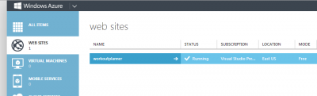
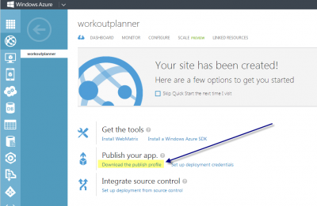
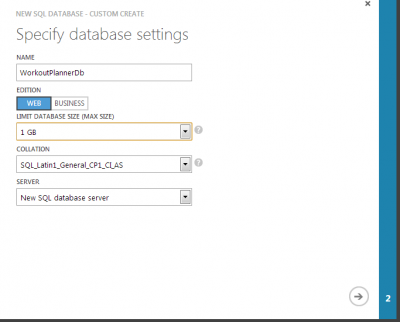
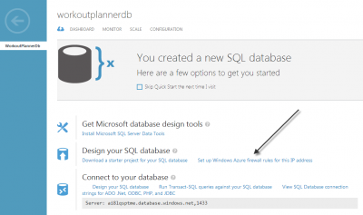
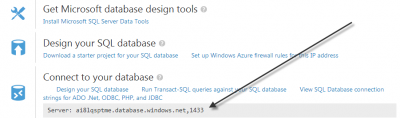
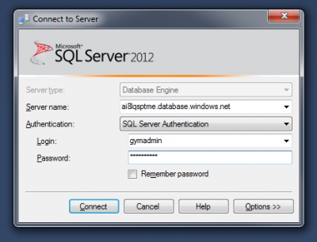
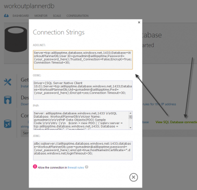
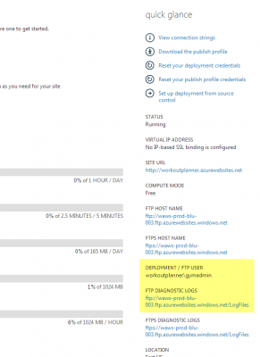
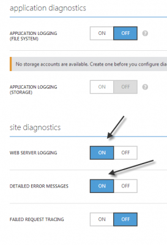
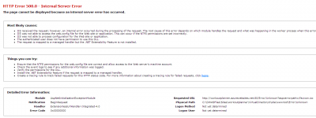

This post show how to transport your Asp.Net MVC to Windows Azure. First of all, you need to create a Windows Azure account. This can be done by going into the [main website of Windows Azure](http://www.windowsazure.com). You can setup a trial account for 30 days.

We won't create a Virtual Machine which is the ultimate control over your website (you can load any Virtual Machine), but use the Web Sites type of server. The creation is straight forward. You setup a name and you are up and running.



To upload your website, you have several option. One of these is to use Visual Studio with a Web Publish. Windows Azure gives an automatically generated publish file.



This profile can be imported inside your solution once downloaded on you development environment. Right click the web project and select publish, the first time you need to select import and select the downloaded file. Later, you will just need to select the configuration. The publish file is an Xml file.


```xml
 <publishData>

<publishProfile profileName="workoutplanner - Web Deploy" publishMethod="MSDeploy" publishUrl="waws-prod-blu-003.publish.azurewebsites.windows.net:443" msdeploySite="workoutplanner" userName="$workoutplanner" userPWD="XXX" destinationAppUrl="http://workoutplanner.azurewebsites.net" SQLServerDBConnectionString="" mySQLDBConnectionString="" hostingProviderForumLink="" controlPanelLink="http://windows.azure.com"><databases/></publishProfile>

<publishProfile profileName="workoutplanner - FTP" publishMethod="FTP" publishUrl="ftp://waws-prod-blu-003.ftp.azurewebsites.windows.net/site/wwwroot" ftpPassiveMode="True" userName="workoutplanner\\$workoutplanner" userPWD="XXX" destinationAppUrl="http://workoutplanner.azurewebsites.net" SQLServerDBConnectionString="" mySQLDBConnectionString="" hostingProviderForumLink="" controlPanelLink="http://windows.azure.com"><databases/></publishProfile>

</publishData> 
```


The generated publish profile contain two profiles. One use Web Deploy and one use FTP. Azure offer these two methods with publishing.


The next step is to setup a database. You can create a database with the same name as yours in your computer.



If it's your first database on Windows Azure, you will have to create a database server which will require you to create a user and password to connect to. Next, you will have to allow your IP to be able to execute SQL Query from your computer to Windows Azure. This will let you create tables, stored procedures, views, etc.



Next, open Microsoft SQL Manager and enter the server address specified inside your Database DashBoard.





Once you can connect, it's time to take your database to Azure. I found easy if you doesn't have too much data to right click your database and select Task>Generate Script and to create a Schema/Data script which will create all database tables and data.

However, you might get some error like this one :

> Msg 40514, Filegroup reference and partitioning scheme' is not supported in this version of SQL Server

This is because you might have in you create table statement `ON [PRIMARY]` keywork which is not supported.

```sql
CREATE TABLE [dbo].[Exercises]( [Id] [int] IDENTITY(1,1) NOT NULL, [Name_French] [nvarchar](max) NULL, [Name_English] [nvarchar](max) NULL, [Muscle_Id] [int] NULL, CONSTRAINT [PK_dbo.Exercises] PRIMARY KEY CLUSTERED ( [Id] ASC )WITH (PAD_INDEX = OFF, STATISTICS_NORECOMPUTE = OFF, IGNORE_DUP_KEY = OFF, ALLOW_ROW_LOCKS = ON, ALLOW_PAGE_LOCKS = ON) ON [PRIMARY] ) ON [PRIMARY] TEXTIMAGE_ON [PRIMARY] 
```


Should become

```sql
CREATE TABLE [dbo].[Exercises]( [Id] [int] IDENTITY(1,1) NOT NULL, [Name_French] [nvarchar](max) NULL, [Name_English] [nvarchar](max) NULL, [Muscle_Id] [int] NULL, CONSTRAINT [PK_dbo.Exercises] PRIMARY KEY CLUSTERED ( [Id] ASC ) ) 
```


From there, open your solution and change the connection string to setup your new database in the Release version. This need to have a connection string to the database your just created. With Windows Azure, it's easy because it generates for you the connection string.



My experience was that I was getting runtime error.


To get the log file, you need to have a FTP account. This can be done by creating a user/password in your website dashboard. Then, click the link that will bring you to a folder where all logs files are located.



If you do not see any logs file, you might need to enable logs. This can be done by going to "Configuration" of the Web Sites. I have enabled Web Server Logging and Detailed Error Messages.



This give us .html file with the error. In my case, I had this message following message.


