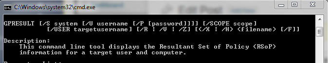

This is a short blog entry that I write more as a reminder to know how to check in which group I belong in active directory while logged into a Windows 7 operating system.

```sh 
gpresult /R 
``` 



```sh 
gpresult /R | find "Admin" 
``` 

This will let you know if you belong to the Admin group. This can be handful in some system that you are developing and some right has been set. This way, you can confirm if you are really into a group or not.
