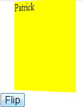

If you are curious about what we will discuss in this blog post, you can visit [JsFiddle](http://jsfiddle.net/tsdME/2/) for the code and an example of how to flip a div with CSS3 and some javascript.

First of all, here is the Html markup which define two divisions which are each side. Both side contain a text. When using the button, it goes from one div to the other with an animation that flip the division. The goal is to simulate that the user click some where and we go behind a div.


```html  <section id="zone"> <div class="recto"> Patrick </div> <div class="verso" style="display:none"> Desjardins </div> <button id="btnFlip">Flip</button> </section> 
``` 

The second step is to define a style to all those Html markup. It also defines the animation that we use to make it looks like if we were flipping the div to go behind it.




```css
 #zone div { width:150px; height:150px; background-color:yellow; color:black; font-size:18px; } #zone { -webkit-perspective: 1200px; } @-webkit-keyframes spinner { from { -webkit-transform: rotateY(0deg); } to { -webkit-transform: rotateY(-180deg); } }

.flip { -webkit-animation-name: spinner; -webkit-animation-timing-function: linear; -webkit-animation-iteration-count: 1; -webkit-animation-duration: 1s; -webkit-transform-style: preserve-3d; -webkit-transform-origin:50% 50%; } 
```


The first selector (#zone div) define the final state of both division. This is required because we want to be able to flip something similar. Also, we will be able to flip back to the original state. Nonetheless, we define a perspective for the zone which will create during the animation a sense of depth. Finally, we specify an animation key frames which do a 3d transformation by using the CSS3 features called rotateY. This will create a flip at the Y axis. Also, the class "flip" is defined which specify where the rotation occur (in the middle of the div) and also the duration which is 1 second in this example.

The last step is to define the action on the button. This action could have been placed directly onto the div but to not mix concept here, we will attach a click event to a button.


```javascript


$(document).on("click", "#btnFlip", function flipDiv() { $('#zone div:hidden').removeClass('flip') $('#zone div:visible').addClass('flip') .delay(600) .fadeOut(300, function(){$('#zone div:not(.flip)').fadeIn(300)}); }); 
``` 


What are we doing here is that we remove from the hidden div the "flip" class and add it to the other division. This let us having a continual movement of the class "flip" between the front and the back.
