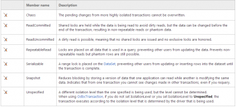

Transaction is handled by the namespace System.Transactions with TransactionScope or with SqlTransaction for DbConnection. So, they are two ways to use transaction.

The transaction scope way allows to have several transactions and also to be in multiple processes. To be able to have multiple processes/threads transactions, the Microsoft Distributed Transaction Coordinator (MSDTC) must be enabled on the machine where the code is running. Having many transactions allow you to have transaction with different sources. That mean that you can have a transaction for a SQL database and one with a complete other database. This can happen with multi-threaded application such as web application. This can be also required if both transaction is in imbrication. Both commit will be require to have the main transaction to pass. If one of the transaction fail, the rollback will be executed on all source. As stated, this require to have MSDTC running on your server/computer. By default, ADO.Net enlist all transactions with the DbConnection. But, you could handle everything manually.

Transaction defines tree levels of trust. Partially trust uses the attribute **AllowPartiallyTrustedCallers** removes the LinkDemand and is used with a single application domain. DistributedTransactionPermission (DTP) that use several transaction and Full trust use the attribute **FullTrust** which is like DTP with durable resource.

You can use transaction implicit and explicit transaction. Explicit transaction can be defined by using the class System.Transaction.TransactionScope.


```csharp
 using (var scope = new TransactionScope()) { //Code here that use ADO.Net. Can be code that use Entity Framework (because it uses ADO.Net) //... scope.Complete(); //Won't abord the transaction, everything is fine. Without this call, everything rollback when the object scope is disposed } 
```

The example above displays a simple use of a transaction scope. First, you can see that we are using the keyword using because TransactionScope is disposable, it inherits the interface IDisposable. This is not require but if you do not want to use the using statement, you will need to explicitly dispose the object. Also, you can notice that we call **Complete()** to tell that everything is fine. Not calling Complete would call a rollback. However, the documentation state that it's not guarantee that calling the **Complete()** method will call a Commit of the transaction. Also, calling Complete in the nested scope has no affect on the root scope.

The last thing that you must know is if you are using the transaction from the DbConnection, you can take the transaction and set it to multiple DbCommand and all DbCommand will be than linked together.


```csharp
 var con = new SqlConnection(/*Connection string*/); con.Open(); var transaction = con.BeginTransaction(); var cmd1 = con.CreateCommand() var cmd2 = con.CreateCommand() cmd1.Transaction = transaction; cmd2.Transaction = transaction; cmd1.Execute(); cmd2.Execute(); //Later transaction.Commit() or transaction.Rollback(); 
```

Every transactions has an **Isolation Level**. The isolation level specify what access the transaction can reach with volatile data. The isolation is set when opening the transaction with SqlConnection.BeginTransaction method.


```csharp
 var transaction = connection.BeginTransaction(IsolationLevel.ReadCommitted); 
```

Here is the official list of value. The default one is Read Commited which block the client to write



If you verify the DbCommand, you will see that by default this one has also a transaction. Instead of having "complete" you can explicitly call **Commit()** or RollBack().


```csharp
 var con = new SqlConnection(/*Connection string*/); con.Open(); var transaction = con.BeginTransaction(); //... transaction.Commit(); OR transaction.Rollback(); 
```
