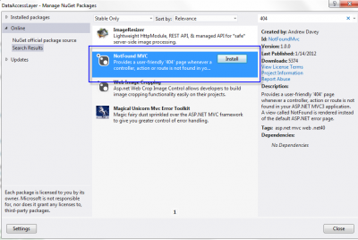

This is a question that Google doesn't provide many answer. Some people suggest using **Nuget package** that handle 404 error, some has solution that worked with Asp.Net MVC 1.0 But, at the end, it's just a 404 webpage and this is why we won't use any Nuget package. You can use a Nuget extension to handle this but from what I am concerned, this is like using a nuclear bomb just to push a nail. Instead, let's focus how what's happening.



404 is a status code that say that we have not reach an existing page on the server. This is convenient to have this kind of page when the user enter a wrong url into its browser. The 404 page show and tell to the user that he is still on your webpage but have reach a wrong destination.

First of all, if the user goes to a webpage that doesn't exist (a wrong controller name, or non existing action of your controller) you will get an error 500. The error 500 mean an internal error server. I suggest you handle 404 an 500 the same way in Asp.Net MVC because we never use real page since they are dynamically generated. Most of the time, user will reach a control using routing which is not a real page. In both case (http error 404 and 500), nothing is show from any of your webpage and in both case you want to alert the user of his error.

To handle the status code, I suggest that you check the response code from the Context at the end of the web request. This can be hooked in the **Global.asax.cs** file.


```csharp
 protected void Application\_EndRequest() { var statusCode = Context.Response.StatusCode; if (statusCode == 404 || statusCode == 500) { Response.Clear(); var routingData = new RouteData(); //rd.DataTokens["area"] = "AreaName"; // In case controller is in another area routingData.Values["controller"] = "Error"; routingData.Values["action"] = "NotFound"; IController c = new ErrorController(); c.Execute(new RequestContext(new HttpContextWrapper(Context), routingData)); } } 
```

As you can see, we clean all responses and start a brand new response by invoking the error controller that we create. This controller needs to have an action that I have called "NotFound" in the ErrorController. This action will display a view where you will be able to display a message to your visitor that will indicate that the page desired doesn't exist.


```csharp
 public ActionResult NotFound() { ActionResult result;

object model = Request.Url.PathAndQuery;

if (Request.IsAjaxRequest()) { if (Request.ContentType == "application/json") { result = Json(new { Error = "Server cannot threat your request." }); } else { result = PartialView(ERROR\_VIEW, model); } } else { result = View(ERROR\_VIEW, model); } return result; } 
```

This is a solution that return the Error404 view that you can create yourself with the whole master page if the request is not Ajax. Otherwise, it return a partial view which is still the Error404 but without the layout around it. Keep in mind that this solution expect that when you are using Ajax that you have specify the content type to json and also that you handle in your Javacript the read of the property Error. If this one is defined, you have to handle it.

```typescript
$.ajax({ type: 'POST', url: 'WrongPage/NotFound', data: JSON.stringify(jsonRequest), contentType: 'application/json; charset=utf-8', dataType: 'json', success: function (data, text) { //Success here }, error: function (request, status, error) { if(request.status == ...) { //Read the error message from the request } } }); 
``` 


This is how to handle easily 404/500 errors with Microsoft Asp.Net MVC framework. Of course, multiple other solution exist. I found this one efficient. As you can see, I haven't set any logging functionality and this is because I use ELMAH (previously seen in this blog) that handle to log wrong date routing.
