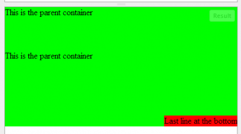

You need to set the parent container to **relative**. When the position is relative, everything that will be under the container with the position to **absolute** will be absolute to the relative parent.


```css
 .parent { position: relative; }

.child { position: absolute; bottom: 0; right:0; } 
```


From here, if you create a child inside the parent container, the child will be at the bottom of the parent.


```html 

This is the parent container

  
  
  

This is the parent container

  
  
  
  
  
  
Last line at the bottom 
``` 

An absolute div (or any other element) relative to the first **relative** parent. In the case that no element has been marked something else than the **static** (like to relative) than the first element will be used which is the Html element.



You can see the [result in action with JSFiddle here](http://jsfiddle.net/KA6YE/).
