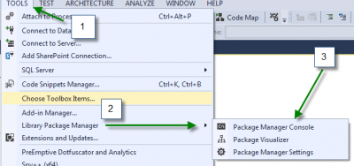
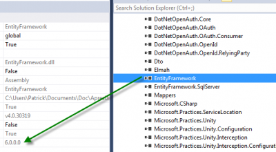
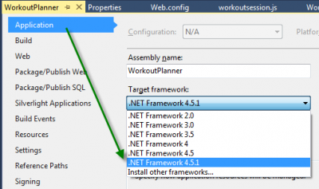

The new version of MVC is out since few weeks. If you have Microsoft Visual Studio 2013 and create a new web application, you will notice some improvements. First, MVC default version is now version 5 and not version 4. This come with a brand new razor version which is the third. Also, Entity Framework is now at version 6. Before going further, notice that if you are migrating to MVC5 than some older version of other assembly won't be compatible. For example, razor version 2 won't work with MVC5.

This is not an easy step to do, migrating, but if you have your MVC4 already up-to-date and have used Nuget for your external libraries, the process won't be that hard. The first step is to make sure you commit all your code to your repository. Preferably, label it with "Last Version MVC4". This way, if something is wrong, you will be able to go back and start from scratch.



The second step is to run Nuget to update every packages. This can be done with a single statement in the Nuget Console.

```sh
 PM> Update-Package 
``` 

This may take several minutes if you use a lot of package. This will do about half of the job. You will need to do this for every of your project that use package from Nuget. A good practice is to have always referenced your external library with Nuget. Even if you are using the same package from some of your projects, this won't duplicate them in your `solution/packages`.

The third step is to be done in every of your project. I suggest you start from your web site project since it's the one that will have the most job to do. Open the web.config of the web project. Verify that you have Entity Framework set to version 6. The information is set inside configuration>configSections inside a section named "EntityFramework".

```xml
 <configuration>
  <configSections>
    <section name="entityFramework" type="System.Data.Entity.Internal.ConfigFile.EntityFrameworkSection, EntityFramework, Version=6.0.0.0, Culture=neutral, PublicKeyToken=b77a5c561934e089" requirePermission="false"/> 
```


As you can see, the version MUST be set to 6.0.0.0 and in fact it should have been modified by the Nuget update that we have done earlier. If it's not, go in your project reference and be sure that you have a reference to EntityFramework.dll.



The screenshot show you that not only the version is set to version 6.0.0.0 but that the version 6 of Entity Framework has a new dll called "EntityFramework.SqlServer". This is now required.

The next step is to go lower in your web.config to the appSetting section. You need to update the version of webpages from 2.0.0.0 to 3.0.0.0

```xml
<appSettings><add key="webpages:Version" "value="3.0.0.0"/>
``` 

Then, you need to set the framework to 4.5.1 (if you want to be all up to date). This can be done in the web.config also inside the configuration tag, under system.web:


```xml
 <system.web> <compilation debug="true" targetFramework="4.5.1"/> <httpRuntime targetFramework="4.5.1"/> 
```


Before going any further in the web.config. Do not forget to open ALL your project to go in the properties of the project and to select the Target Framework to 4.5.1. 



Back to the web.config, we have the runtime tag to update. Here is my runtime information, yours should be almost the same.


```xml
 <runtime> <assemblyBinding xmlns="urn:schemas-microsoft-com:asm.v1"> <dependentAssembly> <assemblyIdentity name="WebMatrix.WebData" publicKeyToken="31BF3856AD364E35" culture="neutral"/> <bindingRedirect oldVersion="0.0.0.0-3.0.0.0" newVersion="3.0.0.0"/> </dependentAssembly> <dependentAssembly> <assemblyIdentity name="System.Web.WebPages.Razor" publicKeyToken="31BF3856AD364E35" culture="neutral"/> <bindingRedirect oldVersion="0.0.0.0-3.0.0.0" newVersion="3.0.0.0"/> </dependentAssembly> <dependentAssembly> <assemblyIdentity name="WebMatrix.Data" publicKeyToken="31BF3856AD364E35" culture="neutral"/> <bindingRedirect oldVersion="0.0.0.0-3.0.0.0" newVersion="3.0.0.0"/> </dependentAssembly> <dependentAssembly> <assemblyIdentity name="System.Web.Razor" publicKeyToken="31BF3856AD364E35" culture="neutral"/> <bindingRedirect oldVersion="0.0.0.0-3.0.0.0" newVersion="3.0.0.0"/> </dependentAssembly> <dependentAssembly> <assemblyIdentity name="System.Web.Helpers" publicKeyToken="31bf3856ad364e35"/> <bindingRedirect oldVersion="1.0.0.0-3.0.0.0" newVersion="3.0.0.0"/> </dependentAssembly> <dependentAssembly> <assemblyIdentity name="System.Web.Mvc" publicKeyToken="31bf3856ad364e35"/> <bindingRedirect oldVersion="0.0.0.0-5.0.0.0" newVersion="5.0.0.0"/> </dependentAssembly> <dependentAssembly> <assemblyIdentity name="System.Web.WebPages" publicKeyToken="31bf3856ad364e35"/> <bindingRedirect oldVersion="1.0.0.0-3.0.0.0" newVersion="3.0.0.0"/> </dependentAssembly> <dependentAssembly> <assemblyIdentity name="AutoMapper" publicKeyToken="be96cd2c38ef1005" culture="neutral"/> <bindingRedirect oldVersion="0.0.0.0-2.2.1.0" newVersion="2.2.1.0"/> </dependentAssembly> <dependentAssembly> <assemblyIdentity name="WebGrease" publicKeyToken="31bf3856ad364e35" culture="neutral"/> <bindingRedirect oldVersion="0.0.0.0-1.5.2.14234" newVersion="1.5.2.14234"/> </dependentAssembly> <dependentAssembly> <assemblyIdentity name="Microsoft.Practices.Unity" publicKeyToken="31bf3856ad364e35" culture="neutral"/> <bindingRedirect oldVersion="0.0.0.0-3.0.0.0" newVersion="3.0.0.0"/> </dependentAssembly> <dependentAssembly> <assemblyIdentity name="DotNetOpenAuth.AspNet" publicKeyToken="2780ccd10d57b246" culture="neutral"/> <bindingRedirect oldVersion="0.0.0.0-4.3.0.0" newVersion="4.3.0.0"/> </dependentAssembly> <dependentAssembly> <assemblyIdentity name="DotNetOpenAuth.Core" publicKeyToken="2780ccd10d57b246" culture="neutral"/> <bindingRedirect oldVersion="0.0.0.0-4.3.0.0" newVersion="4.3.0.0"/> </dependentAssembly> <dependentAssembly> <assemblyIdentity name="System.Web.Http" publicKeyToken="31bf3856ad364e35" culture="neutral"/> <bindingRedirect oldVersion="0.0.0.0-5.0.0.0" newVersion="5.0.0.0"/> </dependentAssembly> <dependentAssembly> <assemblyIdentity name="System.Net.Http.Formatting" publicKeyToken="31bf3856ad364e35" culture="neutral"/> <bindingRedirect oldVersion="0.0.0.0-5.0.0.0" newVersion="5.0.0.0"/> </dependentAssembly> <dependentAssembly> <assemblyIdentity name="Antlr3.Runtime" publicKeyToken="eb42632606e9261f" culture="neutral"/> <bindingRedirect oldVersion="0.0.0.0-3.5.0.2" newVersion="3.5.0.2"/> </dependentAssembly> </assemblyBinding> 
```


This tell the .Net compiler to use the new version if a reference is made to an older version. You can find information through MSDN concerning [Assembly Unification](http://msdn.microsoft.com/en-us/library/7wd6ex19.aspx).

Now, do that in all your web.config that contain similar XML elements. Once it's done, go into the view folder. This one also should contain a web.config. You need to change some version number here too. Here is one of my view folder (you can have few because of area).


```xml
 <?xml version="1.0"?>

<configuration> <configSections> <sectionGroup name="system.web.webPages.razor" type="System.Web.WebPages.Razor.Configuration.RazorWebSectionGroup, System.Web.WebPages.Razor, Version=3.0.0.0, Culture=neutral, PublicKeyToken=31BF3856AD364E35"> <section name="host" type="System.Web.WebPages.Razor.Configuration.HostSection, System.Web.WebPages.Razor, Version=3.0.0.0, Culture=neutral, PublicKeyToken=31BF3856AD364E35" requirePermission="false" /> <section name="pages" type="System.Web.WebPages.Razor.Configuration.RazorPagesSection, System.Web.WebPages.Razor, Version=3.0.0.0, Culture=neutral, PublicKeyToken=31BF3856AD364E35" requirePermission="false" /> </sectionGroup> </configSections>

<system.web.webPages.razor> <host factoryType="System.Web.Mvc.MvcWebRazorHostFactory, System.Web.Mvc, Version=5.0.0.0, Culture=neutral, PublicKeyToken=31BF3856AD364E35" /> <pages pageBaseType="System.Web.Mvc.WebViewPage"> <namespaces> <add namespace="System.Web.Mvc" /> <add namespace="System.Web.Mvc.Ajax" /> <add namespace="System.Web.Mvc.Html" /> <add namespace="System.Web.Optimization"/> <add namespace="System.Web.Routing" /> </namespaces> </pages> </system.web.webPages.razor>

<appSettings> <add key="webpages:Enabled" value="false" /> </appSettings>

<system.web> <httpHandlers> <add path="*" verb="*" type="System.Web.HttpNotFoundHandler"/> </httpHandlers>

<!-- Enabling request validation in view pages would cause validation to occur after the input has already been processed by the controller. By default MVC performs request validation before a controller processes the input. To change this behavior apply the ValidateInputAttribute to a controller or action. --> <pages validateRequest="false" pageParserFilterType="System.Web.Mvc.ViewTypeParserFilter, System.Web.Mvc, Version=5.0.0.0, Culture=neutral, PublicKeyToken=31BF3856AD364E35" pageBaseType="System.Web.Mvc.ViewPage, System.Web.Mvc, Version=5.0.0.0, Culture=neutral, PublicKeyToken=31BF3856AD364E35" userControlBaseType="System.Web.Mvc.ViewUserControl, System.Web.Mvc, Version=5Install-Package -Id Microsoft.AspNet.WebHelpers.0.0.0, Culture=neutral, PublicKeyToken=31BF3856AD364E35"> <controls> <add assembly="System.Web.Mvc, Version=5.0.0.0, Culture=neutral, PublicKeyToken=31BF3856AD364E35" namespace="System.Web.Mvc" tagPrefix="mvc" /> </controls> </pages> </system.web>

<system.webServer> <validation validateIntegratedModeConfiguration="false" />

<handlers> <remove name="BlockViewHandler"/> <add name="BlockViewHandler" path="*" verb="*" preCondition="integratedMode" type="System.Web.HttpNotFoundHandler" /> </handlers> </system.webServer> </configuration> 
```


You have 3 entries to change for razor. You need to change version 2.0.0.0 to version 3.0.0.0. Also, System.Web.Mvc.MvcWebRazorHostFactory, System.Web.Mvc need to be to 5.0.0.0. Then, under pages you have 3 others change concerning MVC that need to be to version 5.

The last modification that is require to use MVC5 is to open with note pad the project file of the web. Search for `ProjectTypeGuids` and remove the `GUID` for MVC4 : `{E3E379DF-F4C6-4180-9B81-6769533ABE47}`.

You won't have the stuff that a brand new MV5 project has like BootStrap but this can be added later on. What you have is a project up-to-date with Microsoft MVC framework 5, Entity Framework 6 and using the .Net Framework 4.5.1
