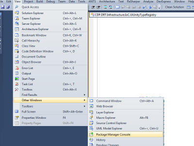

If you are using Entity Framework with the membership, you may come into situation where you need to rebuild your database because you are changing your models. In that case you want to also have the membership tables back when you are rebuilding your database. Here is a way to do it.

First of all, you need to open the **Package Manager Console**. This console will open a console where you will be able to write command to the Entity Framework Migration Tools.

The primary command to be used is "Update-Database". In fact, I always prefer to use "Update-Database -Verbose -Force"

The verbose option let you see all operations that are done which can be helpful in case of problem. The [force](./automatic-migration-was-not-applied-because-it-would-result-in-data-loss) will drop all table instead of altering them. This can be useful in situation where the structure change a lot.
