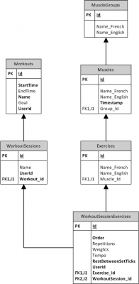
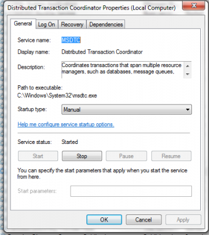

Not every page should be CRUD. In the case of our enterprise example, a software that handle workout exercise, we had firstly created a CRUD application. So, the user had to create the workout in 1 page, then go into another one to create sessions and then another to associate ever exercises into session. In fact, for every sessions of exercise the user had to go into a page, associate it with an existing exercise and then go back to the list and do it again and again. So, if you create a new workout with 5 sessions (for every days of the week) you have to go to 7 pages then for every exercise go into a page. That mean that if we have 10 exercises per training that we had to go into 57 pages! With the proposed solution to handle all exercises into the same page we only have 1 page to go.

Here is the database to inform you concerning the schema before going with Entity Framework to save multiple objects in the same time.



I won't display the whole code for creating a Workout from A to Z but concentrate on the goal of this article : saving multiple entities. The entity we want to save is the one called "Workout", we want to save the sessions and the exercises withing the same page. We won't create new exercise from this page, neither muscle and a group of muscle. But, we will use them.

The first step is to get from the form all information. I won't enter in detail here because they are multiple ways to do it. Let say that our Model is fully loaded. When I say Model, it's the Workout class loaded with WorkoutSessions and WorkoutSessionExercises. It doesn't mean that those objects have all scalar properties loaded. For example, we may have only the exercises ID and not the name of this one. In fact, you shouldn't have everything loaded because the form shouldn't let you edit exercise name. So, we only pass from the form to the controller information concerning unique identifier (in our case Ids) and some other information like the Order of the exercise (see the class WorkoutSessionExercises).

From there, the saving process start. The controller should call the service layer which call the repository. The big works start right here. The first thing to do is to setup a transaction scope. The main reason is that we need to delete exercises that the user might have remove when in a second time we want to add new exercises. We should remove all non used exercises first and then add everything. Otherwise, it won't be able to differentiate in the data context which one is removed, and which one is added. The use of transaction scope create a protection if something goes wrong in the later stage that nothing will be deleted. The transaction scope used in the same one that was used in the past with Ado.net, in fact, Entity Framework use behind Ado.Net and it won't be a problem to use it. Watch out! you will need to have MSDTC service running because multiple connexion to the database will be done.




```csharp
 public int Update(Workout entity) { using (var scope = new TransactionScope()) { // Remove // Insert scope.Complete(); } } 
```

This is how to code should be. A transaction that is before and after remove instruction and insert intruction.

In our case, the code looks like this :


```csharp
 public int Update(Workout entity) { 
   int count = -1; 
  using (base.DatabaseContext.RemoveValidation()) { 
    using (var scope = new TransactionScope()) { 
      RemoveWorkoutSessionExercisesNotUsedAnymore(entity); 
      SetupWorkoutForRepository(entity); 
      DatabaseContext.UpdateOwnable(entity); 
      var ent = DatabaseContext.SetOwnable<Workout>().Local.SingleOrDefault(d => d.Id == entity.Id); 
      DatabaseContext.Entry(ent).CurrentValues.SetValues(entity); 
      count = DatabaseContext.SaveChanges(); 
      scope.Complete(); 
    } 
  } 
  return count; 
} 
```

Has you can see, few things are added. First, the DatabaseContext is using a _USING_ with RemoveValidation method. This is a custom method that remove temporary all validations by Entity Framework. The code call ValidateOnSaveEnabled and set it to false and put it back to true once the scope of the using is over. This is ain't a requirement for you, but I let it there for the reason that you may have to do it. The justification is quite simple. When you are saving from partial data that contain only the primary key (Id) and you attach these one you may have some error that some required field aren't provided. If you tell Entity Framework not to check the validation, you won't have this trouble.

Second, you see that we call RemoveWorkoutSessionExercisesNotUsedAnymore(...) followed by SetupWorkoutForRepository(...). The Remove function do a query to the database to get the list of existing entities and compare with the one provided by the form (from the web page). All entities that were there and that is not anymore are removed.


```csharp
private void RemoveWorkoutSessionExercisesNotUsedAnymore(Workout entity) { 
  var listWorkoutSessionExerciseThatStillRemain = entity.Sessions.SelectMany(d=>d.WorkoutSessionExercises).Select(d=>d.Id).ToArray(); 
  var workoutSessionExerciseFromDatabase = DatabaseContext.SetOwnable<WorkoutSessionExercise>()
  .Where(d=>!listWorkoutSessionExerciseThatStillRemain.Contains(d.Id) && d.WorkoutSession.Workout.Id == entity.Id);
  
  foreach (var sessionExercise in workoutSessionExerciseFromDatabase) { 
    DatabaseContext.SetOwnable<WorkoutSessionExercise>().Remove(sessionExercise); 
  } 
  DatabaseContext.SaveChanges(); 
} 
```

The code is good for new and modified Workout entity. In the case of a new entity, the list of workout session exercise from the database will be empty and nothing will be removed. In the case of a modified Workout that contains workout session exercise, those are removed if they are not found in the list of Id that the user uses. At the end, we call SaveChange() which commit the delete statement to the Sql Server. Of course, since we are in a transaction, nothing will be really committed yet.

Third, the SetupWorkoutForRepository is called. This method is the heart of the work for modifying an entity with multiple children objects. Once the setup is done, the database is saved and the transaction is completed. At this final moment, every delete and insert are commited to the Sql Server Database.

Let's take a look at the setup method which prepare the model classe to be saved by Entity Framework.


```csharp
 private void SetupWorkoutForRepository(Workout entity) { 
   if (entity.Sessions != null) { 
     foreach (var workoutSession in entity.Sessions) { 
       if (workoutSession.WorkoutSessionExercises != null) { 
         foreach (var workoutSessionExercise in workoutSession.WorkoutSessionExercises) { 
           if (workoutSessionExercise.Exercise != null) { 
             if (workoutSessionExercise.Exercise.Id == BaseModel.NOT_INITIALIZED) { 
               workoutSessionExercise.Exercise = null; 
               //Should never go there 
               } else { 
                 if (DatabaseContext.Set<Exercise>().Local.All(e => e.Id != workoutSessionExercise.Exercise.Id)) { 
                   workoutSessionExercise.Exercise = DatabaseContext.Set<Exercise>().Attach(workoutSessionExercise.Exercise); 
                } else { 
                  workoutSessionExercise.Exercise = DatabaseContext.Set<Exercise>().Local.Single(e => e.Id == workoutSessionExercise.Exercise.Id); 
                }
              } 
            }

          if (workoutSessionExercise.Id == BaseModel.NOT_INITIALIZED) { 
            //New workout session exercise 
            DatabaseContext.SetOwnable<WorkoutSessionExercise>().Add(workoutSessionExercise); 
          } else { 
            if (DatabaseContext.Set<WorkoutSessionExercise>().Local.All(e => e.Id != workoutSessionExercise.Id)) { 
              DatabaseContext.SetOwnable<WorkoutSessionExercise>().Attach(workoutSessionExercise); 
            } 
          } 
        } 
        if (workoutSession.Id == BaseModel.NOT_INITIALIZED) { 
          DatabaseContext.SetOwnable<WorkoutSession>().Add(workoutSession); 
        } else { 
          var dbEntry = DatabaseContext.SetOwnable<WorkoutSession>().Local.SingleOrDefault(e => e.Id == workoutSession.Id); 
          if (dbEntry==null) { 
            dbEntry = DatabaseContext.SetOwnable<WorkoutSession>().Attach(workoutSession); 
          } 
        }

        foreach (var workoutSessionExercise in workoutSession.WorkoutSessionExercises) { 
          workoutSessionExercise.WorkoutSession = DatabaseContext.SetOwnable<WorkoutSession>().Local.SingleOrDefault(d=>d.Id == workoutSession.Id); 
        } 
      } 
    } 
  } 
} 
```

I'll go through the whole method because almost all possibles care are treated. First, a Workout contains a list of session. Most of the time, this collection won't be null and we will start looping through them. The same mechanism is executed for the WorkoutSessionExercises collection. Since, in our case, exercise aren't deleted or modified directly into this screen, we have some case simplified. This is why we know that the exercise cannot be null. But, we know that the user can set an exercise to a session. Two scenarios occurs. The first one is that it's the first time we use this exercise. If it's the case, then we need to set Entity Framework an attached object that will represent the exercise. This is done with the line 

```csharp
 workoutSessionExercise.Exercise = DatabaseContext.Set<Exercise>().Attach(workoutSessionExercise.Exercise); 
``` 
The second one is then the exercise has already been used. So, it has already been attached or has been added. We use the Local property to get the instance of the entity from Entity Framework this give us the certitude that we are working on the same Exercise. 

```csharp
 workoutSessionExercise.Exercise = DatabaseContext.Set<Exercise>().Local.Single(e => e.Id == workoutSessionExercise.Exercise.Id); 
```

At the end, we do the same for the workout session exercise. Why do we do exercise first and then we do exercise session? Because attaching or adding the exercise session would result to attach their sub property which is not what we want because we want to control if we attach or not the entity. We want to control what is attached and added and this is why we need to attach stuff from the bottom to up.

Also, you may want to save some property and not everything. In that case you can select the property and indicate if this one has changed or not. 
```csharp
 DatabaseContext.Entry(dbEntry).Property(d => d.Name).IsModified = false; 
``` 

This is an example that we could have set for the WorkoutSession if we would have like not to change the WorkoutSession name.

To conclude, it's possible to save multiple objects that are composed withing a single Entity Framework data context. This approach is not without negative effect. You will soon realize that it requires some time to code every attachment correctly and depending of how your objects are composed and how you use Entity Framework (with or without ID for each foreign key, with or without loading the full graph) your configuration will change.
